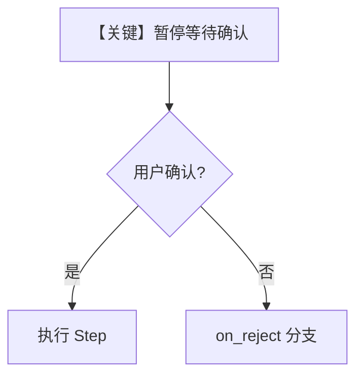

# 01_basic_step_confirmation.py — 实现原理分析

> 源文件：`cookbook/04_workflows/_07_human_in_the_loop/confirmation/01_basic_step_confirmation.py`

## 概述

本示例展示 **`Step` 级确认**：执行前暂停，用户确认则执行；拒绝时依 **`on_reject`**（`cancel` / `skip` 等）取消整次工作流或跳过该步继续。

## 核心配置一览

| 配置项 | 说明 |
|--------|------|
| `requires_confirmation` / `confirmation_message` | Step 或包装 |
| `on_reject` | `OnReject` 枚举 |

## Mermaid 流程图

```mermaid
flowchart TD
    P["【关键】暂停等待确认"] --> C{"用户确认?"}
    C -->|是| S["执行 Step"]
    C -->|否| R["on_reject 分支"]
```

## 关键源码文件索引

| 文件 | 作用 |
|------|------|
| `agno/workflow/step.py` | HITL 字段 |
| `agno/workflow/utils/hitl.py` | 暂停状态 |
