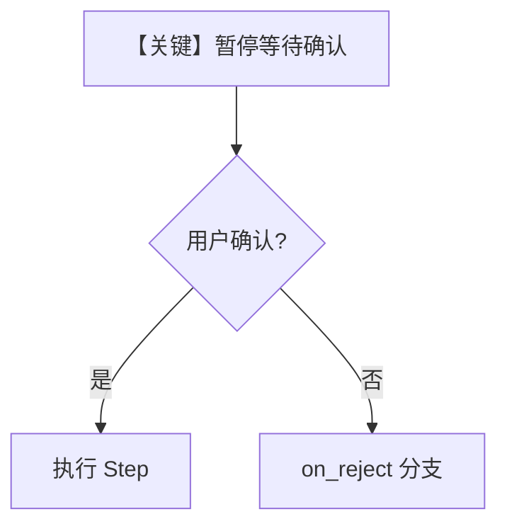

# 01_basic_step_confirmation.py — 实现原理分析

<!-- cookbook-py-source:start -->
## 完整源码

```python
"""
Basic Step Confirmation Example

This example demonstrates how to pause a workflow for user confirmation
before executing a step. The user can either:
- Confirm: Step executes and workflow continues
- Reject with on_reject=OnReject.cancel (default): Workflow is cancelled
- Reject with on_reject=OnReject.skip: Step is skipped and workflow continues with next step
"""

from agno.agent import Agent
from agno.db.sqlite import SqliteDb
from agno.models.openai import OpenAIChat
from agno.workflow import OnReject
from agno.workflow.step import Step
from agno.workflow.workflow import Workflow

# Create agents for each step
fetch_agent = Agent(
    name="Fetcher",
    model=OpenAIChat(id="gpt-4o-mini"),
    instructions="You fetch and summarize data. Return a brief summary of what data you would fetch.",
)

process_agent = Agent(
    name="Processor",
    model=OpenAIChat(id="gpt-4o-mini"),
    instructions="You process data. Describe what processing you would do on the input.",
)

save_agent = Agent(
    name="Saver",
    model=OpenAIChat(id="gpt-4o-mini"),
    instructions="You save results. Confirm that you would save the processed data.",
)

# Create a workflow with a step that requires confirmation
# on_reject="skip" means if user rejects, skip this step and continue with next
workflow = Workflow(
    name="data_processing",
    db=SqliteDb(
        db_file="tmp/workflow_hitl.db"
    ),  # Required for HITL to persist session state
    steps=[
        Step(
            name="fetch_data",
            agent=fetch_agent,
        ),
        Step(
            name="process_data",
            agent=process_agent,
            requires_confirmation=True,
            confirmation_message="About to process sensitive data. Confirm?",
            on_reject=OnReject.skip,  # If rejected, skip this step and continue with save_results
        ),
        Step(
            name="save_results",
            agent=save_agent,
        ),
    ],
)

# Run the workflow
run_output = workflow.run("Process user data")

# Check if workflow is paused
if run_output.is_paused:
    for requirement in run_output.steps_requiring_confirmation:
        print(f"\nStep '{requirement.step_name}' requires confirmation")
        print(f"Message: {requirement.confirmation_message}")

        # Wait for actual user input
        user_input = input("\nDo you want to continue? (yes/no): ").strip().lower()

        if user_input in ("yes", "y"):
            requirement.confirm()
            print("Step confirmed.")
        else:
            requirement.reject()
            print("Step rejected.")

    # Continue the workflow
    run_output = workflow.continue_run(run_output)

print(f"\nFinal output: {run_output.content}")
```

<!-- cookbook-py-source:end -->

> 源文件：`cookbook/04_workflows/_07_human_in_the_loop/confirmation/01_basic_step_confirmation.py`

## 概述

本示例展示 **`Step` 级确认**：执行前暂停，用户确认则执行；拒绝时依 **`on_reject`**（`cancel` / `skip` 等）取消整次工作流或跳过该步继续。

## 核心配置一览

| 配置项 | 说明 |
|--------|------|
| `requires_confirmation` / `confirmation_message` | Step 或包装 |
| `on_reject` | `OnReject` 枚举 |

## Mermaid 流程图


```mermaid
flowchart TD
    P["【关键】暂停等待确认"] --> C{"用户确认?"}
    C -->|是| S["执行 Step"]
    C -->|否| R["on_reject 分支"]
```

## 关键源码文件索引

| 文件 | 作用 |
|------|------|
| `agno/workflow/step.py` | HITL 字段 |
| `agno/workflow/utils/hitl.py` | 暂停状态 |
