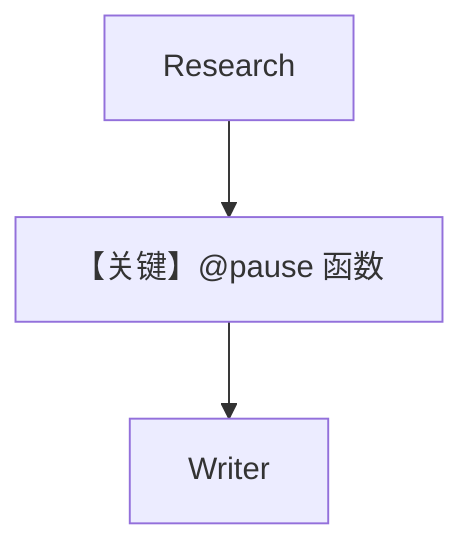

# 02_custom_function_step_confirmation.py — 实现原理分析

> 源文件：`cookbook/04_workflows/_07_human_in_the_loop/confirmation/02_custom_function_step_confirmation.py`

## 概述

本示例展示 **`@pause` 装饰器** 作用于**自定义函数 Step**：在研究步与写作步之间插入需人工确认的函数处理；确认前不写入最终内容。

## Mermaid 流程图

## 关键源码文件索引

| 文件 | 作用 |
|------|------|
| `agno/workflow/decorators.py` | `@pause` |
