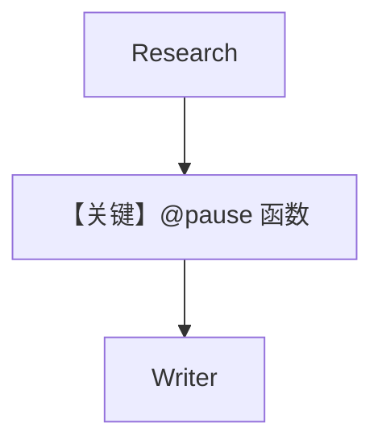

# 02_custom_function_step_confirmation.py — 实现原理分析

<!-- cookbook-py-source:start -->
## 完整源码

```python
"""
Test script demonstrating Step-level Human-In-The-Loop (HITL) functionality.

This example shows a blog post workflow where:
1. Research agent gathers information (no confirmation)
2. Custom function processes the research (HITL via @pause decorator)
3. Writer agent creates the final post (no confirmation)

Two approaches for HITL:
1. Flag-based: Using requires_confirmation=True on Step
2. Decorator-based: Using @pause decorator on custom functions
"""

from agno.agent import Agent
from agno.db.postgres import PostgresDb
from agno.models.openai import OpenAIChat
from agno.workflow.decorators import pause
from agno.workflow.step import Step
from agno.workflow.types import StepInput, StepOutput
from agno.workflow.workflow import Workflow

db_url = "postgresql+psycopg://ai:ai@localhost:5532/ai"


# ============================================================
# Step 1: Research Agent (no confirmation needed)
# ============================================================
research_agent = Agent(
    name="Researcher",
    model=OpenAIChat(id="gpt-4o-mini"),
    instructions=[
        "You are a research assistant.",
        "Given a topic, provide 3 key points about it in a concise bullet list.",
        "Keep each point to one sentence.",
    ],
)


# ============================================================
# Step 2: Process research (requires confirmation via @pause decorator)
# ============================================================
@pause(
    name="Process Research",
    requires_confirmation=True,
    confirmation_message="Research complete. Ready to generate blog post. Proceed?",
)
def process_research(step_input: StepInput) -> StepOutput:
    """Process the research data before writing."""
    research = step_input.previous_step_content or "No research available"
    return StepOutput(
        content=f"PROCESSED RESEARCH:\n{research}\n\nReady for blog post generation."
    )


# ============================================================
# Step 3: Writer Agent (no confirmation needed)
# ============================================================
writer_agent = Agent(
    name="Writer",
    model=OpenAIChat(id="gpt-4o-mini"),
    instructions=[
        "You are a blog writer.",
        "Given processed research, write a short 2-paragraph blog post.",
        "Keep it concise and engaging.",
    ],
)


# Define steps
research_step = Step(name="research", agent=research_agent)
process_step = Step(
    name="process_research", executor=process_research
)  # @pause auto-detected
write_step = Step(name="write_post", agent=writer_agent)

# Create workflow
workflow = Workflow(
    name="blog_post_workflow",
    db=PostgresDb(db_url=db_url),
    steps=[research_step, process_step, write_step],
)

if __name__ == "__main__":
    print("Starting blog post workflow...")
    print("=" * 50)

    run_output = workflow.run("Benefits of morning exercise")

    # Handle HITL pause
    while run_output.is_paused:
        for requirement in run_output.steps_requiring_confirmation:
            print(f"\n[HITL] Step '{requirement.step_name}' requires confirmation")
            print(f"[HITL] {requirement.confirmation_message}")

            user_input = input("\nContinue? (yes/no): ").strip().lower()

            if user_input in ("yes", "y"):
                requirement.confirm()
                print("[HITL] Confirmed - continuing workflow...")
            else:
                requirement.reject()
                print("[HITL] Rejected - cancelling workflow...")

        run_output = workflow.continue_run(run_output)

    print("\n" + "=" * 50)
    print(f"Status: {run_output.status}")
    print(f"Output:\n{run_output.content}")
```

<!-- cookbook-py-source:end -->

> 源文件：`cookbook/04_workflows/_07_human_in_the_loop/confirmation/02_custom_function_step_confirmation.py`

## 概述

本示例展示 **`@pause` 装饰器** 作用于**自定义函数 Step**：在研究步与写作步之间插入需人工确认的函数处理；确认前不写入最终内容。

## Mermaid 流程图



## 关键源码文件索引

| 文件 | 作用 |
|------|------|
| `agno/workflow/decorators.py` | `@pause` |
