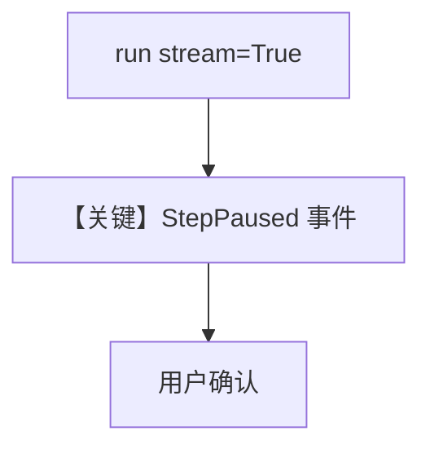

# 03_step_confirmation_streaming.py — 实现原理分析

> 源文件：`cookbook/04_workflows/_07_human_in_the_loop/confirmation/03_step_confirmation_streaming.py`

## 概述

本示例与 `01_basic_step_confirmation` 相同语义，但使用 **`workflow.run(..., stream=True)`**：客户端从事件迭代器观察 **`StepPaused`** 等事件以驱动前端确认 UI。

## Mermaid 流程图

## 关键源码文件索引

| 文件 | 作用 |
|------|------|
| `agno/run/workflow.py` | `StepPausedEvent` |
