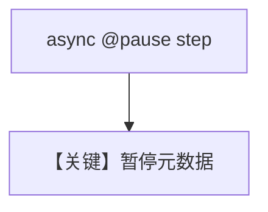

# 04_async_step_confirmation.py — 实现原理分析

> 源文件：`cookbook/04_workflows/_07_human_in_the_loop/confirmation/04_async_step_confirmation.py`

## 概述

本示例验证 **`@pause` 与 `async def` 协程 Step** 兼容：装饰器仅附加元数据，不破坏 `await` 语义，便于 I/O 型人工确认前处理。

## Mermaid 流程图

## 关键源码文件索引

| 文件 | 作用 |
|------|------|
| `agno/workflow/decorators.py` | `@pause` |
