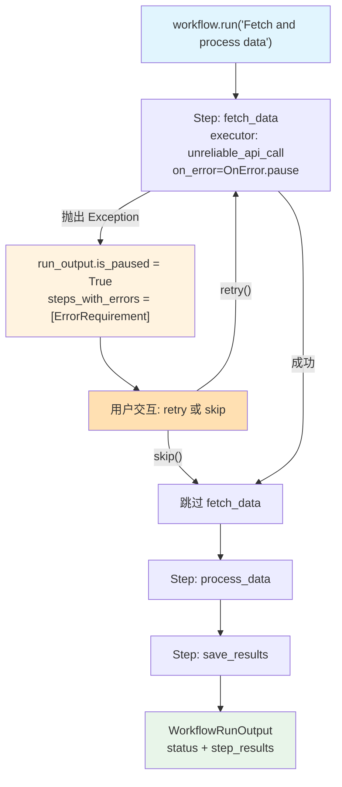

# 01_error_retry_skip.py — 实现原理分析

> 源文件：`cookbook/04_workflows/_07_human_in_the_loop/error/01_error_retry_skip.py`

## 概述

本示例展示 Agno Workflow **HITL 错误处理**机制：通过 `Step(on_error=OnError.pause)` 配置步骤出错时暂停并询问用户，用户可选择「重试」(`error_req.retry()`) 或「跳过」(`error_req.skip()`) 失败步骤，实现对不可靠操作（API 调用、网络请求等）的人工干预恢复。

**核心配置一览：**

| 配置项 | 值 | 说明 |
|--------|------|------|
| `Step.on_error` | `OnError.pause` | 出错时暂停 HITL |
| `run_output.steps_with_errors` | 列表 | 失败步骤的错误信息 |
| `error_req.retry()` | 方法 | 重试失败步骤 |
| `error_req.skip()` | 方法 | 跳过失败步骤继续 |
| `error_req.error_message` | `str` | 错误详情 |
| `error_req.retry_count` | `int` | 已重试次数 |

## 核心组件解析

### 配置错误暂停步骤

```python
from agno.workflow import OnError

workflow = Workflow(
    name="error_hitl_workflow",
    db=SqliteDb(db_file="tmp/error_hitl.db"),
    steps=[
        Step(
            name="fetch_data",
            executor=unreliable_api_call,
            on_error=OnError.pause,   # 出错时暂停等待用户决定
        ),
        Step(name="process_data", executor=process_data),
        Step(name="save_results", executor=save_results),
    ],
)
```

### 失败的执行器（模拟不可靠 API）

```python
def unreliable_api_call(step_input: StepInput) -> StepOutput:
    if random.random() < 0.99:  # 99% 失败概率
        raise Exception("API call failed: Connection timeout")
    return StepOutput(content="API call succeeded!", success=True)
```

### 错误 HITL 处理循环

```python
run_output = workflow.run("Fetch and process data")

while run_output.is_paused:
    if run_output.steps_with_errors:
        for error_req in run_output.steps_with_errors:
            print(f"Step '{error_req.step_name}' FAILED")
            print(f"Error: {error_req.error_message}")
            print(f"Retried: {error_req.retry_count} times")

            user_choice = input("What to do? (retry/skip): ").strip().lower()

            if user_choice == "retry":
                error_req.retry()    # 重新执行失败步骤
            else:
                error_req.skip()     # 跳过并继续

    run_output = workflow.continue_run(run_output)
```

### 错误信息对象 `ErrorRequirement`

```python
error_req.step_name      # 失败步骤名称
error_req.error_type     # 异常类型名
error_req.error_message  # 详细错误信息
error_req.retry_count    # 已重试次数
error_req.retry()        # 触发重试
error_req.skip()         # 跳过步骤
```

## Mermaid 流程图



## OnError 模式对比

| `on_error` 值 | 行为 | 适用场景 |
|-------------|------|---------|
| 未配置（默认） | 步骤标记失败，继续后续 | 非关键步骤 |
| `OnError.pause` | 暂停等待人工决定 | 需要人工干预恢复 |

## 关键源码文件索引

| 文件 | 关键类/函数 | 作用 |
|------|------------|------|
| `agno/workflow/step.py` | `Step.on_error` | 错误处理策略配置 |
| `agno/workflow/__init__.py` | `OnError` | 错误处理枚举 |
| `agno/workflow/types.py` | `ErrorRequirement` | 错误信息对象 |
| `agno/workflow/workflow.py` | `Workflow.continue_run()` | 用户决策后继续 |
