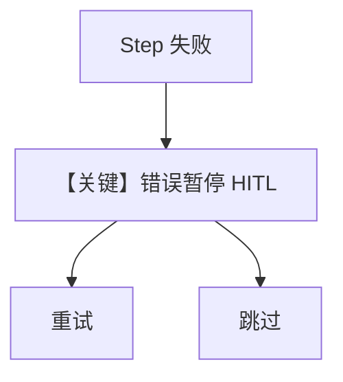

# 01_error_retry_skip.py — 实现原理分析

> 源文件：`cookbook/04_workflows/_07_human_in_the_loop/error/01_error_retry_skip.py`

## 概述

本示例展示 **`on_error="pause"`（或等价配置）**：Step 失败时工作流暂停，由用户选择 **重试该步** 或 **跳过** 继续后续步。

## Mermaid 流程图

```mermaid
flowchart TD
    E["Step 失败"] --> P["【关键】错误暂停 HITL"]
    P --> R["重试"]
    P --> S["跳过"]
```

## 关键源码文件索引

| 文件 | 作用 |
|------|------|
| `agno/workflow/step.py` | `on_error` |
| `agno/run/workflow.py` | `StepErrorEvent` |
