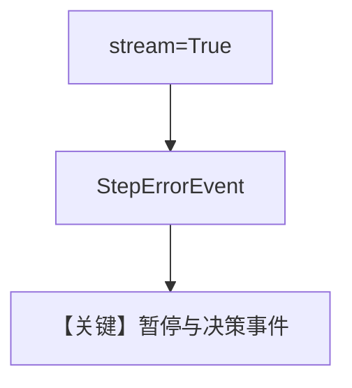

# 02_error_retry_skip_streaming.py — 实现原理分析

> 源文件：`cookbook/04_workflows/_07_human_in_the_loop/error/02_error_retry_skip_streaming.py`

## 概述

本示例为 **流式版** `01_error_retry_skip`：通过事件流暴露失败与暂停，便于实时 UI。

## Mermaid 流程图

## 关键源码文件索引

| 文件 | 作用 |
|------|------|
| `agno/workflow/workflow.py` | 流式 run |
