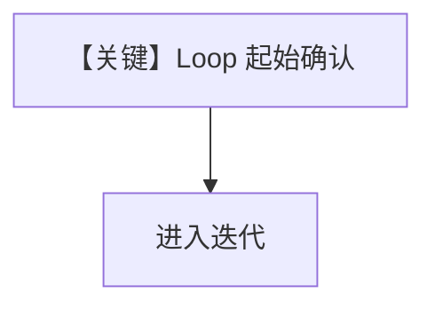

# 01_loop_confirmation.py — 实现原理分析

<!-- cookbook-py-source:start -->
## 完整源码

```python
"""
Loop with User Confirmation HITL Example

This example demonstrates start confirmation for Loop components.

When `requires_confirmation=True`:
- Pauses before the first iteration
- User confirms -> execute loop
- User rejects -> skip loop entirely

This is useful for:
- Optional iterative processing
- User-controlled loop execution
- Confirming expensive/time-consuming loops
"""

from agno.db.sqlite import SqliteDb
from agno.workflow.loop import Loop
from agno.workflow.step import Step
from agno.workflow.types import StepInput, StepOutput
from agno.workflow.workflow import Workflow


# ============================================================
# Step functions
# ============================================================
def prepare_data(step_input: StepInput) -> StepOutput:
    """Prepare data for processing."""
    return StepOutput(
        content="Data prepared for iterative processing.\n"
        "Ready to begin refinement loop."
    )


def refine_analysis(step_input: StepInput) -> StepOutput:
    """Perform one iteration of analysis refinement."""
    # Track iteration count via session state or input
    iteration = getattr(step_input, "_iteration_count", 1)
    return StepOutput(
        content=f"Iteration {iteration} complete:\n"
        f"- Quality score: {70 + iteration * 10}%\n"
        f"- Improvements made: {iteration * 3}\n"
        "- Further refinement possible"
    )


def finalize_results(step_input: StepInput) -> StepOutput:
    """Finalize the results."""
    previous_content = step_input.previous_step_content or "No iterations"
    return StepOutput(
        content=f"=== FINAL RESULTS ===\n\n{previous_content}\n\nProcessing complete."
    )


# Define the steps
prepare_step = Step(name="prepare_data", executor=prepare_data)

# Loop with start confirmation - user must confirm to start the loop
refinement_loop = Loop(
    name="refinement_loop",
    steps=[Step(name="refine_analysis", executor=refine_analysis)],
    max_iterations=5,
    requires_confirmation=True,
    confirmation_message="Start the refinement loop? This may take several iterations.",
)

finalize_step = Step(name="finalize_results", executor=finalize_results)

# Create workflow with database for HITL persistence
workflow = Workflow(
    name="loop_start_confirmation_demo",
    steps=[prepare_step, refinement_loop, finalize_step],
    db=SqliteDb(db_file="tmp/loop_hitl.db"),
)

if __name__ == "__main__":
    print("=" * 60)
    print("Loop with Start Confirmation HITL Example")
    print("=" * 60)

    run_output = workflow.run("Process quarterly data")

    # Handle HITL pauses
    while run_output.is_paused:
        # Handle Step requirements (confirmation for loop start)
        for requirement in run_output.steps_requiring_confirmation:
            print(f"\n[DECISION POINT] {requirement.step_name}")
            print(f"[HITL] {requirement.confirmation_message}")

            user_choice = input("\nStart the loop? (yes/no): ").strip().lower()
            if user_choice in ("yes", "y"):
                requirement.confirm()
                print("[HITL] Confirmed - starting loop")
            else:
                requirement.reject()
                print("[HITL] Rejected - skipping loop")

        run_output = workflow.continue_run(run_output)

    print("\n" + "=" * 60)
    print(f"Status: {run_output.status}")
    print("=" * 60)
    print(run_output.content)
```

<!-- cookbook-py-source:end -->

> 源文件：`cookbook/04_workflows/_07_human_in_the_loop/loop/01_loop_confirmation.py`

## 概述

本示例展示 **`Loop.requires_confirmation=True` 的起始确认**：在**第一轮迭代前**暂停，用户确认后进入循环；拒绝则依 `on_reject` 跳过循环等（见 `loop.py` `L80-85`）。

## Mermaid 流程图



## 关键源码文件索引

| 文件 | 作用 |
|------|------|
| `agno/workflow/loop.py` | `requires_confirmation` |
