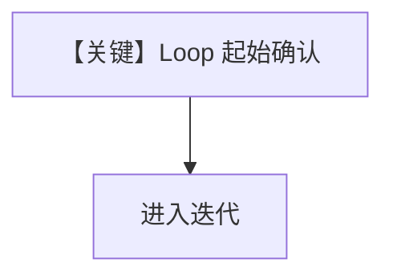

# 01_loop_confirmation.py — 实现原理分析

> 源文件：`cookbook/04_workflows/_07_human_in_the_loop/loop/01_loop_confirmation.py`

## 概述

本示例展示 **`Loop.requires_confirmation=True` 的起始确认**：在**第一轮迭代前**暂停，用户确认后进入循环；拒绝则依 `on_reject` 跳过循环等（见 `loop.py` `L80-85`）。

## Mermaid 流程图

## 关键源码文件索引

| 文件 | 作用 |
|------|------|
| `agno/workflow/loop.py` | `requires_confirmation` |
