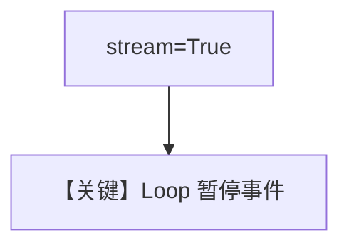

# 02_loop_confirmation_streaming.py — 实现原理分析

> 源文件：`cookbook/04_workflows/_07_human_in_the_loop/loop/02_loop_confirmation_streaming.py`

## 概述

本示例为 **流式** 的 Loop 起始确认：事件流中可观察 **Loop 级暂停**，与 `01_loop_confirmation` 逻辑一致。

## Mermaid 流程图

## 关键源码文件索引

| 文件 | 作用 |
|------|------|
| `agno/workflow/workflow.py` | 流式事件 |
