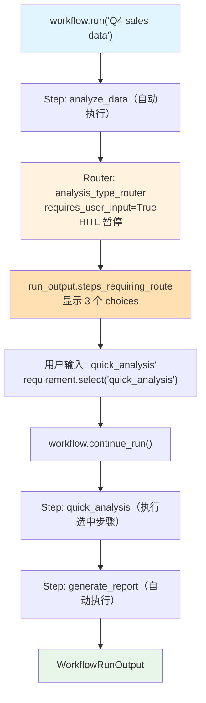

# 01_router_user_selection.md — 实现原理分析

> 源文件：`cookbook/04_workflows/_07_human_in_the_loop/router/01_router_user_selection.py`

## 概述

本示例展示 Agno Workflow **`Router` 的 HITL 用户路由选择**机制：通过 `Router(requires_user_input=True)` 将路由决策权交给用户，用户在运行时从 `choices` 列表中选择要执行的步骤，实现人工驱动的交互式工作流决策树。

**核心配置一览：**

| 配置项 | 值 | 说明 |
|--------|------|------|
| `Router.requires_user_input` | `True` | 启用 Router HITL |
| `Router.user_input_message` | 提示文本 | 显示给用户的选择提示 |
| `Router.allow_multiple_selections` | `False` | 是否允许多选 |
| `run_output.steps_requiring_route` | 列表 | 等待路由选择的 Router |
| `requirement.select(choice_name)` | 方法 | 设置用户选择 |
| `requirement.available_choices` | 列表 | 可选的步骤名称列表 |

## 核心组件解析

### Router HITL 配置

```python
analysis_router = Router(
    name="analysis_type_router",
    choices=[
        Step(
            name="quick_analysis",
            description="Fast analysis with basic insights (2 min)",
            executor=quick_analysis,
        ),
        Step(
            name="deep_analysis",
            description="Comprehensive analysis with full details (10 min)",
            executor=deep_analysis,
        ),
        Step(
            name="custom_analysis",
            description="Custom analysis with your parameters",
            executor=custom_analysis,
        ),
    ],
    requires_user_input=True,                           # 启用 HITL
    user_input_message="Select the type of analysis:",  # 提示文本
    allow_multiple_selections=False,                    # 单选
)
```

### HITL 交互处理

```python
run_output = workflow.run("Q4 sales data")

while run_output.is_paused:
    for requirement in run_output.steps_requiring_route:
        print(f"\n[DECISION POINT] Router: {requirement.step_name}")
        print(f"[HITL] {requirement.user_input_message}")

        # 显示可选项
        for choice in requirement.available_choices:
            print(f"  - {choice}")

        # 用户选择
        selection = input("Enter your choice: ").strip()
        requirement.select(selection)  # 设置选择

    run_output = workflow.continue_run(run_output)
```

### custom_analysis 使用用户附加输入

```python
def custom_analysis(step_input: StepInput) -> StepOutput:
    # custom 步骤可读取用户在 Router 选择时附加的输入
    user_input = step_input.additional_data.get("user_input", {}) if step_input.additional_data else {}
    params = user_input.get("custom_params", "default parameters")
    return StepOutput(content=f"Custom analysis with params: {params}")
```

## Mermaid 流程图



## 关键源码文件索引

| 文件 | 关键类/函数 | 作用 |
|------|------------|------|
| `agno/workflow/router.py` | `Router.requires_user_input` | 启用 Router HITL |
| `agno/workflow/types.py` | `StepRequirement.select()` | 用户路由选择接口 |
| `agno/workflow/types.py` | `WorkflowRunOutput.steps_requiring_route` | 等待路由选择的列表 |
