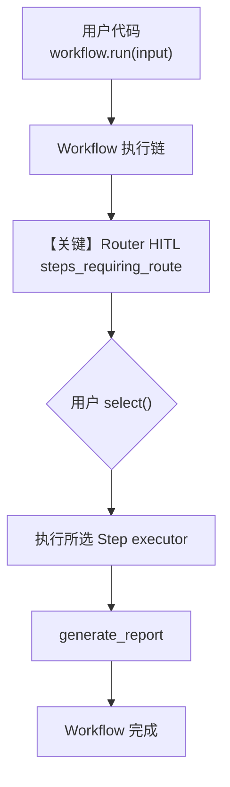

# 01_router_user_selection.py — 实现原理分析

<!-- cookbook-py-source:start -->
## 完整源码

```python
"""
Router with User Selection HITL Example

This example demonstrates how to create a user-driven decision tree using
a Router where the user selects which path to take at runtime.

The Router with HITL pattern is powerful for:
- Interactive wizards
- User-driven workflows
- Decision trees with human judgment
- Dynamic routing based on user preferences

Flow:
1. Analyze data (automatic step)
2. User chooses analysis type via Router HITL
3. Execute the chosen analysis path
4. Generate report (automatic step)
"""

from agno.db.sqlite import SqliteDb
from agno.workflow.router import Router
from agno.workflow.step import Step
from agno.workflow.types import StepInput, StepOutput
from agno.workflow.workflow import Workflow


# ============================================================
# Step 1: Analyze data (automatic)
# ============================================================
def analyze_data(step_input: StepInput) -> StepOutput:
    """Analyze the data and provide options."""
    user_query = step_input.input or "data"
    return StepOutput(
        content=f"Analysis complete for '{user_query}':\n"
        "- Found 1000 records\n"
        "- Data quality: Good\n"
        "- Ready for processing\n\n"
        "Please choose how you'd like to proceed."
    )


# ============================================================
# Router Choice Steps
# ============================================================
def quick_analysis(step_input: StepInput) -> StepOutput:
    """Perform quick analysis."""
    return StepOutput(
        content="Quick Analysis Results:\n"
        "- Summary statistics computed\n"
        "- Basic trends identified\n"
        "- Processing time: 2 minutes\n"
        "- Confidence: 85%"
    )


def deep_analysis(step_input: StepInput) -> StepOutput:
    """Perform deep analysis."""
    return StepOutput(
        content="Deep Analysis Results:\n"
        "- Comprehensive statistical analysis\n"
        "- Pattern recognition applied\n"
        "- Anomaly detection completed\n"
        "- Correlation matrix generated\n"
        "- Processing time: 10 minutes\n"
        "- Confidence: 97%"
    )


def custom_analysis(step_input: StepInput) -> StepOutput:
    """Perform custom analysis based on user preferences."""
    user_input = (
        step_input.additional_data.get("user_input", {})
        if step_input.additional_data
        else {}
    )
    params = user_input.get("custom_params", "default parameters")

    return StepOutput(
        content=f"Custom Analysis Results:\n"
        f"- Custom parameters applied: {params}\n"
        "- Tailored analysis completed\n"
        "- Processing time: varies\n"
        "- Confidence: based on parameters"
    )


# ============================================================
# Step 4: Generate report (automatic)
# ============================================================
def generate_report(step_input: StepInput) -> StepOutput:
    """Generate final report."""
    analysis_results = step_input.previous_step_content or "No results"
    return StepOutput(
        content=f"=== FINAL REPORT ===\n\n{analysis_results}\n\n"
        "Report generated successfully.\n"
        "Thank you for using the analysis workflow!"
    )


# Define the analysis step
analyze_step = Step(name="analyze_data", executor=analyze_data)

# Define the Router with HITL - user selects which analysis to perform
analysis_router = Router(
    name="analysis_type_router",
    choices=[
        Step(
            name="quick_analysis",
            description="Fast analysis with basic insights (2 min)",
            executor=quick_analysis,
        ),
        Step(
            name="deep_analysis",
            description="Comprehensive analysis with full details (10 min)",
            executor=deep_analysis,
        ),
        Step(
            name="custom_analysis",
            description="Custom analysis with your parameters",
            executor=custom_analysis,
        ),
    ],
    requires_user_input=True,
    user_input_message="Select the type of analysis to perform:",
    allow_multiple_selections=False,  # Only one analysis type at a time
)

# Define the report step
report_step = Step(name="generate_report", executor=generate_report)

# Create workflow
workflow = Workflow(
    name="user_driven_analysis",
    db=SqliteDb(db_file="tmp/workflow_router_hitl.db"),
    steps=[analyze_step, analysis_router, report_step],
)

if __name__ == "__main__":
    print("=" * 60)
    print("User-Driven Analysis Workflow with Router HITL")
    print("=" * 60)

    run_output = workflow.run("Q4 sales data")

    # Handle HITL pauses
    while run_output.is_paused:
        # Handle Router requirements (user selection)
        # with requires_route_selection=True
        for requirement in run_output.steps_requiring_route:
            print(f"\n[DECISION POINT] Router: {requirement.step_name}")
            print(f"[HITL] {requirement.user_input_message}")

            # Show available choices
            print("\nAvailable options:")
            for choice in requirement.available_choices or []:
                print(f"  - {choice}")

            # Get user selection
            selection = input("\nEnter your choice: ").strip()
            if selection:
                requirement.select(selection)
                print(f"\n[HITL] Selected: {selection}")

        # Handle Step requirements (confirmation or user input)
        for requirement in run_output.steps_requiring_user_input:
            print(f"\n[HITL] Step: {requirement.step_name}")
            print(f"[HITL] {requirement.user_input_message}")

            if requirement.user_input_schema:
                user_values = {}
                for field in requirement.user_input_schema:
                    required_marker = "*" if field.required else ""
                    if field.description:
                        print(f"  ({field.description})")
                    value = input(f"{field.name}{required_marker}: ").strip()
                    if value:
                        user_values[field.name] = value
                requirement.set_user_input(**user_values)

        for requirement in run_output.steps_requiring_confirmation:
            print(
                f"\n[HITL] {requirement.step_name}: {requirement.confirmation_message}"
            )
            if input("Continue? (yes/no): ").strip().lower() in ("yes", "y"):
                requirement.confirm()
            else:
                requirement.reject()

        run_output = workflow.continue_run(run_output)

    print("\n" + "=" * 60)
    print(f"Status: {run_output.status}")
    print("=" * 60)
    print(run_output.content)
```

<!-- cookbook-py-source:end -->

> 源文件：`cookbook/04_workflows/_07_human_in_the_loop/router/01_router_user_selection.py`

## 概述

本示例展示 Agno 的 **Workflow + Router HITL（用户选择路由）** 机制：在自动分析步骤之后暂停，由用户在多个 `Step` 候选中**手动选择**一条分析路径，再继续生成报告。

**核心配置一览：**

| 配置项 | 值 | 说明 |
|--------|------|------|
| `Workflow.name` | `"user_driven_analysis"` | 工作流名称 |
| `Workflow.db` | `SqliteDb(db_file="tmp/workflow_router_hitl.db")` | 会话/HITL 持久化 |
| `Workflow.steps` | `[analyze_step, analysis_router, report_step]` | 分析 → 路由 → 报告 |
| `Router.name` | `"analysis_type_router"` | 路由器名称 |
| `Router.choices` | 三个 `Step`（quick/deep/custom） | 可选分析分支 |
| `Router.requires_user_input` | `True` | 需用户选路 |
| `Router.user_input_message` | `"Select the type of analysis to perform:"` | 选路提示 |
| `Router.allow_multiple_selections` | `False` | 单次只能选一条 |
| `Agent` | 无 | 本文件未使用 LLM Agent |

## 架构分层

```
用户代码层                agno.workflow 层
┌──────────────────┐    ┌──────────────────────────────────┐
│ 01_router_...py  │    │ Workflow.run() / continue_run() │
│ workflow.run()   │───>│  执行 Step / Router              │
│ input() 选路     │    │  Router HITL → steps_requiring_  │
│ requirement.     │    │    route + select()              │
│   select()       │    │  SqliteDb 持久化暂停状态          │
└──────────────────┘    └──────────────────────────────────┘
                                │
                                ▼
                        （无统一 LLM；纯函数 StepOutput）
```

## 核心组件解析

### Workflow 与 HITL 循环

`Workflow`（`agno/workflow/workflow.py` 中 `run` / `continue_run`）驱动步骤顺序执行；当 `Router` 需要用户选路时，`RunOutput` 置为暂停，`steps_requiring_route` 列出待满足的选路要求。用户代码在 `while run_output.is_paused` 中调用 `requirement.select(selection)`，再 `workflow.continue_run(run_output)` 恢复执行。

### Router 用户选择模式

`Router`（`agno/workflow/router.py` `L45` 起）在 `requires_user_input=True` 时进入 HITL：**不调用** `selector` 自动选路，而是暂停并暴露 `available_choices`；用户选定后执行对应 `Step` 的 `executor`。

### StepInput / StepOutput 数据流

各 `executor` 接收 `StepInput`，返回 `StepOutput(content=...)`。`custom_analysis` 从 `step_input.additional_data["user_input"]` 读取可选参数（若上游注入）。

### 运行机制与因果链

1. **数据路径**：`workflow.run("Q4 sales data")` → `analyze_data` 产出文本 → `Router` 暂停 → 终端 `input` → `select` → `continue_run` → 执行所选分析 Step → `generate_report` 汇总 `previous_step_content`。
2. **状态与副作用**：`SqliteDb` 写入工作流会话，便于暂停/续跑；无 Agent session、无知识库。
3. **关键分支**：`requires_user_input=True` 时走「用户选路」；若为 `requires_confirmation` 或纯 `selector` 自动路由则不同（见同目录其他示例）。
4. **与相邻示例差异**：相对 `02_router_multi_selection.py`，本例 **`allow_multiple_selections=False`**，一次只能选一个分支。

## System Prompt 组装

本示例**不存在**针对整个 Workflow 的单一 `Agent.get_system_message()`。提示词仅出现在：

- `Router.user_input_message`（面向**人类操作者**的 CLI 提示，不进入任何 LLM）
- 各 `StepOutput.content` 中的演示字符串（步骤间传递的业务文本，非模型 system）

### 拼装顺序与源码锚点

不适用 OpenAI/Agent 的 `_messages.py` 默认拼装链。若将来某 `Step` 绑定 `agent=Agent(...)`，system 文本才由该 Step 内 Agent 的 `get_system_message()` 生成。

### 还原后的完整 System 文本

```text
（无 LLM Agent 参与本脚本演示路径；无面向模型的 system 文本可静态还原。）
```

### 段落释义（模型视角）

不适用：本文件演示路径下无 Chat Completions 请求。

### 与 User / Developer 消息的边界

不适用。

## 完整 API 请求

本示例主路径**不调用**大模型 API。步骤函数仅返回字符串 `StepOutput`。若扩展为 Agent 步骤，需按该 `Agent` 的 `Model` 子类查看 `invoke`/`ainvoke`（例如 `OpenAIChat` → Chat Completions）。

```python
# 本文件当前无等价 LLM 请求；占位说明：
# 若 report_step 改为 agent=Agent(model=OpenAIChat(...))，
# 则一次 run 会构造 messages=[system?, user,...] 发往 chat.completions.create
```

## Mermaid 流程图


```mermaid
flowchart TD
    A["用户代码<br/>workflow.run(input)"] --> B["Workflow 执行链"]
    B --> C["【关键】Router HITL<br/>steps_requiring_route"]
    C --> D{"用户 select()"}
    D --> E["执行所选 Step executor"]
    E --> F["generate_report"]
    F --> G["Workflow 完成"]
```

- **【关键】Router HITL**：演示用户在运行时选定 `quick_analysis` / `deep_analysis` / `custom_analysis` 之一。

## 关键源码文件索引

| 文件 | 关键函数/类 | 作用 |
|------|------------|------|
| `agno/workflow/workflow.py` | `Workflow.run()` L6366 起 | 启动工作流、产生暂停状态 |
| `agno/workflow/workflow.py` | `Workflow.continue_run()` L4312 起 | HITL 满足后继续 |
| `agno/workflow/router.py` | `Router` L45-107 | HITL 选路/确认等字段定义 |
| `agno/workflow/types.py` | `StepInput` / `StepOutput` | 步骤输入输出契约 |
