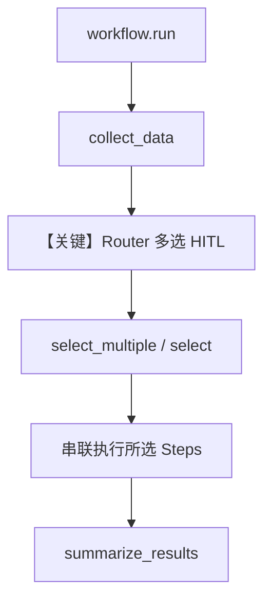

# 02_router_multi_selection.py — 实现原理分析

> 源文件：`cookbook/04_workflows/_07_human_in_the_loop/router/02_router_multi_selection.py`

## 概述

本示例展示 Agno 的 **Router HITL 多选** 机制：用户可通过逗号分隔一次选择**多个**处理步骤，`Router` 按顺序串联执行所选 `Step`（`allow_multiple_selections=True`）。

**核心配置一览：**

| 配置项 | 值 | 说明 |
|--------|------|------|
| `Workflow.name` | `"multi_step_processing"` | 工作流名称 |
| `Workflow.db` | `SqliteDb(db_file="tmp/workflow_router_multi.db")` | 持久化 |
| `Router.name` | `"processing_pipeline"` | 路由器名称 |
| `Router.choices` | 5 个 `Step`（clean/validate/enrich/transform/aggregate） | 可选处理步骤 |
| `Router.requires_user_input` | `True` | 用户选路 |
| `Router.allow_multiple_selections` | `True` | **允许多选** |
| `Router.user_input_message` | `"Select processing steps to apply (comma-separated for multiple):"` | 多选提示 |
| `Agent` | 无 | 无 LLM |

## 架构分层

```
用户代码层                agno.workflow 层
┌──────────────────┐    ┌──────────────────────────────────┐
│ workflow.run()   │───>│ collect_data → Router 暂停        │
│ select_multiple  │    │  或 select() 单条                 │
│  / select()      │    │  → 多 Step 链式执行 → summarize   │
└──────────────────┘    └──────────────────────────────────┘
```

## 核心组件解析

### select 与 select_multiple

脚本在 `allow_multiple_selections` 为真时，对用户输入按逗号拆分；若多于一个选项则调用 `requirement.select_multiple(selections)`，否则 `requirement.select(selections[0])`。这与 `01_router_user_selection.md` 中单选 `select` 形成对比。

### 运行机制与因果链

1. **数据路径**：输入字符串经 `collect_data` → Router 暂停 → 用户输入如 `clean, validate, transform` → 框架按选择顺序执行各 `executor`，内容在 `previous_step_content` 中累积 → `summarize_results` 输出全文。
2. **状态**：`SqliteDb` 持久化；无 Agent DB。
3. **分支**：多选走 `select_multiple`；单 token 走 `select`。
4. **差异**：相对 `01`，本文件核心是多选与串联执行语义。

## System Prompt 组装

无全局 Agent。`user_input_message` 与 `StepOutput.content` 均不进入 LLM system。不适用 `get_system_message()` 默认链。

### 还原后的完整 System 文本

```text
（无 LLM；无 model system 文本。）
```

### 段落释义

不适用。

### 与 User 消息边界

不适用。

## 完整 API 请求

无大模型调用。

```python
# 本示例无 chat.completions / responses 调用
```

## Mermaid 流程图



## 关键源码文件索引

| 文件 | 关键函数/类 | 作用 |
|------|------------|------|
| `agno/workflow/router.py` | `Router` L45+ | `allow_multiple_selections` 等 |
| `agno/workflow/workflow.py` | `Workflow.run` / `continue_run` | 执行与续跑 |
