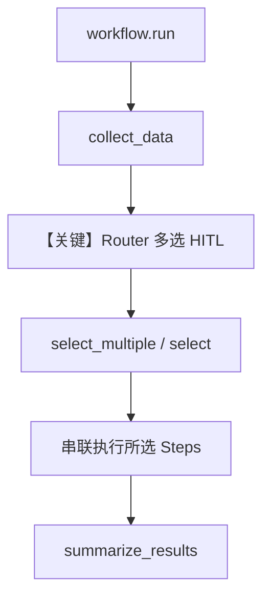

# 02_router_multi_selection.py — 实现原理分析

<!-- cookbook-py-source:start -->
## 完整源码

```python
"""
Router with Multiple Selection HITL Example

This example demonstrates how to let users select MULTIPLE paths to execute
in sequence using a Router with allow_multiple_selections=True.

Use cases:
- Build-your-own pipeline (user picks which analyses to run)
- Multi-step processing where user controls the steps
- Customizable workflows with optional components

Flow:
1. Collect data (automatic)
2. User selects one or more processing steps via Router HITL
3. Execute ALL selected steps in sequence (chained)
4. Summarize results (automatic)
"""

from agno.db.sqlite import SqliteDb
from agno.workflow.router import Router
from agno.workflow.step import Step
from agno.workflow.types import StepInput, StepOutput
from agno.workflow.workflow import Workflow


# ============================================================
# Step 1: Collect data (automatic)
# ============================================================
def collect_data(step_input: StepInput) -> StepOutput:
    """Collect and prepare data for processing."""
    user_query = step_input.input or "dataset"
    return StepOutput(
        content=f"Data collected for '{user_query}':\n"
        "- 5000 records loaded\n"
        "- Schema validated\n"
        "- Ready for processing\n\n"
        "Select which processing steps to apply (you can choose multiple)."
    )


# ============================================================
# Router Choice Steps - User can select multiple
# ============================================================
def clean_data(step_input: StepInput) -> StepOutput:
    """Clean and normalize the data."""
    prev = step_input.previous_step_content or ""
    return StepOutput(
        content=f"{prev}\n\n[CLEANING]\n"
        "- Removed 150 duplicate records\n"
        "- Fixed 23 null values\n"
        "- Standardized date formats\n"
        "- Data cleaning complete"
    )


def validate_data(step_input: StepInput) -> StepOutput:
    """Validate data integrity."""
    prev = step_input.previous_step_content or ""
    return StepOutput(
        content=f"{prev}\n\n[VALIDATION]\n"
        "- Schema validation: PASSED\n"
        "- Referential integrity: PASSED\n"
        "- Business rules check: PASSED\n"
        "- Data validation complete"
    )


def enrich_data(step_input: StepInput) -> StepOutput:
    """Enrich data with additional information."""
    prev = step_input.previous_step_content or ""
    return StepOutput(
        content=f"{prev}\n\n[ENRICHMENT]\n"
        "- Added geographic coordinates\n"
        "- Appended demographic data\n"
        "- Calculated derived metrics\n"
        "- Data enrichment complete"
    )


def transform_data(step_input: StepInput) -> StepOutput:
    """Transform data for analysis."""
    prev = step_input.previous_step_content or ""
    return StepOutput(
        content=f"{prev}\n\n[TRANSFORMATION]\n"
        "- Normalized numeric columns\n"
        "- One-hot encoded categories\n"
        "- Created feature vectors\n"
        "- Data transformation complete"
    )


def aggregate_data(step_input: StepInput) -> StepOutput:
    """Aggregate data for reporting."""
    prev = step_input.previous_step_content or ""
    return StepOutput(
        content=f"{prev}\n\n[AGGREGATION]\n"
        "- Grouped by region and time\n"
        "- Calculated summary statistics\n"
        "- Built pivot tables\n"
        "- Data aggregation complete"
    )


# ============================================================
# Step 4: Summarize results (automatic)
# ============================================================
def summarize_results(step_input: StepInput) -> StepOutput:
    """Generate final summary."""
    processing_results = step_input.previous_step_content or "No processing performed"
    return StepOutput(
        content=f"=== PROCESSING SUMMARY ===\n\n{processing_results}\n\n"
        "=== END OF PIPELINE ===\n"
        "All selected processing steps completed successfully."
    )


# Define steps
collect_step = Step(name="collect_data", executor=collect_data)

# Define the Router with HITL - user can select MULTIPLE steps
processing_router = Router(
    name="processing_pipeline",
    choices=[
        Step(
            name="clean",
            description="Clean and normalize data (remove duplicates, fix nulls)",
            executor=clean_data,
        ),
        Step(
            name="validate",
            description="Validate data integrity and business rules",
            executor=validate_data,
        ),
        Step(
            name="enrich",
            description="Enrich with external data sources",
            executor=enrich_data,
        ),
        Step(
            name="transform",
            description="Transform for ML/analysis (normalize, encode)",
            executor=transform_data,
        ),
        Step(
            name="aggregate",
            description="Aggregate for reporting (group, summarize)",
            executor=aggregate_data,
        ),
    ],
    requires_user_input=True,
    user_input_message="Select processing steps to apply (comma-separated for multiple):",
    allow_multiple_selections=True,  # KEY: Allow selecting multiple steps
)

summary_step = Step(name="summarize", executor=summarize_results)

# Create workflow
workflow = Workflow(
    name="multi_step_processing",
    db=SqliteDb(db_file="tmp/workflow_router_multi.db"),
    steps=[collect_step, processing_router, summary_step],
)

if __name__ == "__main__":
    print("=" * 60)
    print("Multi-Selection Router HITL Example")
    print("=" * 60)

    run_output = workflow.run("customer transactions")

    # Handle HITL pauses
    while run_output.is_paused:
        # Handle Router requirements (user selection)
        # Note: Router selection requirements are now unified into step_requirements
        for requirement in run_output.steps_requiring_route:
            print(f"\n[DECISION POINT] Router: {requirement.step_name}")
            print(f"[HITL] {requirement.user_input_message}")

            # Show available choices with descriptions
            print("\nAvailable processing steps:")
            for i, choice in enumerate(requirement.available_choices or [], 1):
                print(f"  {i}. {choice}")

            if requirement.allow_multiple_selections:
                print("\nTip: Enter multiple choices separated by commas")
                print("Example: clean, validate, transform")

            # Get user selection(s)
            selection = input("\nEnter your choice(s): ").strip()
            if selection:
                # Handle comma-separated selections
                selections = [s.strip() for s in selection.split(",")]
                if len(selections) > 1:
                    requirement.select_multiple(
                        selections
                    )  # Use select_multiple for list
                    print(f"\n[HITL] Selected {len(selections)} steps: {selections}")
                else:
                    requirement.select(selections[0])  # Single selection
                    print(f"\n[HITL] Selected: {selections[0]}")

        # Handle Step requirements if any
        for requirement in run_output.steps_requiring_user_input:
            print(f"\n[HITL] Step: {requirement.step_name}")
            print(f"[HITL] {requirement.user_input_message}")
            if requirement.user_input_schema:
                user_values = {}
                for field in requirement.user_input_schema:
                    value = input(f"{field.name}: ").strip()
                    if value:
                        user_values[field.name] = value
                requirement.set_user_input(**user_values)

        for requirement in run_output.steps_requiring_confirmation:
            print(
                f"\n[HITL] {requirement.step_name}: {requirement.confirmation_message}"
            )
            if input("Continue? (yes/no): ").strip().lower() in ("yes", "y"):
                requirement.confirm()
            else:
                requirement.reject()

        run_output = workflow.continue_run(run_output)

    print("\n" + "=" * 60)
    print(f"Status: {run_output.status}")
    print("=" * 60)
    print(run_output.content)
```

<!-- cookbook-py-source:end -->

> 源文件：`cookbook/04_workflows/_07_human_in_the_loop/router/02_router_multi_selection.py`

## 概述

本示例展示 Agno 的 **Router HITL 多选** 机制：用户可通过逗号分隔一次选择**多个**处理步骤，`Router` 按顺序串联执行所选 `Step`（`allow_multiple_selections=True`）。

**核心配置一览：**

| 配置项 | 值 | 说明 |
|--------|------|------|
| `Workflow.name` | `"multi_step_processing"` | 工作流名称 |
| `Workflow.db` | `SqliteDb(db_file="tmp/workflow_router_multi.db")` | 持久化 |
| `Router.name` | `"processing_pipeline"` | 路由器名称 |
| `Router.choices` | 5 个 `Step`（clean/validate/enrich/transform/aggregate） | 可选处理步骤 |
| `Router.requires_user_input` | `True` | 用户选路 |
| `Router.allow_multiple_selections` | `True` | **允许多选** |
| `Router.user_input_message` | `"Select processing steps to apply (comma-separated for multiple):"` | 多选提示 |
| `Agent` | 无 | 无 LLM |

## 架构分层

```
用户代码层                agno.workflow 层
┌──────────────────┐    ┌──────────────────────────────────┐
│ workflow.run()   │───>│ collect_data → Router 暂停        │
│ select_multiple  │    │  或 select() 单条                 │
│  / select()      │    │  → 多 Step 链式执行 → summarize   │
└──────────────────┘    └──────────────────────────────────┘
```

## 核心组件解析

### select 与 select_multiple

脚本在 `allow_multiple_selections` 为真时，对用户输入按逗号拆分；若多于一个选项则调用 `requirement.select_multiple(selections)`，否则 `requirement.select(selections[0])`。这与 `01_router_user_selection.md` 中单选 `select` 形成对比。

### 运行机制与因果链

1. **数据路径**：输入字符串经 `collect_data` → Router 暂停 → 用户输入如 `clean, validate, transform` → 框架按选择顺序执行各 `executor`，内容在 `previous_step_content` 中累积 → `summarize_results` 输出全文。
2. **状态**：`SqliteDb` 持久化；无 Agent DB。
3. **分支**：多选走 `select_multiple`；单 token 走 `select`。
4. **差异**：相对 `01`，本文件核心是多选与串联执行语义。

## System Prompt 组装

无全局 Agent。`user_input_message` 与 `StepOutput.content` 均不进入 LLM system。不适用 `get_system_message()` 默认链。

### 还原后的完整 System 文本

```text
（无 LLM；无 model system 文本。）
```

### 段落释义

不适用。

### 与 User 消息边界

不适用。

## 完整 API 请求

无大模型调用。

```python
# 本示例无 chat.completions / responses 调用
```

## Mermaid 流程图



## 关键源码文件索引

| 文件 | 关键函数/类 | 作用 |
|------|------------|------|
| `agno/workflow/router.py` | `Router` L45+ | `allow_multiple_selections` 等 |
| `agno/workflow/workflow.py` | `Workflow.run` / `continue_run` | 执行与续跑 |
