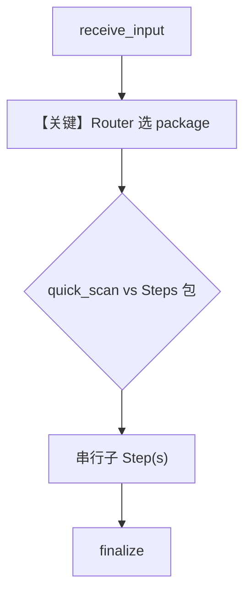

# 03_router_nested_choices.py — 实现原理分析

<!-- cookbook-py-source:start -->
## 完整源码

```python
"""
Router with Nested Choices HITL Example

This example demonstrates how to use HITL with nested step lists in Router choices.
When choices contain nested lists like [step_a, [step_b, step_c]], the nested list
becomes a Steps container that executes ALL steps in sequence when selected.

Use cases:
- Pre-defined pipelines that user can choose from
- "Packages" of processing steps (e.g., "Basic", "Standard", "Premium")
- Workflow templates where user picks a complete flow

Flow:
1. Receive input (automatic)
2. User selects a processing package (single step OR a sequence of steps)
3. Execute the selected package (if nested, all steps run in sequence)
4. Generate output (automatic)

Key concept:
- choices=[step_a, [step_b, step_c], step_d]
  - "step_a" -> executes just step_a
  - "steps_group_1" -> executes step_b THEN step_c (chained)
  - "step_d" -> executes just step_d
"""

from agno.db.sqlite import SqliteDb
from agno.workflow.router import Router
from agno.workflow.step import Step
from agno.workflow.steps import Steps
from agno.workflow.types import StepInput, StepOutput
from agno.workflow.workflow import Workflow


# ============================================================
# Step 1: Receive input (automatic)
# ============================================================
def receive_input(step_input: StepInput) -> StepOutput:
    """Receive and validate input."""
    user_query = step_input.input or "document"
    return StepOutput(
        content=f"Input received: '{user_query}'\n"
        "Ready for processing.\n\n"
        "Please select a processing package."
    )


# ============================================================
# Individual processing steps
# ============================================================
def quick_scan(step_input: StepInput) -> StepOutput:
    """Quick scan - fast but basic."""
    prev = step_input.previous_step_content or ""
    return StepOutput(
        content=f"{prev}\n\n[QUICK SCAN]\n"
        "- Surface-level analysis\n"
        "- Key points extracted\n"
        "- Processing time: 30 seconds"
    )


def deep_analysis(step_input: StepInput) -> StepOutput:
    """Deep analysis - thorough examination."""
    prev = step_input.previous_step_content or ""
    return StepOutput(
        content=f"{prev}\n\n[DEEP ANALYSIS]\n"
        "- Comprehensive examination\n"
        "- Pattern detection applied\n"
        "- Processing time: 5 minutes"
    )


def quality_check(step_input: StepInput) -> StepOutput:
    """Quality check - verify results."""
    prev = step_input.previous_step_content or ""
    return StepOutput(
        content=f"{prev}\n\n[QUALITY CHECK]\n"
        "- Results validated\n"
        "- Accuracy verified: 98%\n"
        "- Processing time: 1 minute"
    )


def format_output(step_input: StepInput) -> StepOutput:
    """Format output - prepare final results."""
    prev = step_input.previous_step_content or ""
    return StepOutput(
        content=f"{prev}\n\n[FORMAT OUTPUT]\n"
        "- Results formatted\n"
        "- Report generated\n"
        "- Processing time: 30 seconds"
    )


def archive_results(step_input: StepInput) -> StepOutput:
    """Archive results - store for future reference."""
    prev = step_input.previous_step_content or ""
    return StepOutput(
        content=f"{prev}\n\n[ARCHIVE]\n"
        "- Results archived\n"
        "- Backup created\n"
        "- Processing time: 15 seconds"
    )


# ============================================================
# Final step (automatic)
# ============================================================
def finalize(step_input: StepInput) -> StepOutput:
    """Finalize and return results."""
    results = step_input.previous_step_content or "No processing performed"
    return StepOutput(
        content=f"=== FINAL RESULTS ===\n\n{results}\n\n=== PROCESSING COMPLETE ==="
    )


# Define individual steps
quick_scan_step = Step(
    name="quick_scan", description="Fast surface-level scan (30s)", executor=quick_scan
)

# Define step sequences as Steps containers with descriptive names
standard_package = Steps(
    name="standard_package",
    description="Standard processing: Deep Analysis + Quality Check (6 min)",
    steps=[
        Step(name="deep_analysis", executor=deep_analysis),
        Step(name="quality_check", executor=quality_check),
    ],
)

premium_package = Steps(
    name="premium_package",
    description="Premium processing: Deep Analysis + Quality Check + Format + Archive (8 min)",
    steps=[
        Step(name="deep_analysis", executor=deep_analysis),
        Step(name="quality_check", executor=quality_check),
        Step(name="format_output", executor=format_output),
        Step(name="archive_results", executor=archive_results),
    ],
)

# Create workflow with Router HITL
# User can select:
# - "quick_scan" -> runs just quick_scan
# - "standard_package" -> runs deep_analysis THEN quality_check
# - "premium_package" -> runs deep_analysis THEN quality_check THEN format_output THEN archive_results
workflow = Workflow(
    name="package_selection_workflow",
    db=SqliteDb(db_file="tmp/workflow_router_nested.db"),
    steps=[
        Step(name="receive_input", executor=receive_input),
        Router(
            name="package_selector",
            choices=[
                quick_scan_step,  # Single step
                standard_package,  # Steps container (2 steps)
                premium_package,  # Steps container (4 steps)
            ],
            requires_user_input=True,
            user_input_message="Select a processing package:",
            allow_multiple_selections=False,  # Pick ONE package
        ),
        Step(name="finalize", executor=finalize),
    ],
)

# Alternative: Using nested lists directly (auto-converted to Steps containers)
# Note: Auto-generated names like "steps_group_0" are less descriptive
workflow_with_nested_lists = Workflow(
    name="nested_list_workflow",
    db=SqliteDb(db_file="tmp/workflow_router_nested_alt.db"),
    steps=[
        Step(name="receive_input", executor=receive_input),
        Router(
            name="package_selector",
            choices=[
                Step(
                    name="quick_scan",
                    description="Fast scan (30s)",
                    executor=quick_scan,
                ),
                # Nested list -> becomes "steps_group_1" Steps container
                [
                    Step(name="deep_analysis", executor=deep_analysis),
                    Step(name="quality_check", executor=quality_check),
                ],
                # Nested list -> becomes "steps_group_2" Steps container
                [
                    Step(name="deep_analysis", executor=deep_analysis),
                    Step(name="quality_check", executor=quality_check),
                    Step(name="format_output", executor=format_output),
                    Step(name="archive_results", executor=archive_results),
                ],
            ],
            requires_user_input=True,
            user_input_message="Select a processing option:",
        ),
        Step(name="finalize", executor=finalize),
    ],
)

if __name__ == "__main__":
    print("=" * 60)
    print("Router with Nested Choices (Pre-defined Packages)")
    print("=" * 60)
    print("\nThis example shows how to offer 'packages' of steps.")
    print("Each package can be a single step or a sequence of steps.\n")

    run_output = workflow.run("quarterly report")

    # Handle HITL pauses
    while run_output.is_paused:
        # Handle Router requirements (user selection)
        for requirement in run_output.steps_requiring_route:
            print(f"\n[DECISION POINT] {requirement.step_name}")
            print(f"[HITL] {requirement.user_input_message}")

            # Show available packages
            print("\nAvailable packages:")
            for i, choice in enumerate(requirement.available_choices or [], 1):
                # Get description if available from the router's choices
                print(f"  {i}. {choice}")

            print("\nPackage details:")
            print("  - quick_scan: Fast surface-level scan (30s)")
            print("  - standard_package: Deep Analysis + Quality Check (6 min)")
            print("  - premium_package: Full pipeline with archiving (8 min)")

            selection = input("\nEnter your choice: ").strip()
            if selection:
                requirement.select(selection)
                print(f"\n[HITL] Selected package: {selection}")

        for requirement in run_output.steps_requiring_confirmation:
            print(
                f"\n[HITL] {requirement.step_name}: {requirement.confirmation_message}"
            )
            if input("Continue? (yes/no): ").strip().lower() in ("yes", "y"):
                requirement.confirm()
            else:
                requirement.reject()

        run_output = workflow.continue_run(run_output)

    print("\n" + "=" * 60)
    print(f"Status: {run_output.status}")
    print("=" * 60)
    print(run_output.content)
```

<!-- cookbook-py-source:end -->

> 源文件：`cookbook/04_workflows/_07_human_in_the_loop/router/03_router_nested_choices.py`

## 概述

本示例展示 Agno **Router 嵌套选项**：`choices` 中既可放单个 `Step`，也可放 `Steps` 容器（或嵌套 list，自动转为 `Steps`），选中后按包内顺序**串行**执行多条子步骤。

**核心配置一览：**

| 配置项 | 值 | 说明 |
|--------|------|------|
| `Workflow`（主示例） | `name="package_selection_workflow"`，`db=SqliteDb("tmp/workflow_router_nested.db")` | 主演示工作流 |
| `Router.choices` | `quick_scan_step`, `standard_package`, `premium_package` | 单步或 `Steps` 包 |
| `Steps` | `standard_package` / `premium_package` | 命名子流水线 |
| `Router.requires_user_input` | `True` | 用户选包 |
| `Router.allow_multiple_selections` | `False` | 单包 |
| `workflow_with_nested_lists` | 第二个 `Workflow` | 嵌套 list 自动转 `Steps` 的替代写法 |
| `Agent` | 无 | 无 LLM |

## 架构分层

```
用户代码层                agno.workflow 层
┌──────────────────┐    ┌──────────────────────────────────┐
│ 选 quick_scan 或  │    │ Router 解析 choices：            │
│  standard/premium│───>│  Steps 内多 Step 顺序执行        │
│ package          │    │  finalize 汇总 previous_content   │
└──────────────────┘    └──────────────────────────────────┘
```

## 核心组件解析

### Steps 与嵌套 list

`Steps`（`agno.workflow.steps`）将多个 `Step` 打包为一个可选「套餐」。`workflow_with_nested_lists` 注释说明裸 list 会生成如 `steps_group_0` 等自动命名，可读性弱于显式 `Steps(name=...)`。

### 运行机制与因果链

1. **路径**：`receive_input` → Router 暂停 → 用户输入包名 → 执行单 `Step` 或 `Steps` 内链 → `finalize`。
2. **状态**：双库文件（主/alt 各一个 `SqliteDb`）；`__main__` 仅 `run` 主 `workflow`。
3. **分支**：三选一 package；与多选 Router 不同。
4. **差异**：相对 `01/02`，本例强调 **Steps 容器 = 预定义子流水线**。

## System Prompt 组装

无 Agent。不适用 LLM system 拼装。

### 还原后的完整 System 文本

```text
（无 LLM。）
```

### 段落释义

不适用。

## 完整 API 请求

无。

## Mermaid 流程图



## 关键源码文件索引

| 文件 | 关键函数/类 | 作用 |
|------|------------|------|
| `agno/workflow/router.py` | `Router` | choices 可含 Steps |
| `agno/workflow/steps.py` | `Steps` | 子步骤分组 |
