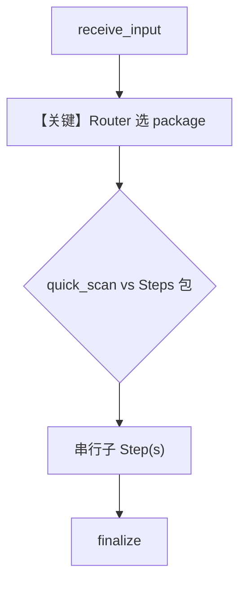

# 03_router_nested_choices.py — 实现原理分析

> 源文件：`cookbook/04_workflows/_07_human_in_the_loop/router/03_router_nested_choices.py`

## 概述

本示例展示 Agno **Router 嵌套选项**：`choices` 中既可放单个 `Step`，也可放 `Steps` 容器（或嵌套 list，自动转为 `Steps`），选中后按包内顺序**串行**执行多条子步骤。

**核心配置一览：**

| 配置项 | 值 | 说明 |
|--------|------|------|
| `Workflow`（主示例） | `name="package_selection_workflow"`，`db=SqliteDb("tmp/workflow_router_nested.db")` | 主演示工作流 |
| `Router.choices` | `quick_scan_step`, `standard_package`, `premium_package` | 单步或 `Steps` 包 |
| `Steps` | `standard_package` / `premium_package` | 命名子流水线 |
| `Router.requires_user_input` | `True` | 用户选包 |
| `Router.allow_multiple_selections` | `False` | 单包 |
| `workflow_with_nested_lists` | 第二个 `Workflow` | 嵌套 list 自动转 `Steps` 的替代写法 |
| `Agent` | 无 | 无 LLM |

## 架构分层

```
用户代码层                agno.workflow 层
┌──────────────────┐    ┌──────────────────────────────────┐
│ 选 quick_scan 或  │    │ Router 解析 choices：            │
│  standard/premium│───>│  Steps 内多 Step 顺序执行        │
│ package          │    │  finalize 汇总 previous_content   │
└──────────────────┘    └──────────────────────────────────┘
```

## 核心组件解析

### Steps 与嵌套 list

`Steps`（`agno.workflow.steps`）将多个 `Step` 打包为一个可选「套餐」。`workflow_with_nested_lists` 注释说明裸 list 会生成如 `steps_group_0` 等自动命名，可读性弱于显式 `Steps(name=...)`。

### 运行机制与因果链

1. **路径**：`receive_input` → Router 暂停 → 用户输入包名 → 执行单 `Step` 或 `Steps` 内链 → `finalize`。
2. **状态**：双库文件（主/alt 各一个 `SqliteDb`）；`__main__` 仅 `run` 主 `workflow`。
3. **分支**：三选一 package；与多选 Router 不同。
4. **差异**：相对 `01/02`，本例强调 **Steps 容器 = 预定义子流水线**。

## System Prompt 组装

无 Agent。不适用 LLM system 拼装。

### 还原后的完整 System 文本

```text
（无 LLM。）
```

### 段落释义

不适用。

## 完整 API 请求

无。

## Mermaid 流程图



## 关键源码文件索引

| 文件 | 关键函数/类 | 作用 |
|------|------------|------|
| `agno/workflow/router.py` | `Router` | choices 可含 Steps |
| `agno/workflow/steps.py` | `Steps` | 子步骤分组 |
