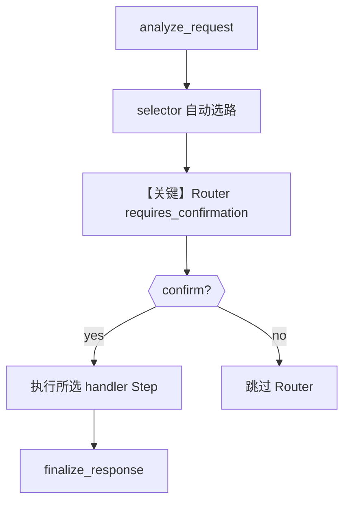

# 04_router_confirmation.py — 实现原理分析

> 源文件：`cookbook/04_workflows/_07_human_in_the_loop/router/04_router_confirmation.py`

## 概述

本示例展示 Agno **Router 确认型 HITL**：由 **`selector` 函数自动决定**走哪条分支，但在执行前**暂停并要求用户确认**（`requires_confirmation=True`）；确认则执行路由结果，拒绝则跳过整个 Router。

**核心配置一览：**

| 配置项 | 值 | 说明 |
|--------|------|------|
| `Workflow.name` | `"router_confirmation_demo"` | 工作流名 |
| `Workflow.db` | `SqliteDb(db_file="tmp/router_hitl.db")` | 持久化 |
| `Router.name` | `"request_router"` | 路由器 |
| `Router.choices` | `handle_urgent` / `handle_billing` / `handle_general` | 候选步骤 |
| `Router.selector` | `route_by_category` | 根据上一步内容返回 step 名字符串 |
| `Router.requires_confirmation` | `True` | 执行前确认 |
| `Router.confirmation_message` | `"The system has selected a handler. Proceed with the routed action?"` | 确认文案 |
| `Router.requires_user_input` | 未设置（默认 `False`） | 非用户选路模式 |
| `Agent` | 无 | 无 LLM |

## 架构分层

```
用户代码层                agno.workflow 层
┌──────────────────┐    ┌──────────────────────────────────┐
│ workflow.run()   │───>│ analyze_request → selector 选路   │
│ steps_requiring_ │    │  → 【暂停】confirmation           │
│   confirmation   │    │  confirm()/reject() → continue_run│
└──────────────────┘    └──────────────────────────────────┘
```

## 核心组件解析

### selector 与确认的分工

`Router` 文档（`router.py`）说明：`requires_user_input` 与 `requires_confirmation` 是不同模式。本例中 `route_by_category` 解析 `previous_step_content` 中的 `urgent`/`billing` 等关键字，返回对应 step 名；**用户不选路**，只在 `steps_requiring_confirmation` 上调用 `confirm` 或 `reject`。

### 运行机制与因果链

1. **路径**：`workflow.run("URGENT: ...")` → `analyze_request` 产出含 `urgent` 的文本 → selector 指向 `handle_urgent` → 暂停待确认 → 用户 yes → 执行 `handle_urgent` → `finalize_response`。
2. **副作用**：DB 记录暂停点；reject 时 Router 按 `on_reject` 策略跳过（默认 `skip`）。
3. **分支**：确认 vs 拒绝；与 `requires_user_input=True` 的 Router 对比。
4. **差异**：同目录 `01` 是用户选路；本例是**自动选路 + 人工确认**。

## System Prompt 组装

无 LLM Agent。`confirmation_message` 面向人类操作者，不进入 `get_system_message()`。

### 还原后的完整 System 文本

```text
（无模型 system。）
```

### 段落释义

不适用。

## 完整 API 请求

无大模型调用。

## Mermaid 流程图



## 关键源码文件索引

| 文件 | 关键函数/类 | 作用 |
|------|------------|------|
| `agno/workflow/router.py` | `Router` `requires_confirmation` | 确认型 HITL |
| `agno/workflow/workflow.py` | `continue_run` | 续跑 |
