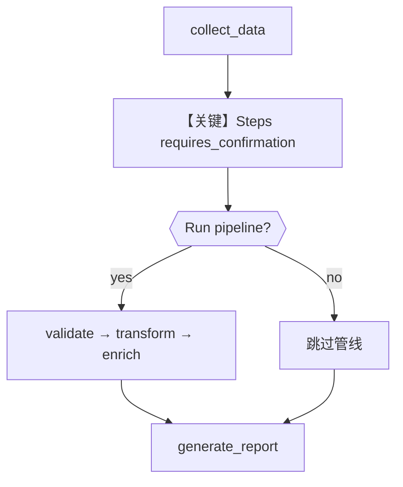

# 01_steps_pipeline_confirmation.py — 实现原理分析

<!-- cookbook-py-source:start -->
## 完整源码

```python
"""
Steps Pipeline with User Confirmation HITL Example

This example demonstrates how to use HITL with a Steps component,
allowing the user to confirm before executing an entire pipeline of steps.

When `requires_confirmation=True` on a Steps component:
- User confirms -> Execute all steps in the pipeline
- User rejects -> Skip the entire pipeline

This is useful for:
- Optional processing pipelines
- Expensive/time-consuming step groups
- User-controlled workflow sections
"""

from agno.db.sqlite import SqliteDb
from agno.workflow.step import Step
from agno.workflow.steps import Steps
from agno.workflow.types import StepInput, StepOutput
from agno.workflow.workflow import Workflow


# ============================================================
# Step functions
# ============================================================
def collect_data(step_input: StepInput) -> StepOutput:
    """Collect initial data."""
    return StepOutput(
        content="Data collection complete:\n"
        "- 1000 records gathered\n"
        "- Ready for optional advanced processing"
    )


# Advanced processing pipeline steps
def validate_data(step_input: StepInput) -> StepOutput:
    """Validate the data."""
    return StepOutput(
        content="Validation complete:\n"
        "- Schema validation passed\n"
        "- Data integrity verified"
    )


def transform_data(step_input: StepInput) -> StepOutput:
    """Transform the data."""
    return StepOutput(
        content="Transformation complete:\n- Data normalized\n- Outliers handled"
    )


def enrich_data(step_input: StepInput) -> StepOutput:
    """Enrich the data with additional information."""
    return StepOutput(
        content="Enrichment complete:\n"
        "- External data merged\n"
        "- Derived fields computed"
    )


def generate_report(step_input: StepInput) -> StepOutput:
    """Generate final report."""
    previous_content = step_input.previous_step_content or "Basic data"
    return StepOutput(
        content=f"=== FINAL REPORT ===\n\n{previous_content}\n\n"
        "Report generated successfully."
    )


# Define the steps
collect_step = Step(name="collect_data", executor=collect_data)

# Steps pipeline with HITL confirmation
# User must confirm to run this entire pipeline
advanced_processing = Steps(
    name="advanced_processing_pipeline",
    steps=[
        Step(name="validate_data", executor=validate_data),
        Step(name="transform_data", executor=transform_data),
        Step(name="enrich_data", executor=enrich_data),
    ],
    requires_confirmation=True,
    confirmation_message="Run advanced processing pipeline? (This includes validation, transformation, and enrichment)",
)

report_step = Step(name="generate_report", executor=generate_report)

# Create workflow with database for HITL persistence
workflow = Workflow(
    name="steps_pipeline_confirmation_demo",
    steps=[collect_step, advanced_processing, report_step],
    db=SqliteDb(db_file="tmp/steps_hitl.db"),
)

if __name__ == "__main__":
    print("=" * 60)
    print("Steps Pipeline with User Confirmation HITL Example")
    print("=" * 60)

    run_output = workflow.run("Process quarterly data")

    # Handle HITL pauses
    while run_output.is_paused:
        # Handle Step requirements (confirmation for pipeline)
        for requirement in run_output.steps_requiring_confirmation:
            print(f"\n[DECISION POINT] {requirement.step_name}")
            print(f"[HITL] {requirement.confirmation_message}")

            user_choice = input("\nRun this pipeline? (yes/no): ").strip().lower()
            if user_choice in ("yes", "y"):
                requirement.confirm()
                print("[HITL] Confirmed - executing pipeline")
            else:
                requirement.reject()
                print("[HITL] Rejected - skipping pipeline")

        run_output = workflow.continue_run(run_output)

    print("\n" + "=" * 60)
    print(f"Status: {run_output.status}")
    print("=" * 60)
    print(run_output.content)
```

<!-- cookbook-py-source:end -->

> 源文件：`cookbook/04_workflows/_07_human_in_the_loop/steps/01_steps_pipeline_confirmation.py`

## 概述

本示例展示 **`Steps` 组件上的确认型 HITL**：整段流水线（validate → transform → enrich）作为一步，执行前暂停，用户确认后**一次性跑完**子步骤；拒绝则跳过整个 `Steps` 块。

**核心配置一览：**

| 配置项 | 值 | 说明 |
|--------|------|------|
| `Workflow.name` | `"steps_pipeline_confirmation_demo"` | 工作流名 |
| `Workflow.db` | `SqliteDb(db_file="tmp/steps_hitl.db")` | 持久化 |
| `Workflow.steps` | `collect_step`, `advanced_processing`, `report_step` | 收集 → 可选高级管线 → 报告 |
| `Steps.name` | `"advanced_processing_pipeline"` | 管线名称 |
| `Steps.steps` | 3 个 `Step` | 子步骤列表 |
| `Steps.requires_confirmation` | `True` | 管线级确认 |
| `Steps.confirmation_message` | `"Run advanced processing pipeline? (This includes validation, transformation, and enrichment)"` | 确认文案 |
| `Agent` | 无 | 无 LLM |

## 架构分层

```
用户代码层                agno.workflow 层
┌──────────────────┐    ┌──────────────────────────────────┐
│ workflow.run()   │───>│ collect_data → Steps 暂停确认     │
│ requirement.     │    │  confirm → 顺序执行子 Step        │
│   confirm()      │    │  → generate_report                │
└──────────────────┘    └──────────────────────────────────┘
```

## 核心组件解析

### Steps 与 Router 确认的差异

`Router` 的确认针对**路由结果**；`Steps` 的确认针对**固定子步骤序列**是否执行，不涉及分支选择。

### 运行机制与因果链

1. **路径**：`run("Process quarterly data")` → `collect_data` → `advanced_processing` 在运行子步骤前暂停 → `steps_requiring_confirmation` → 用户输入 → `continue_run` → 子 Step 链式执行 → `generate_report`。
2. **状态**：`tmp/steps_hitl.db`。
3. **分支**：确认执行整段管线 vs reject 跳过。
4. **差异**：相对 `router/04`，本例无 selector，是**静态管线 + 确认**。

## System Prompt 组装

无 Agent。不适用 `get_system_message()`。

### 还原后的完整 System 文本

```text
（无 LLM。）
```

## 完整 API 请求

无。

## Mermaid 流程图



## 关键源码文件索引

| 文件 | 关键函数/类 | 作用 |
|------|------------|------|
| `agno/workflow/steps.py` | `Steps` | 子步骤组与 HITL 字段 |
| `agno/workflow/workflow.py` | `Workflow` | run/continue_run |
