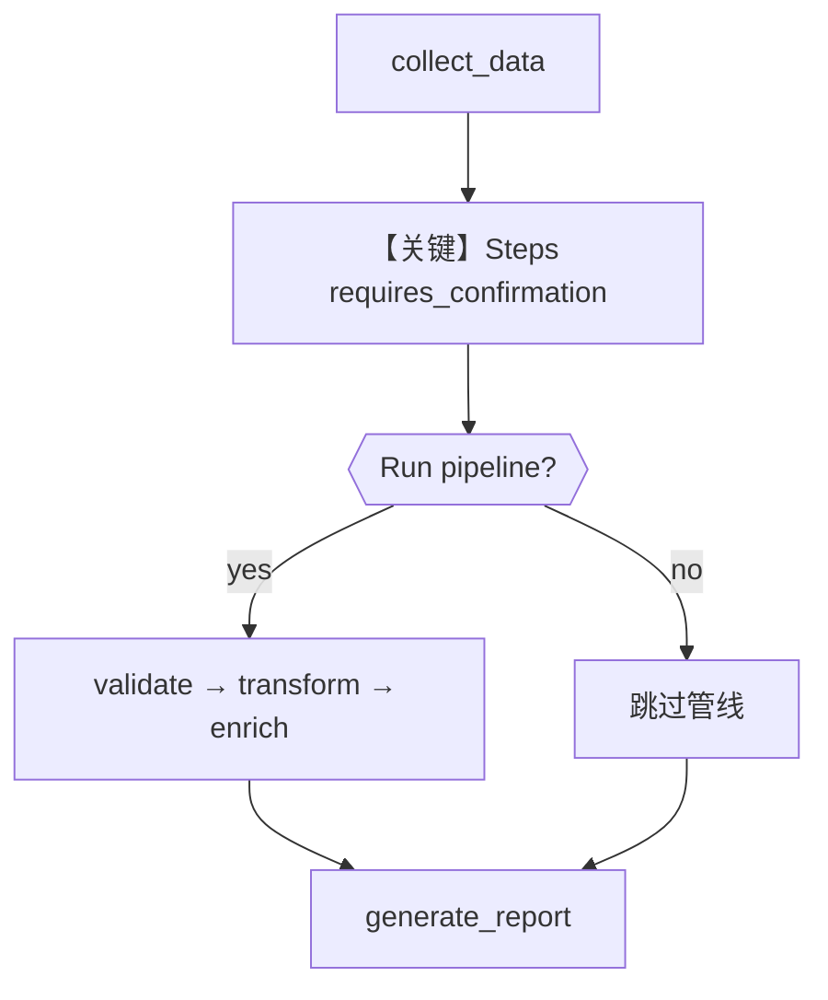

# 01_steps_pipeline_confirmation.py — 实现原理分析

> 源文件：`cookbook/04_workflows/_07_human_in_the_loop/steps/01_steps_pipeline_confirmation.py`

## 概述

本示例展示 **`Steps` 组件上的确认型 HITL**：整段流水线（validate → transform → enrich）作为一步，执行前暂停，用户确认后**一次性跑完**子步骤；拒绝则跳过整个 `Steps` 块。

**核心配置一览：**

| 配置项 | 值 | 说明 |
|--------|------|------|
| `Workflow.name` | `"steps_pipeline_confirmation_demo"` | 工作流名 |
| `Workflow.db` | `SqliteDb(db_file="tmp/steps_hitl.db")` | 持久化 |
| `Workflow.steps` | `collect_step`, `advanced_processing`, `report_step` | 收集 → 可选高级管线 → 报告 |
| `Steps.name` | `"advanced_processing_pipeline"` | 管线名称 |
| `Steps.steps` | 3 个 `Step` | 子步骤列表 |
| `Steps.requires_confirmation` | `True` | 管线级确认 |
| `Steps.confirmation_message` | `"Run advanced processing pipeline? (This includes validation, transformation, and enrichment)"` | 确认文案 |
| `Agent` | 无 | 无 LLM |

## 架构分层

```
用户代码层                agno.workflow 层
┌──────────────────┐    ┌──────────────────────────────────┐
│ workflow.run()   │───>│ collect_data → Steps 暂停确认     │
│ requirement.     │    │  confirm → 顺序执行子 Step        │
│   confirm()      │    │  → generate_report                │
└──────────────────┘    └──────────────────────────────────┘
```

## 核心组件解析

### Steps 与 Router 确认的差异

`Router` 的确认针对**路由结果**；`Steps` 的确认针对**固定子步骤序列**是否执行，不涉及分支选择。

### 运行机制与因果链

1. **路径**：`run("Process quarterly data")` → `collect_data` → `advanced_processing` 在运行子步骤前暂停 → `steps_requiring_confirmation` → 用户输入 → `continue_run` → 子 Step 链式执行 → `generate_report`。
2. **状态**：`tmp/steps_hitl.db`。
3. **分支**：确认执行整段管线 vs reject 跳过。
4. **差异**：相对 `router/04`，本例无 selector，是**静态管线 + 确认**。

## System Prompt 组装

无 Agent。不适用 `get_system_message()`。

### 还原后的完整 System 文本

```text
（无 LLM。）
```

## 完整 API 请求

无。

## Mermaid 流程图



## 关键源码文件索引

| 文件 | 关键函数/类 | 作用 |
|------|------------|------|
| `agno/workflow/steps.py` | `Steps` | 子步骤组与 HITL 字段 |
| `agno/workflow/workflow.py` | `Workflow` | run/continue_run |
