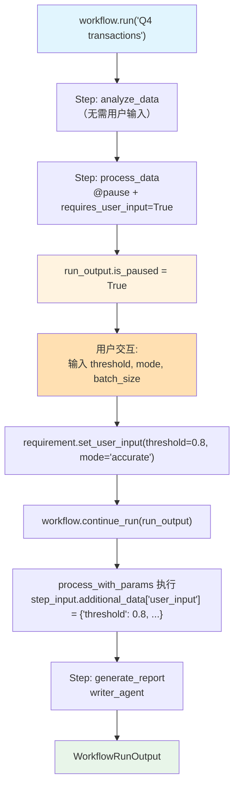

# 01_basic_user_input.py — 实现原理分析

> 源文件：`cookbook/04_workflows/_07_human_in_the_loop/user_input/01_basic_user_input.py`

## 概述

本示例展示 Agno Workflow **HITL 用户输入收集**机制：通过 `@pause` 装饰器标记需要暂停收集用户输入的函数步骤，使用 `UserInputField` 定义输入字段的类型和约束，用户填写后通过 `requirement.set_user_input(**values)` 将输入注入到 `step_input.additional_data["user_input"]`。

**核心配置一览：**

| 配置项 | 值 | 说明 |
|--------|------|------|
| `@pause(requires_user_input=True)` | 函数装饰器 | 标记需要用户输入的步骤 |
| `user_input_schema` | `[UserInputField(...)]` | 定义字段名称、类型、描述 |
| `requirement.set_user_input(**values)` | 用户数据注入 | 填充到 `additional_data["user_input"]` |
| 步骤内读取 | `step_input.additional_data.get("user_input", {})` | 获取用户输入值 |

## 核心组件解析

### @pause 装饰器定义用户输入

```python
from agno.workflow.decorators import pause
from agno.workflow.types import UserInputField

@pause(
    name="Process Data",
    requires_user_input=True,
    user_input_message="Please provide processing parameters:",
    user_input_schema=[
        UserInputField(
            name="threshold",
            field_type="float",
            description="Processing threshold (0.0 to 1.0)",
            required=True,
        ),
        UserInputField(
            name="mode",
            field_type="str",
            description="Processing mode: 'fast' or 'accurate'",
            required=True,
        ),
        UserInputField(
            name="batch_size",
            field_type="int",
            description="Number of records per batch",
            required=False,
        ),
    ],
)
def process_with_params(step_input: StepInput) -> StepOutput:
    user_input = step_input.additional_data.get("user_input", {}) if step_input.additional_data else {}
    threshold = user_input.get("threshold", 0.5)
    mode = user_input.get("mode", "fast")
    batch_size = user_input.get("batch_size", 100)
    return StepOutput(content=f"Processed with threshold={threshold}, mode={mode}")
```

### HITL 用户输入交互循环

```python
run_output = workflow.run("customer transactions from Q4")

while run_output.is_paused:
    for requirement in run_output.steps_requiring_user_input:
        print(f"[HITL] {requirement.user_input_message}")

        user_values = {}
        for field in requirement.user_input_schema:
            value = input(f"  {field.name} ({field.field_type}): ").strip()
            # 类型转换
            if field.field_type == "int":
                user_values[field.name] = int(value)
            elif field.field_type == "float":
                user_values[field.name] = float(value)
            else:
                user_values[field.name] = value

        requirement.set_user_input(**user_values)  # 注入用户输入

    run_output = workflow.continue_run(run_output)
```

### UserInputField 结构

```python
UserInputField(
    name="threshold",         # 字段名（步骤内通过此名读取）
    field_type="float",       # 类型: str, int, float, bool
    description="...",        # 显示给用户的说明
    required=True,            # 是否必填
)
```

## Mermaid 流程图



## 关键源码文件索引

| 文件 | 关键类/函数 | 作用 |
|------|------------|------|
| `agno/workflow/decorators.py` | `@pause` | HITL 暂停装饰器 |
| `agno/workflow/types.py` | `UserInputField` | 用户输入字段定义 |
| `agno/workflow/types.py` | `StepRequirement.set_user_input()` | 注入用户输入到 additional_data |
| `agno/workflow/workflow.py` | `Workflow.continue_run()` | 用户响应后继续执行 |
