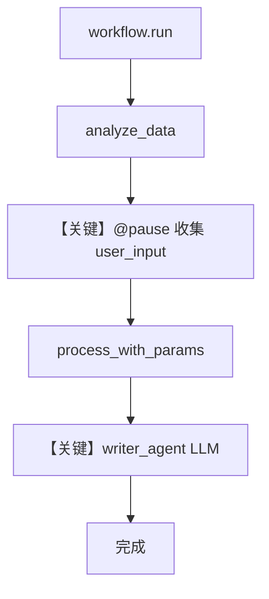

# 01_basic_user_input.py — 实现原理分析

> 源文件：`cookbook/04_workflows/_07_human_in_the_loop/user_input/01_basic_user_input.py`

## 概述

本示例展示 Agno 的 **Workflow HITL：@pause 装饰器收集用户输入** 与 **Agent 步骤生成报告**：前两步为函数 Step（第二步暂停填表），第三步用 `Agent` 基于处理结果写摘要；用户输入经 `step_input.additional_data["user_input"]` 注入。

**核心配置一览：**

| 配置项 | 值 | 说明 |
|--------|------|------|
| `Workflow.name` | `"data_processing_with_params"` | 工作流名 |
| `Workflow.db` | `PostgresDb(db_url="postgresql+psycopg://ai:ai@localhost:5532/ai")` | 需本地 PG |
| `Workflow.steps` | `analyze_step`, `process_step`, `report_step` | 分析 → HITL 处理 → Agent 报告 |
| `@pause` | `requires_user_input=True`，`user_input_message`，`user_input_schema`（3 个 `UserInputField`） | 装饰 `process_with_params` |
| `writer_agent` | `Agent(name="Report Writer", model=OpenAIChat(id="gpt-4o-mini"), instructions=[...])` | 报告生成 |
| `writer_agent.markdown` | `False`（默认） | 未启用 markdown 附加说明 |
| `writer_agent.tools` | 未设置 | 无工具 |

## 架构分层

```
用户代码层                agno.workflow + agno.agent
┌──────────────────┐    ┌──────────────────────────────────┐
│ workflow.run()   │───>│ Step: analyze → @pause 收集字段     │
│ set_user_input   │    │  → process_with_params              │
│ continue_run     │    │  → Step(agent=writer_agent)       │
│                  │    │     Agent._run → get_system_message │
│                  │    │     OpenAIChat.invoke → completions │
└──────────────────┘    └──────────────────────────────────┘
```

## 核心组件解析

### @pause 与 Step 绑定

`@pause(...)` 将 HITL 元数据挂到可调用对象上；`Step(name="process_data", executor=process_with_params)` 由框架识别为需用户输入的步骤，暂停时出现在 `steps_requiring_user_input`。

### UserInputField 与 additional_data

`process_with_params` 从 `step_input.additional_data["user_input"]` 读取 `threshold`/`mode`/`batch_size`，与 `UserInputField` 定义一致。

### Report Writer Agent

`writer_agent` 在 `generate_report` 步骤执行时走标准 Agent 管线：`get_system_message()`（`agno/agent/_messages.py` `L106` 起）拼装默认 system，再 `get_run_messages()` 组用户消息（含前序步骤输出）。

### 运行机制与因果链

1. **路径**：`run("customer transactions from Q4")` → `analyze_data` → 暂停 → CLI 填表 → `set_user_input` → `continue_run` → `process_with_params` → `writer_agent` 调用 LLM → 结束。
2. **状态**：`PostgresDb` 持久化工作流与 Agent 会话（若框架为步骤级 agent 建 session）。
3. **分支**：无确认；仅有 user input HITL。
4. **差异**：相对 `02_step_user_input.py`，本例用 **装饰器** 声明 HITL，而非 `Step(requires_user_input=...)`。

## System Prompt 组装

### 全局 Workflow

不存在单一「工作流级」system；**仅 `writer_agent` 这一步**产生 LLM system。

### Report Writer：`get_system_message()` 默认路径

| 序号 | 组成部分 | 本文件中的值/来源 | 是否生效 |
|------|---------|-----------------|---------|
| 1 | `system_message` | 未设置 | 否（走默认拼装） |
| 2 | `build_context` | 默认 `True` | 是 |
| 3 | `instructions` | 三句 list（见下「还原」） | 是（`# 3.1`，多行时为多条 `- ...`，`use_instruction_tags=False`） |
| 4 | `description` / `role` | 未设置 | 否 |
| 5 | `markdown` | `False` | 否（不追加「Use markdown...」） |
| 6 | `name` + `add_name_to_context` | `name` 有，`add_name_to_context` 默认 False | 否 |

### 拼装顺序与源码锚点

默认路径：`# 3.1` 收集 `instructions` → `# 3.3.3` 写入多条 bullet（`L241-255` `_messages.py`）→ 无 `# 3.3.4` 附加段（markdown 等未开）→ 返回 `Message(role=system, ...)`（具体 role 见 `agent.system_message_role` 默认）。

### 还原后的完整 System 文本

```text
- You are a report writer.
- Given processing results, write a brief summary report.
- Keep it concise - 2-3 sentences.

```

（若 `OpenAIChat` 的 `instructions` 非空，还会经 `# 3.1` 合并进上述块；本示例使用默认 `OpenAIChat(id="gpt-4o-mini")`，通常无额外 model 指令。）

### 段落释义（模型视角）

- 三条 bullet 约束角色为报告撰写者、输入为「处理结果」、输出长度控制在 2～3 句。

### 与 User 消息边界

用户消息为工作流传入的、包含前序步骤输出的运行输入；system 仅含上述指令，不含 HITL 表单字段（表单只进入 `process_with_params` 的 Step）。

## 完整 API 请求

`OpenAIChat` 使用 Chat Completions（`agno/models/openai/chat.py` `L412-417` `chat.completions.create`）。

```python
# 一次典型 Agent 调用（结构示意；messages 由 Agent 内部组装）
client.chat.completions.create(
    model="gpt-4o-mini",
    messages=[
        {"role": "system", "content": "<见上一节还原的 system 文本>"},
        {"role": "user", "content": "<含 process 步骤输出的用户消息>"},
    ],
)
```

> 与第 5 节 system 块对应；user 正文依赖运行时前序 `StepOutput`，无法仅从本文件静态固定。

## Mermaid 流程图


```mermaid
flowchart TD
    A["workflow.run"] --> B["analyze_data"]
    B --> C["【关键】@pause 收集 user_input"]
    C --> D["process_with_params"]
    D --> E["【关键】writer_agent LLM"]
    E --> F["完成"]
```

## 关键源码文件索引

| 文件 | 关键函数/类 | 作用 |
|------|------------|------|
| `agno/workflow/decorators.py` | `@pause` | 声明 HITL |
| `agno/agent/_messages.py` | `get_system_message()` L106+ | system 拼装 |
| `agno/models/openai/chat.py` | `OpenAIChat.invoke()` L385+ | Chat Completions |
