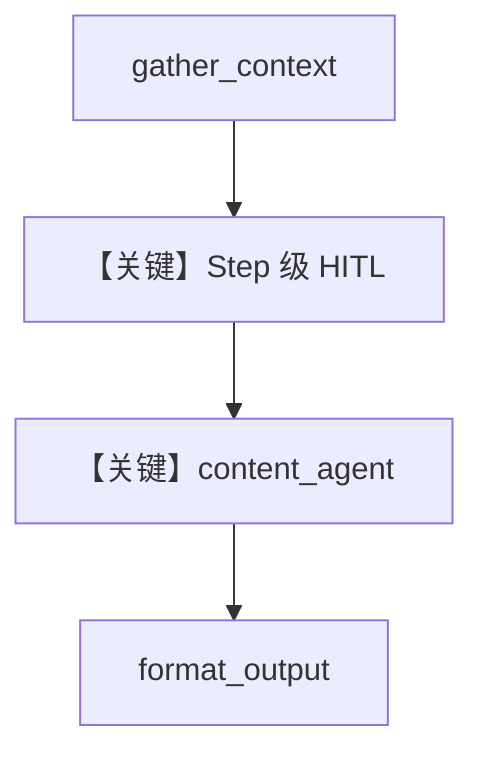

# 02_step_user_input.py — 实现原理分析

<!-- cookbook-py-source:start -->
## 完整源码

```python
"""
Step-Level User Input HITL Example

This example demonstrates how to pause a workflow to collect user input
using Step parameters directly (without the @pause decorator).

This approach is useful when:
- Using agent-based steps that need user parameters
- You want to configure HITL at the Step level rather than on a function
- You need to override or add HITL to existing functions/agents

Use case: Collecting user preferences before an agent generates content.
"""

from agno.agent import Agent
from agno.db.sqlite import SqliteDb
from agno.models.openai import OpenAIChat
from agno.workflow.step import Step
from agno.workflow.types import StepInput, StepOutput, UserInputField
from agno.workflow.workflow import Workflow


# Step 1: Gather context (no HITL)
def gather_context(step_input: StepInput) -> StepOutput:
    """Gather initial context from the input."""
    topic = step_input.input or "general topic"
    return StepOutput(
        content=f"Context gathered for: '{topic}'\n"
        "Ready to generate content based on user preferences."
    )


# Step 2: Content generator agent (HITL configured on Step, not function)
# Note: User input from HITL is automatically appended to the message as "User preferences:"
content_agent = Agent(
    name="Content Generator",
    model=OpenAIChat(id="gpt-4o-mini"),
    instructions=[
        "You are a content generator.",
        "Generate content based on the topic and user preferences provided.",
        "The user preferences will be provided in the message - use them to guide your output.",
        "Respect the tone, length, and format specified by the user.",
        "Keep the output focused and professional.",
    ],
)


# Step 3: Format output (no HITL)
def format_output(step_input: StepInput) -> StepOutput:
    """Format the final output."""
    content = step_input.previous_step_content or "No content generated"
    return StepOutput(content=f"=== GENERATED CONTENT ===\n\n{content}\n\n=== END ===")


# Define workflow with Step-level HITL configuration
workflow = Workflow(
    name="content_generation_workflow",
    db=SqliteDb(db_file="tmp/workflow_step_user_input.db"),
    steps=[
        Step(name="gather_context", executor=gather_context),
        # HITL configured directly on the Step using agent
        Step(
            name="generate_content",
            agent=content_agent,
            requires_user_input=True,
            user_input_message="Please provide your content preferences:",
            user_input_schema=[
                UserInputField(
                    name="tone",
                    field_type="str",
                    description="Tone of the content: 'formal', 'casual', or 'technical'",
                    required=True,
                ),
                UserInputField(
                    name="length",
                    field_type="str",
                    description="Content length: 'short' (1 para), 'medium' (3 para), or 'long' (5+ para)",
                    required=True,
                ),
                UserInputField(
                    name="include_examples",
                    field_type="bool",
                    description="Include practical examples?",
                    required=False,
                ),
            ],
        ),
        Step(name="format_output", executor=format_output),
    ],
)


# Alternative: Using executor function with Step-level HITL
def process_data(step_input: StepInput) -> StepOutput:
    """Process data with user-specified options."""
    user_input = (
        step_input.additional_data.get("user_input", {})
        if step_input.additional_data
        else {}
    )

    format_type = user_input.get("format", "json")
    include_metadata = user_input.get("include_metadata", False)

    return StepOutput(
        content=f"Data processed with format: {format_type}, metadata: {include_metadata}"
    )


workflow_with_executor = Workflow(
    name="data_processing_workflow",
    db=SqliteDb(db_file="tmp/workflow_step_executor_input.db"),
    steps=[
        Step(name="gather_context", executor=gather_context),
        # HITL on Step with a plain executor function
        Step(
            name="process_data",
            executor=process_data,
            requires_user_input=True,
            user_input_message="Configure data processing:",
            user_input_schema=[
                UserInputField(
                    name="format",
                    field_type="str",
                    description="Output format: 'json', 'csv', or 'xml'",
                    required=True,
                ),
                UserInputField(
                    name="include_metadata",
                    field_type="bool",
                    description="Include metadata in output?",
                    required=False,
                ),
            ],
        ),
        Step(name="format_output", executor=format_output),
    ],
)


if __name__ == "__main__":
    print("=" * 60)
    print("Step-Level User Input HITL Example")
    print("=" * 60)
    print("\nThis example uses Step parameters for HITL configuration.")
    print("No @pause decorator needed - configure directly on Step.\n")

    # Run the agent-based workflow
    run_output = workflow.run("Python async programming")

    # Handle HITL pauses
    while run_output.is_paused:
        for requirement in run_output.steps_requiring_user_input:
            print(f"\n[HITL] Step '{requirement.step_name}' requires user input")
            print(f"[HITL] {requirement.user_input_message}")

            # Display schema and collect input
            if requirement.user_input_schema:
                print("\nFields (* = required):")
                user_values = {}
                for field in requirement.user_input_schema:
                    required_marker = "*" if field.required else ""
                    field_desc = f" - {field.description}" if field.description else ""
                    prompt = f"  {field.name}{required_marker} ({field.field_type}){field_desc}: "

                    value = input(prompt).strip()

                    # Convert to appropriate type
                    if value:
                        if field.field_type == "int":
                            user_values[field.name] = int(value)
                        elif field.field_type == "float":
                            user_values[field.name] = float(value)
                        elif field.field_type == "bool":
                            user_values[field.name] = value.lower() in (
                                "true",
                                "yes",
                                "1",
                                "y",
                            )
                        else:
                            user_values[field.name] = value

                # Set the user input
                requirement.set_user_input(**user_values)
                print("\n[HITL] Preferences received - continuing workflow...")

        # Check for confirmation requirements (if any)
        for requirement in run_output.steps_requiring_confirmation:
            print(f"\n[HITL] Step '{requirement.step_name}' requires confirmation")
            print(f"[HITL] {requirement.confirmation_message}")

            confirm = input("\nContinue? (yes/no): ").strip().lower()
            if confirm in ("yes", "y"):
                requirement.confirm()
            else:
                requirement.reject()

        # Continue the workflow
        run_output = workflow.continue_run(run_output)

    print("\n" + "=" * 60)
    print(f"Status: {run_output.status}")
    print("=" * 60)
    print(run_output.content)
```

<!-- cookbook-py-source:end -->

> 源文件：`cookbook/04_workflows/_07_human_in_the_loop/user_input/02_step_user_input.py`

## 概述

本示例展示 **在 `Step` 构造函数上直接配置 HITL**（`requires_user_input`、`user_input_schema`），无需 `@pause`；支持 **`agent=` 步骤**与 **`executor=` 步骤**两种形态，并演示 `workflow_with_executor` 备选工作流。

**核心配置一览：**

| 配置项 | 值 | 说明 |
|--------|------|------|
| `Workflow`（主） | `name="content_generation_workflow"`，`SqliteDb("tmp/workflow_step_user_input.db")` | 主示例 |
| `Step`（generate_content） | `agent=content_agent`，`requires_user_input=True`，`user_input_schema`（tone/length/include_examples） | Agent + HITL |
| `content_agent` | `OpenAIChat(id="gpt-4o-mini")`，`instructions` 五句 list | 内容生成 |
| `Workflow`（备选） | `workflow_with_executor`，`Step(executor=process_data, requires_user_input=...)` | 纯函数 + HITL |

## 架构分层

```
用户代码层                agno.workflow + agno.agent
┌──────────────────┐    ┌──────────────────────────────────┐
│ Step 级 HITL     │───>│ gather_context → 暂停填偏好       │
│ set_user_input   │    │  → Agent.run（偏好并入消息）      │
│                  │    │  → format_output                  │
└──────────────────┘    └──────────────────────────────────┘
```

## 核心组件解析

### Step 级 HITL

文件头注释说明：用户输入会**附加到发给 Agent 的消息**中（以用户偏好形式）。框架在续跑后将 `user_input` 注入上下文，使模型按 tone/length 等生成。

### 备选 executor 工作流

`process_data` 从 `additional_data["user_input"]` 读取 `format`/`include_metadata`，展示非 Agent 步骤同样可用 Step 级 HITL。

### 运行机制与因果链

1. **路径**：`gather_context` → HITL → `content_agent` → `format_output`。
2. **状态**：SQLite 工作流 DB。
3. **分支**：主工作流用 agent；备选用手写 executor。
4. **差异**：相对 `01_basic_user_input.md`，本例 HITL 在 **`Step(...)` 参数**上声明。

## System Prompt 组装

仅 **`content_agent`** 产生 LLM system（当执行 `generate_content` 步骤时）。

### 还原后的完整 System 文本（默认拼装，多指令 bullet）

```text
- You are a content generator.
- Generate content based on the topic and user preferences provided.
- The user preferences will be provided in the message - use them to guide your output.
- Respect the tone, length, and format specified by the user.
- Keep the output focused and professional.

```

### 拼装顺序与源码锚点

同 `get_system_message()` `# 3.1` + `# 3.3.3`（`agno/agent/_messages.py`）；`markdown=False`，不追加 markdown 说明段。

### 段落释义

- 强调根据消息中的「用户偏好」调整语气、长度与格式；专业、聚焦输出。

### 与 User 消息边界

HITL 收集的字段由工作流注入用户侧消息；system 不包含 tone/length 的具体取值，取值在用户消息中体现。

## 完整 API 请求

```python
# OpenAIChat → chat.completions.create（见 chat.py invoke）
client.chat.completions.create(
    model="gpt-4o-mini",
    messages=[
        {"role": "system", "content": "<上节五条 bullet>"},
        {"role": "user", "content": "<topic + User preferences: ...>"},
    ],
)
```

## Mermaid 流程图



## 关键源码文件索引

| 文件 | 关键函数/类 | 作用 |
|------|------------|------|
| `agno/workflow/step.py` | `Step` | HITL 字段 |
| `agno/agent/_messages.py` | `get_system_message` | Agent system |
| `agno/models/openai/chat.py` | `invoke` | Chat Completions |
