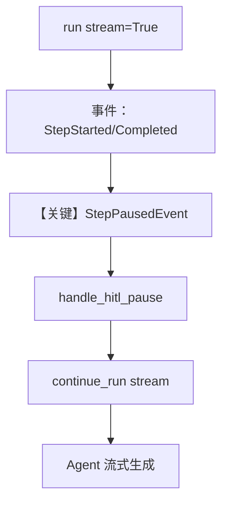

# 03_step_user_input_streaming.py — 实现原理分析

> 源文件：`cookbook/04_workflows/_07_human_in_the_loop/user_input/03_step_user_input_streaming.py`

## 概述

本示例在 **`02_step_user_input.py` 同构工作流**上增加 **`workflow.run(..., stream=True, stream_events=True)`** 与 **`continue_run(..., stream=True, stream_events=True)`**：通过 `StepPausedEvent` 等事件在流式执行中检测 HITL 暂停，并在控制台交互后继续。

**核心配置一览：**

| 配置项 | 值 | 说明 |
|--------|------|------|
| `Workflow` | `name="content_generation_workflow_stream"`，`SqliteDb("tmp/workflow_step_user_input_stream.db")` | 流式示例库文件 |
| `workflow.run` | `stream=True`, `stream_events=True` | 流式 + 步骤事件 |
| `Step`（generate_content） | 同 02，`UserInputField.allowed_values` 用于 tone/length | 枚举校验 |
| `content_agent` | `OpenAIChat(id="gpt-4o-mini")` | 与 02 一致 |
| 事件类型 | `WorkflowStartedEvent`, `StepStartedEvent`, `StepCompletedEvent`, `StepPausedEvent`, `WorkflowCompletedEvent` | 自 `agno.run.workflow` 导入 |

## 架构分层

```
用户代码层                agno.workflow 事件流
┌──────────────────┐    ┌──────────────────────────────────┐
│ for event in     │───>│ 流式产出事件；StepPausedEvent     │
│   workflow.run   │    │  → handle_hitl_pause               │
│ continue_run 流式 │    │  → 再消费 continue_stream          │
└──────────────────┘    └──────────────────────────────────┘
```

## 核心组件解析

### 流式与 HITL

非流式版本用 `while run_output.is_paused`；本例在事件循环中识别 `StepPausedEvent`，最终在流结束后仍用 `run_output.is_paused` 与 `handle_hitl_pause` 处理 `steps_requiring_user_input`。

### UserInputField 校验

`set_user_input` 默认做校验（`try/except ValueError`）；`allowed_values` 限制 tone/length 可选值。

### 运行机制与因果链

1. **路径**：事件流推进步骤 → 暂停 → `input()` → `continue_run` 流式恢复 → Agent 步骤 → 完成。
2. **状态**：SQLite + `session.runs` 回退取得 `WorkflowRunOutput`。
3. **分支**：校验失败打印错误（示例中 `raise` 重新抛出）。
4. **差异**：相对 `02`，本例强调 **stream + stream_events** 与事件驱动观测。

## System Prompt 组装

与 `02_step_user_input.md` 中 **`content_agent`** 相同（五条 `instructions`），`get_system_message()` 默认路径。

### 还原后的完整 System 文本

```text
- You are a content generator.
- Generate content based on the topic and user preferences provided.
- The user preferences will be provided in the message - use them to guide your output.
- Respect the tone, length, and format specified by the user.
- Keep the output focused and professional.

```

## 完整 API 请求

Agent 步骤仍为 `OpenAIChat` → `chat.completions.create`；流式时对应 `invoke_stream` / 流式 API（若框架对同一模型走 stream 分支）。结构与非流式一致，差异在**响应为流**。

```python
# 等价消息结构（与非流式相同）；差别在 API 是否 stream=True
client.chat.completions.create(
    model="gpt-4o-mini",
    messages=[
        {"role": "system", "content": "<五条 instructions>"},
        {"role": "user", "content": "<topic + preferences>"},
    ],
    stream=True,  # 实际参数以 Agent 内部调用为准
)
```

## Mermaid 流程图



## 关键源码文件索引

| 文件 | 关键函数/类 | 作用 |
|------|------------|------|
| `agno/run/workflow` | `StepPausedEvent` 等 | 流式 HITL 观测 |
| `agno/workflow/workflow.py` | `run`/`continue_run` 重载 | `stream`/`stream_events` |
| `agno/agent/_messages.py` | `get_system_message` | system 文本 |
