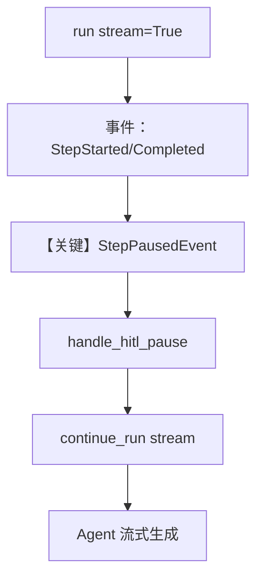

# 03_step_user_input_streaming.py — 实现原理分析

<!-- cookbook-py-source:start -->
## 完整源码

```python
"""
Step-Level User Input HITL Example (Streaming)

This example demonstrates how to handle HITL with streaming workflows.

Key differences from non-streaming:
1. workflow.run(..., stream=True) returns an Iterator of events
2. stream_events=True is required to receive StepStartedEvent/StepCompletedEvent
3. Look for StepPausedEvent to detect HITL pauses
4. Events are processed as they stream in
5. Use workflow.continue_run(..., stream=True, stream_events=True) to continue with streaming

This is useful for:
- Real-time progress updates
- Large workflows where you want incremental feedback
- UI integrations that show step-by-step progress
"""

from agno.agent import Agent
from agno.db.sqlite import SqliteDb
from agno.models.openai import OpenAIChat
from agno.run.workflow import (
    StepCompletedEvent,
    StepPausedEvent,
    StepStartedEvent,
    WorkflowCompletedEvent,
    WorkflowRunOutput,
    WorkflowStartedEvent,
)
from agno.workflow.step import Step
from agno.workflow.types import StepInput, StepOutput, UserInputField
from agno.workflow.workflow import Workflow


# Step 1: Gather context (no HITL)
def gather_context(step_input: StepInput) -> StepOutput:
    """Gather initial context from the input."""
    topic = step_input.input or "general topic"
    return StepOutput(
        content=f"Context gathered for: '{topic}'\n"
        "Ready to generate content based on user preferences."
    )


# Step 2: Content generator agent (HITL configured on Step)
content_agent = Agent(
    name="Content Generator",
    model=OpenAIChat(id="gpt-4o-mini"),
    instructions=[
        "You are a content generator.",
        "Generate content based on the topic and user preferences provided.",
        "The user preferences will be provided in the message - use them to guide your output.",
        "Respect the tone, length, and format specified by the user.",
        "Keep the output focused and professional.",
    ],
)


# Step 3: Format output (no HITL)
def format_output(step_input: StepInput) -> StepOutput:
    """Format the final output."""
    content = step_input.previous_step_content or "No content generated"
    return StepOutput(content=f"=== GENERATED CONTENT ===\n\n{content}\n\n=== END ===")


# Define workflow with Step-level HITL configuration
workflow = Workflow(
    name="content_generation_workflow_stream",
    db=SqliteDb(db_file="tmp/workflow_step_user_input_stream.db"),
    steps=[
        Step(name="gather_context", executor=gather_context),
        Step(
            name="generate_content",
            agent=content_agent,
            requires_user_input=True,
            user_input_message="Please provide your content preferences:",
            user_input_schema=[
                UserInputField(
                    name="tone",
                    field_type="str",
                    description="Tone of the content",
                    required=True,
                    # Validation: only these values are allowed
                    allowed_values=["formal", "casual", "technical"],
                ),
                UserInputField(
                    name="length",
                    field_type="str",
                    description="Content length",
                    required=True,
                    allowed_values=["short", "medium", "long"],
                ),
                UserInputField(
                    name="include_examples",
                    field_type="bool",
                    description="Include practical examples?",
                    required=False,
                ),
            ],
        ),
        Step(name="format_output", executor=format_output),
    ],
)


def handle_hitl_pause(run_output: WorkflowRunOutput) -> None:
    """Handle HITL requirements from the paused workflow."""
    # Handle user input requirements
    for requirement in run_output.steps_requiring_user_input:
        print(f"\n[HITL] Step '{requirement.step_name}' requires user input")
        print(f"[HITL] {requirement.user_input_message}")

        if requirement.user_input_schema:
            print("\nFields (* = required):")
            user_values = {}
            for field in requirement.user_input_schema:
                required_marker = "*" if field.required else ""
                field_desc = f" - {field.description}" if field.description else ""
                # Show allowed values if specified
                allowed_hint = (
                    f" [{', '.join(str(v) for v in field.allowed_values)}]"
                    if field.allowed_values
                    else ""
                )
                prompt = f"  {field.name}{required_marker} ({field.field_type}){allowed_hint}{field_desc}: "

                value = input(prompt).strip()

                if value:
                    if field.field_type == "int":
                        user_values[field.name] = int(value)
                    elif field.field_type == "float":
                        user_values[field.name] = float(value)
                    elif field.field_type == "bool":
                        user_values[field.name] = value.lower() in (
                            "true",
                            "yes",
                            "1",
                            "y",
                        )
                    else:
                        user_values[field.name] = value

            # set_user_input validates by default; catch validation errors
            try:
                requirement.set_user_input(**user_values)
                print("\n[HITL] Preferences received - continuing workflow...")
            except ValueError as e:
                print(f"\n[HITL] Validation error: {e}")
                print("[HITL] Please provide valid input.")
                # In a real app, you'd loop and re-prompt
                raise

    # Handle confirmation requirements
    for requirement in run_output.steps_requiring_confirmation:
        print(f"\n[HITL] Step '{requirement.step_name}' requires confirmation")
        print(f"[HITL] {requirement.confirmation_message}")

        confirm = input("\nContinue? (yes/no): ").strip().lower()
        if confirm in ("yes", "y"):
            requirement.confirm()
        else:
            requirement.reject()


def run_workflow_streaming(input_text: str) -> WorkflowRunOutput:
    """Run workflow with streaming and handle HITL pauses."""
    print("=" * 60)
    print("Step-Level User Input HITL Example (Streaming)")
    print("=" * 60)
    print("\nStarting workflow with streaming...\n")

    # Track the final run output
    run_output: WorkflowRunOutput | None = None

    # Run with streaming - returns an iterator of events
    # stream=True enables streaming output, stream_events=True enables step events
    event_stream = workflow.run(input_text, stream=True, stream_events=True)

    for event in event_stream:
        # Check event type and handle accordingly
        if isinstance(event, WorkflowStartedEvent):
            print(f"[EVENT] Workflow started: {event.workflow_name}")

        elif isinstance(event, StepStartedEvent):
            print(f"[EVENT] Step started: {event.step_name}")

        elif isinstance(event, StepCompletedEvent):
            print(f"[EVENT] Step completed: {event.step_name}")
            if event.content:
                # Show preview of content (truncated)
                preview = (
                    str(event.content)[:100] + "..."
                    if len(str(event.content)) > 100
                    else str(event.content)
                )
                print(f"        Content: {preview}")

        elif isinstance(event, StepPausedEvent):
            # HITL pause detected!
            print(f"\n[EVENT] Step PAUSED: {event.step_name}")
            if event.requires_user_input:
                print("        Reason: User input required")
                print(f"        Message: {event.user_input_message}")
            elif event.requires_confirmation:
                print("        Reason: Confirmation required")
                print(f"        Message: {event.confirmation_message}")

        elif isinstance(event, WorkflowCompletedEvent):
            print("\n[EVENT] Workflow completed!")
            print(
                f"        Final content length: {len(str(event.content)) if event.content else 0} chars"
            )

        # Check if the event contains the workflow run output
        # (some events have a workflow_run_output attribute)
        if hasattr(event, "workflow_run_output") and event.workflow_run_output:
            run_output = event.workflow_run_output

    # After streaming, we need to get the current run state
    # The last event in a paused workflow should give us the state
    # If run_output is still None, get it from session
    if run_output is None:
        # Get the latest run from the session
        session = workflow.get_session()
        if session and session.runs:
            run_output = session.runs[-1]

    # If workflow is paused, handle HITL and continue
    while run_output and run_output.is_paused:
        handle_hitl_pause(run_output)

        print("\n[INFO] Continuing workflow with streaming...\n")

        # Continue with streaming
        continue_stream = workflow.continue_run(
            run_output, stream=True, stream_events=True
        )

        for event in continue_stream:
            if isinstance(event, StepStartedEvent):
                print(f"[EVENT] Step started: {event.step_name}")

            elif isinstance(event, StepCompletedEvent):
                print(f"[EVENT] Step completed: {event.step_name}")
                if event.content:
                    preview = (
                        str(event.content)[:100] + "..."
                        if len(str(event.content)) > 100
                        else str(event.content)
                    )
                    print(f"        Content: {preview}")

            elif isinstance(event, StepPausedEvent):
                print(f"\n[EVENT] Step PAUSED: {event.step_name}")

            elif isinstance(event, WorkflowCompletedEvent):
                print("\n[EVENT] Workflow completed!")

            if hasattr(event, "workflow_run_output") and event.workflow_run_output:
                run_output = event.workflow_run_output

        # Get updated run output from session
        session = workflow.get_session()
        if session and session.runs:
            run_output = session.runs[-1]

    return run_output  # type: ignore


if __name__ == "__main__":
    final_output = run_workflow_streaming("Python async programming")

    print("\n" + "=" * 60)
    print(f"Final Status: {final_output.status}")
    print("=" * 60)
    print(final_output.content)
```

<!-- cookbook-py-source:end -->

> 源文件：`cookbook/04_workflows/_07_human_in_the_loop/user_input/03_step_user_input_streaming.py`

## 概述

本示例在 **`02_step_user_input.py` 同构工作流**上增加 **`workflow.run(..., stream=True, stream_events=True)`** 与 **`continue_run(..., stream=True, stream_events=True)`**：通过 `StepPausedEvent` 等事件在流式执行中检测 HITL 暂停，并在控制台交互后继续。

**核心配置一览：**

| 配置项 | 值 | 说明 |
|--------|------|------|
| `Workflow` | `name="content_generation_workflow_stream"`，`SqliteDb("tmp/workflow_step_user_input_stream.db")` | 流式示例库文件 |
| `workflow.run` | `stream=True`, `stream_events=True` | 流式 + 步骤事件 |
| `Step`（generate_content） | 同 02，`UserInputField.allowed_values` 用于 tone/length | 枚举校验 |
| `content_agent` | `OpenAIChat(id="gpt-4o-mini")` | 与 02 一致 |
| 事件类型 | `WorkflowStartedEvent`, `StepStartedEvent`, `StepCompletedEvent`, `StepPausedEvent`, `WorkflowCompletedEvent` | 自 `agno.run.workflow` 导入 |

## 架构分层

```
用户代码层                agno.workflow 事件流
┌──────────────────┐    ┌──────────────────────────────────┐
│ for event in     │───>│ 流式产出事件；StepPausedEvent     │
│   workflow.run   │    │  → handle_hitl_pause               │
│ continue_run 流式 │    │  → 再消费 continue_stream          │
└──────────────────┘    └──────────────────────────────────┘
```

## 核心组件解析

### 流式与 HITL

非流式版本用 `while run_output.is_paused`；本例在事件循环中识别 `StepPausedEvent`，最终在流结束后仍用 `run_output.is_paused` 与 `handle_hitl_pause` 处理 `steps_requiring_user_input`。

### UserInputField 校验

`set_user_input` 默认做校验（`try/except ValueError`）；`allowed_values` 限制 tone/length 可选值。

### 运行机制与因果链

1. **路径**：事件流推进步骤 → 暂停 → `input()` → `continue_run` 流式恢复 → Agent 步骤 → 完成。
2. **状态**：SQLite + `session.runs` 回退取得 `WorkflowRunOutput`。
3. **分支**：校验失败打印错误（示例中 `raise` 重新抛出）。
4. **差异**：相对 `02`，本例强调 **stream + stream_events** 与事件驱动观测。

## System Prompt 组装

与 `02_step_user_input.md` 中 **`content_agent`** 相同（五条 `instructions`），`get_system_message()` 默认路径。

### 还原后的完整 System 文本

```text
- You are a content generator.
- Generate content based on the topic and user preferences provided.
- The user preferences will be provided in the message - use them to guide your output.
- Respect the tone, length, and format specified by the user.
- Keep the output focused and professional.

```

## 完整 API 请求

Agent 步骤仍为 `OpenAIChat` → `chat.completions.create`；流式时对应 `invoke_stream` / 流式 API（若框架对同一模型走 stream 分支）。结构与非流式一致，差异在**响应为流**。

```python
# 等价消息结构（与非流式相同）；差别在 API 是否 stream=True
client.chat.completions.create(
    model="gpt-4o-mini",
    messages=[
        {"role": "system", "content": "<五条 instructions>"},
        {"role": "user", "content": "<topic + preferences>"},
    ],
    stream=True,  # 实际参数以 Agent 内部调用为准
)
```

## Mermaid 流程图



## 关键源码文件索引

| 文件 | 关键函数/类 | 作用 |
|------|------------|------|
| `agno/run/workflow` | `StepPausedEvent` 等 | 流式 HITL 观测 |
| `agno/workflow/workflow.py` | `run`/`continue_run` 重载 | `stream`/`stream_events` |
| `agno/agent/_messages.py` | `get_system_message` | system 文本 |
