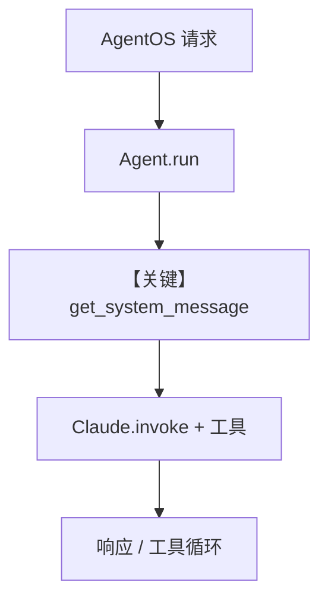

# _agents.py — 实现原理分析

> 源文件：`cookbook/05_agent_os/advanced_demo/_agents.py`

## 概述

本模块为 **AgentOS 高级演示** 提供两个预置 **Agent（`sage`、`agno_assist`）**：`sage` 集成 **Exa + WebSearch + FileTools**、会话历史、记忆更新与较长的 `description`/`expected_output`；`agno_assist` 绑定 **Knowledge（PgVector + Postgres 内容表）** 回答 Agno 文档问题。模块**仅被 import**，不在此文件直接 `run`。

**核心配置一览（`sage`）：**

| 配置项 | 值 | 说明 |
|--------|------|------|
| `name` / `id` | `"Sage"` / `"sage"` | 标识 |
| `model` | `Claude(id="claude-3-7-sonnet-latest")` | Anthropic Messages API |
| `db` | `PostgresDb(db_url=..., session_table="sage_sessions")` | 会话存储 |
| `tools` | `ExaTools(...)`, `WebSearchTools(...)`, `FileTools(base_dir=...)` | 搜索与写文件 |
| `read_chat_history` | `True` | 读会话与工具历史 |
| `add_history_to_context` | `True`，`num_history_runs=5` | 上下文带历史 |
| `add_datetime_to_context` | `True` | system 附加当前时间 |
| `add_name_to_context` | `True` | system 附加 Agent 名 |
| `update_memory_on_run` | `True` | 运行更新记忆 |
| `description` | `AGENT_DESCRIPTION`（dedent 长文） | 角色与工具约束 |
| `instructions` | `AGENT_INSTRUCTIONS` | 分步作答流程 |
| `expected_output` | `EXPECTED_OUTPUT_TEMPLATE` | 输出结构模板 |
| `markdown` | `True` | 附加 markdown 格式说明 |

**`agno_assist`：** `knowledge=knowledge`，`instructions="Search your knowledge before answering the question."`，`db` session 表 `agno_assist_sessions`，`markdown=True`，`add_history_to_context=True`，`add_datetime_to_context=True`。

## 架构分层

```
cookbook 导入层          agno.agent + AgentOS（demo.py）
┌──────────────┐        ┌────────────────────────────────┐
│ from _agents │───────>│ sage / agno_assist 注册到       │
│ import sage  │        │ AgentOS.agents                 │
└──────────────┘        └────────────────────────────────┘
```

## 核心组件解析

### sage：多工具与研究型指令

`AGENT_DESCRIPTION` 强制 **同时使用** DuckDuckGo 与 Exa，并要求数据来源；`AGENT_INSTRUCTIONS` 规定检索与成文步骤；`EXPECTED_OUTPUT_TEMPLATE` 进入 `expected_output`（`# 3.3.7`）， shaping 长文报告结构。

### agno_assist：Knowledge RAG

`Knowledge` 使用 `PgVector` + `OpenAIEmbedder`，`contents_db` 指向 `knowledge_table="agno-assist-knowledge"`。需在运行前向量化文档（由其他脚本或 API 完成）；Agent 侧需 **`search_knowledge`** 若框架未默认开启——**本文件未设 `search_knowledge=True`**，行为以当前 Agno 默认为准（若默认 False，则知识检索可能不自动触发，需对照 `Agent` 默认值核查）。

### 运行机制与因果链

1. **数据路径**：外部 `demo.py` 将 agent 交给 `AgentOS` → HTTP/Web UI 请求 → `Agent.run` → `get_system_message` → Claude `invoke` + 工具循环。
2. **状态**：Postgres 会话与 knowledge 表；`update_memory_on_run` 与 memory 管线相关。
3. **分支**：工具调用失败/无结果时走模型重试或说明；与仅单工具的 minimal agent 不同。
4. **定位**：相对 `agno_assist.py`（单文件 MCP 示例），本模块展示 **生产向** 长描述 + 多工具 + KB。

## System Prompt 组装

以 **`sage`** 为例（默认 `build_context=True`，无自定义 `system_message`）。

### 组成部分表

| 序号 | 组成部分 | 本文件 | 生效 |
|------|---------|--------|------|
| 1 | `description` | `AGENT_DESCRIPTION` 全文 | 是（`# 3.3.1`） |
| 2 | `role` | 未设置 | 否 |
| 3 | `instructions` | `AGENT_INSTRUCTIONS` 全文 | 是（`# 3.3.3`） |
| 4 | `markdown` | `True` | 是（`# 3.2.1` → additional_information） |
| 5 | `add_datetime_to_context` | `True` | 是 |
| 6 | `add_name_to_context` | `True` | 是（name=Sage） |
| 7 | `expected_output` | `EXPECTED_OUTPUT_TEMPLATE` | 是（`# 3.3.7`） |

### 拼装顺序与源码锚点

`get_system_message()`（`agno/agent/_messages.py`）：`# 3.1` 收集 instructions；`# 3.3.1` description；`# 3.3.3` instructions 正文；`# 3.3.4` `<additional_information>` 内含 markdown/时间/姓名；`# 3.3.7` `<expected_output>`；工具说明若有则 `# 3.3.5`。

### 还原后的完整 System 文本（顺序忠实重组；`dedent` 已展开）

因篇幅，`AGENT_DESCRIPTION`、`AGENT_INSTRUCTIONS`、`EXPECTED_OUTPUT_TEMPLATE` 三处**必须与 `_agents.py` 中字符串逐字一致**。下面用占位说明：**请直接复制源文件中第 28-118 行三处 `dedent("""...""")` 内正文**，按上节顺序拼接为：

1. `description` 全文  
2. 空行后 instructions 列表项（`use_instruction_tags` 默认 False，多行指令为 `- ...` 或连续段落，以 `_messages` 实际拼接为准）  
3. `<additional_information>` 内：  
   - `Use markdown to format your answers.`  
   - `The current time is <运行时时间>.`  
   - `Your name is: Sage.`  
4. `<expected_output>` 包裹的 `EXPECTED_OUTPUT_TEMPLATE` 全文（含 Jinja 风格占位符）

**静态还原无法包含**：`The current time is ...` 的**确切时间字符串**（运行时生成）。验证方式：在 `get_system_message` 返回前打印 `message.content`。

**`agno_assist` 还原（精简字面量）**：

```text
Search your knowledge before answering the question.
```

并叠加 `description`（一行）、`markdown` 附加句、时间、`additional_information` 中与 knowledge/memory 相关的默认段（若 `search_knowledge` 等开启时会有更多；本文件仅显式 `instructions` 与 `description`）。

### 段落释义

- `description`：绑定 Sage 人设、三工具职责与「先搜再答」合规要求。  
- `expected_output`：约束长回答的章节、Sources 列表与落款。  
- `additional_information`：格式、时间、身份上下文。

### 与 User 边界

用户消息为 API 传入 query；检索到的知识若注入则可能在 user/tool 结果中，视 `search_knowledge` 与运行配置而定。

## 完整 API 请求

`Claude` 使用 Anthropic Messages API（`agno/models/anthropic/claude.py` `invoke`），**不是** `chat.completions.create`。

```python
# 结构示意（参数名以 invoke 实现为准）
# client.messages.create(model="claude-3-7-sonnet-latest", system="...", messages=[...])
```

## Mermaid 流程图



## 关键源码文件索引

| 文件 | 关键符号 | 作用 |
|------|---------|------|
| `agno/agent/_messages.py` | `get_system_message` L106+ | system 拼装 |
| `agno/models/anthropic/claude.py` | `invoke` L563+ | Messages API |
| `agno/os/__init__.py` 等 | `AgentOS` | 注册与 HTTP |
