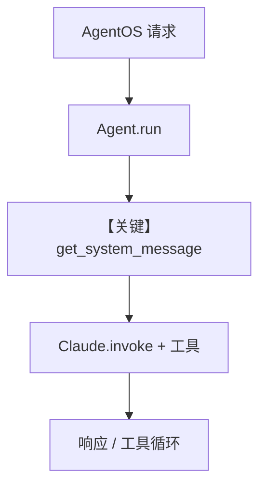

# _agents.py — 实现原理分析

<!-- cookbook-py-source:start -->
## 完整源码

```python
"""
 Agents
=======

Demonstrates  agents.
"""

from datetime import datetime
from pathlib import Path
from textwrap import dedent

from agno.agent import Agent
from agno.db.postgres import PostgresDb
from agno.knowledge.embedder.openai import OpenAIEmbedder
from agno.knowledge.knowledge import Knowledge
from agno.models.anthropic.claude import Claude
from agno.tools.exa import ExaTools
from agno.tools.file import FileTools
from agno.tools.websearch import WebSearchTools
from agno.vectordb.pgvector.pgvector import PgVector

# ---------------------------------------------------------------------------
# Create Example
# ---------------------------------------------------------------------------

db_url = "postgresql+psycopg://ai:ai@localhost:5532/ai"

AGENT_DESCRIPTION = dedent("""\
    You are Sage, a cutting-edge Answer Engine built to deliver precise, context-rich, and engaging responses.
    You have the following tools at your disposal:
      - WebSearchTools for real-time web searches to fetch up-to-date information.
      - ExaTools for structured, in-depth analysis.
      - FileTools for saving the output upon user confirmation.

    Your response should always be clear, concise, and detailed. Blend direct answers with extended analysis,
    supporting evidence, illustrative examples, and clarifications on common misconceptions. Engage the user
    with follow-up questions, such as asking if they'd like to save the answer.

    <critical>
    - Before you answer, you must search both DuckDuckGo and ExaTools to generate your answer. If you don't, you will be penalized.
    - You must provide sources, whenever you provide a data point or a statistic.
    - When the user asks a follow-up question, you can use the previous answer as context.
    - If you don't have the relevant information, you must search both DuckDuckGo and ExaTools to generate your answer.
    </critical>\
""")

AGENT_INSTRUCTIONS = dedent("""\
    Here's how you should answer the user's question:

    1. Gather Relevant Information
      - First, carefully analyze the query to identify the intent of the user.
      - Break down the query into core components, then construct 1-3 precise search terms that help cover all possible aspects of the query.
      - Then, search using BOTH `web_search` and `search_exa` with the search terms. Remember to search both tools.
      - Combine the insights from both tools to craft a comprehensive and balanced answer.
      - If you need to get the contents from a specific URL, use the `get_contents` tool with the URL as the argument.
      - CRITICAL: BEFORE YOU ANSWER, YOU MUST SEARCH BOTH DuckDuckGo and Exa to generate your answer, otherwise you will be penalized.

    2. Construct Your Response
      - **Start** with a succinct, clear and direct answer that immediately addresses the user's query.
      - **Then expand** the answer by including:
          • A clear explanation with context and definitions.
          • Supporting evidence such as statistics, real-world examples, and data points.
          • Clarifications that address common misconceptions.
      - Expand the answer only if the query requires more detail. Simple questions like: "What is the weather in Tokyo?" or "What is the capital of France?" don't need an in-depth analysis.
      - Ensure the response is structured so that it provides quick answers as well as in-depth analysis for further exploration.

    3. Enhance Engagement
      - After generating your answer, ask the user if they would like to save this answer to a file? (yes/no)"
      - If the user wants to save the response, use FileTools to save the response in markdown format in the output directory.

    4. Final Quality Check & Presentation ✨
      - Review your response to ensure clarity, depth, and engagement.
      - Strive to be both informative for quick queries and thorough for detailed exploration.

    5. In case of any uncertainties, clarify limitations and encourage follow-up queries.\
""")

EXPECTED_OUTPUT_TEMPLATE = dedent("""\
    {# If this is the first message, include the question title #}
    
    ## {An engaging title for this report. Keep it short.}
    

    **{A clear and direct response that answers the question.}**

    {# If the query requires more detail, include the sections below #}
    

    ### {Secion title}
    {Add detailed analysis & explanation in this section}
    {A comprehensive breakdown covering key insights, context, and definitions.}

    ### {Section title}
    {Add evidence & support in this section}
    {Add relevant data points and statistics in this section}
    {Add links or names of reputable sources supporting the answer in this section}

    ### {Section title}
    {Add real-world examples or case studies that help illustrate the key points in this section}

    ### {Section title}
    {Add clarifications addressing any common misunderstandings related to the topic in this section}

    ### {Section title}
    {Add further details, implications, or suggestions for ongoing exploration in this section}
    

    {Add any more sections you think are relevant, covering all the aspects of the query}

    ### Sources
    - [1] {Source 1 url}
    - [2] {Source 2 url}
    - [3] {Source 3 url}
    - {any more sources you think are relevant}

    Generated by Sage on: {current_time}

    Stay curious and keep exploring ✨\
    """)

sage = Agent(
    name="Sage",
    id="sage",
    model=Claude(id="claude-3-7-sonnet-latest"),
    db=PostgresDb(db_url=db_url, session_table="sage_sessions"),
    tools=[
        ExaTools(
            start_published_date=datetime.now().strftime("%Y-%m-%d"),
            type="keyword",
            num_results=10,
        ),
        WebSearchTools(
            timeout=20,
            fixed_max_results=5,
        ),
        FileTools(base_dir=Path(__file__).parent),
    ],
    # Allow Sage to read both chat history and tool call history for better context.
    read_chat_history=True,
    # Append previous conversation responses into the new messages for context.
    add_history_to_context=True,
    num_history_runs=5,
    add_datetime_to_context=True,
    add_name_to_context=True,
    update_memory_on_run=True,
    description=AGENT_DESCRIPTION,
    instructions=AGENT_INSTRUCTIONS,
    expected_output=EXPECTED_OUTPUT_TEMPLATE,
    markdown=True,
)

knowledge = Knowledge(
    name="Agno Docs",
    contents_db=PostgresDb(db_url=db_url, knowledge_table="agno-assist-knowledge"),
    vector_db=PgVector(
        db_url=db_url,
        table_name="agno_assist_knowledge",
        embedder=OpenAIEmbedder(id="text-embedding-3-small"),
    ),
)

agno_assist = Agent(
    name="Agno Assist",
    model=Claude(id="claude-3-7-sonnet-latest"),
    description="You help answer questions about the Agno framework.",
    instructions="Search your knowledge before answering the question.",
    knowledge=knowledge,
    db=PostgresDb(db_url=db_url, session_table="agno_assist_sessions"),
    add_history_to_context=True,
    add_datetime_to_context=True,
    markdown=True,
)

# ---------------------------------------------------------------------------
# Run Example
# ---------------------------------------------------------------------------

if __name__ == "__main__":
    raise SystemExit("This module is intended to be imported.")
```

<!-- cookbook-py-source:end -->

> 源文件：`cookbook/05_agent_os/advanced_demo/_agents.py`

## 概述

本模块为 **AgentOS 高级演示** 提供两个预置 **Agent（`sage`、`agno_assist`）**：`sage` 集成 **Exa + WebSearch + FileTools**、会话历史、记忆更新与较长的 `description`/`expected_output`；`agno_assist` 绑定 **Knowledge（PgVector + Postgres 内容表）** 回答 Agno 文档问题。模块**仅被 import**，不在此文件直接 `run`。

**核心配置一览（`sage`）：**

| 配置项 | 值 | 说明 |
|--------|------|------|
| `name` / `id` | `"Sage"` / `"sage"` | 标识 |
| `model` | `Claude(id="claude-3-7-sonnet-latest")` | Anthropic Messages API |
| `db` | `PostgresDb(db_url=..., session_table="sage_sessions")` | 会话存储 |
| `tools` | `ExaTools(...)`, `WebSearchTools(...)`, `FileTools(base_dir=...)` | 搜索与写文件 |
| `read_chat_history` | `True` | 读会话与工具历史 |
| `add_history_to_context` | `True`，`num_history_runs=5` | 上下文带历史 |
| `add_datetime_to_context` | `True` | system 附加当前时间 |
| `add_name_to_context` | `True` | system 附加 Agent 名 |
| `update_memory_on_run` | `True` | 运行更新记忆 |
| `description` | `AGENT_DESCRIPTION`（dedent 长文） | 角色与工具约束 |
| `instructions` | `AGENT_INSTRUCTIONS` | 分步作答流程 |
| `expected_output` | `EXPECTED_OUTPUT_TEMPLATE` | 输出结构模板 |
| `markdown` | `True` | 附加 markdown 格式说明 |

**`agno_assist`：** `knowledge=knowledge`，`instructions="Search your knowledge before answering the question."`，`db` session 表 `agno_assist_sessions`，`markdown=True`，`add_history_to_context=True`，`add_datetime_to_context=True`。

## 架构分层

```
cookbook 导入层          agno.agent + AgentOS（demo.py）
┌──────────────┐        ┌────────────────────────────────┐
│ from _agents │───────>│ sage / agno_assist 注册到       │
│ import sage  │        │ AgentOS.agents                 │
└──────────────┘        └────────────────────────────────┘
```

## 核心组件解析

### sage：多工具与研究型指令

`AGENT_DESCRIPTION` 强制 **同时使用** DuckDuckGo 与 Exa，并要求数据来源；`AGENT_INSTRUCTIONS` 规定检索与成文步骤；`EXPECTED_OUTPUT_TEMPLATE` 进入 `expected_output`（`# 3.3.7`）， shaping 长文报告结构。

### agno_assist：Knowledge RAG

`Knowledge` 使用 `PgVector` + `OpenAIEmbedder`，`contents_db` 指向 `knowledge_table="agno-assist-knowledge"`。需在运行前向量化文档（由其他脚本或 API 完成）；Agent 侧需 **`search_knowledge`** 若框架未默认开启——**本文件未设 `search_knowledge=True`**，行为以当前 Agno 默认为准（若默认 False，则知识检索可能不自动触发，需对照 `Agent` 默认值核查）。

### 运行机制与因果链

1. **数据路径**：外部 `demo.py` 将 agent 交给 `AgentOS` → HTTP/Web UI 请求 → `Agent.run` → `get_system_message` → Claude `invoke` + 工具循环。
2. **状态**：Postgres 会话与 knowledge 表；`update_memory_on_run` 与 memory 管线相关。
3. **分支**：工具调用失败/无结果时走模型重试或说明；与仅单工具的 minimal agent 不同。
4. **定位**：相对 `agno_assist.py`（单文件 MCP 示例），本模块展示 **生产向** 长描述 + 多工具 + KB。

## System Prompt 组装

以 **`sage`** 为例（默认 `build_context=True`，无自定义 `system_message`）。

### 组成部分表

| 序号 | 组成部分 | 本文件 | 生效 |
|------|---------|--------|------|
| 1 | `description` | `AGENT_DESCRIPTION` 全文 | 是（`# 3.3.1`） |
| 2 | `role` | 未设置 | 否 |
| 3 | `instructions` | `AGENT_INSTRUCTIONS` 全文 | 是（`# 3.3.3`） |
| 4 | `markdown` | `True` | 是（`# 3.2.1` → additional_information） |
| 5 | `add_datetime_to_context` | `True` | 是 |
| 6 | `add_name_to_context` | `True` | 是（name=Sage） |
| 7 | `expected_output` | `EXPECTED_OUTPUT_TEMPLATE` | 是（`# 3.3.7`） |

### 拼装顺序与源码锚点

`get_system_message()`（`agno/agent/_messages.py`）：`# 3.1` 收集 instructions；`# 3.3.1` description；`# 3.3.3` instructions 正文；`# 3.3.4` `<additional_information>` 内含 markdown/时间/姓名；`# 3.3.7` `<expected_output>`；工具说明若有则 `# 3.3.5`。

### 还原后的完整 System 文本（顺序忠实重组；`dedent` 已展开）

因篇幅，`AGENT_DESCRIPTION`、`AGENT_INSTRUCTIONS`、`EXPECTED_OUTPUT_TEMPLATE` 三处**必须与 `_agents.py` 中字符串逐字一致**。下面用占位说明：**请直接复制源文件中第 28-118 行三处 `dedent("""...""")` 内正文**，按上节顺序拼接为：

1. `description` 全文  
2. 空行后 instructions 列表项（`use_instruction_tags` 默认 False，多行指令为 `- ...` 或连续段落，以 `_messages` 实际拼接为准）  
3. `<additional_information>` 内：  
   - `Use markdown to format your answers.`  
   - `The current time is <运行时时间>.`  
   - `Your name is: Sage.`  
4. `<expected_output>` 包裹的 `EXPECTED_OUTPUT_TEMPLATE` 全文（含 Jinja 风格占位符）

**静态还原无法包含**：`The current time is ...` 的**确切时间字符串**（运行时生成）。验证方式：在 `get_system_message` 返回前打印 `message.content`。

**`agno_assist` 还原（精简字面量）**：

```text
Search your knowledge before answering the question.
```

并叠加 `description`（一行）、`markdown` 附加句、时间、`additional_information` 中与 knowledge/memory 相关的默认段（若 `search_knowledge` 等开启时会有更多；本文件仅显式 `instructions` 与 `description`）。

### 段落释义

- `description`：绑定 Sage 人设、三工具职责与「先搜再答」合规要求。  
- `expected_output`：约束长回答的章节、Sources 列表与落款。  
- `additional_information`：格式、时间、身份上下文。

### 与 User 边界

用户消息为 API 传入 query；检索到的知识若注入则可能在 user/tool 结果中，视 `search_knowledge` 与运行配置而定。

## 完整 API 请求

`Claude` 使用 Anthropic Messages API（`agno/models/anthropic/claude.py` `invoke`），**不是** `chat.completions.create`。

```python
# 结构示意（参数名以 invoke 实现为准）
# client.messages.create(model="claude-3-7-sonnet-latest", system="...", messages=[...])
```

## Mermaid 流程图



## 关键源码文件索引

| 文件 | 关键符号 | 作用 |
|------|---------|------|
| `agno/agent/_messages.py` | `get_system_message` L106+ | system 拼装 |
| `agno/models/anthropic/claude.py` | `invoke` L563+ | Messages API |
| `agno/os/__init__.py` 等 | `AgentOS` | 注册与 HTTP |
