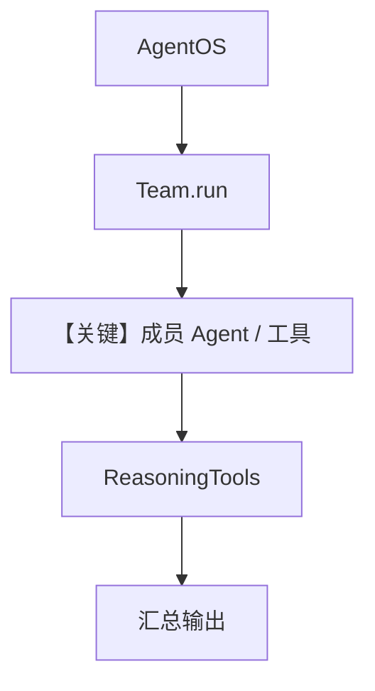

# _teams.py — 实现原理分析

<!-- cookbook-py-source:start -->
## 完整源码

```python
"""
 Teams
======

Demonstrates  teams.
"""

from agno.agent import Agent
from agno.db.postgres import PostgresDb
from agno.models.anthropic import Claude
from agno.team.team import Team
from agno.tools.reasoning import ReasoningTools
from agno.tools.websearch import WebSearchTools
from agno.tools.yfinance import YFinanceTools

# ---------------------------------------------------------------------------
# Create Example
# ---------------------------------------------------------------------------

db_url = "postgresql+psycopg://ai:ai@localhost:5532/ai"

web_agent = Agent(
    name="Web Search Agent",
    role="Handle web search requests",
    model=Claude(id="claude-3-7-sonnet-latest"),
    db=PostgresDb(db_url=db_url, session_table="web_agent_sessions"),
    tools=[WebSearchTools()],
    instructions=["Always include sources"],
)

finance_agent = Agent(
    name="Finance Agent",
    role="Handle financial data requests",
    model=Claude(id="claude-3-7-sonnet-latest"),
    db=PostgresDb(db_url=db_url, session_table="finance_agent_sessions"),
    tools=[YFinanceTools()],
    instructions=["Use tables to display data"],
)

finance_reasoning_team = Team(
    name="Reasoning Team Leader",
    model=Claude(id="claude-3-7-sonnet-latest"),
    db=PostgresDb(db_url=db_url, session_table="finance_reasoning_team_sessions"),
    members=[
        web_agent,
        finance_agent,
    ],
    tools=[ReasoningTools(add_instructions=True)],
    markdown=True,
    show_members_responses=True,
)

# ---------------------------------------------------------------------------
# Run Example
# ---------------------------------------------------------------------------

if __name__ == "__main__":
    raise SystemExit("This module is intended to be imported.")
```

<!-- cookbook-py-source:end -->

> 源文件：`cookbook/05_agent_os/advanced_demo/_teams.py`

## 概述

本模块定义 **`finance_reasoning_team`（Team）**：两名 **Agent**（`web_agent` 带 `WebSearchTools`，`finance_agent` 带 `YFinanceTools`），由 Team 级 **`Claude`** 协调，并挂载 **`ReasoningTools(add_instructions=True)`**。供 `demo.py` 等通过 `AgentOS` 注册。`__main__` 仅退出，禁止直接运行。

**核心配置一览：**

| 配置项 | 值 | 说明 |
|--------|------|------|
| `web_agent.model` | `Claude(id="claude-3-7-sonnet-latest")` | 成员模型 |
| `web_agent.instructions` | `["Always include sources"]` | 成员指令 |
| `finance_agent.instructions` | `["Use tables to display data"]` | 成员指令 |
| `finance_reasoning_team.model` | `Claude(id="claude-3-7-sonnet-latest")` | Team 协调模型 |
| `finance_reasoning_team.members` | `[web_agent, finance_agent]` | 成员列表 |
| `finance_reasoning_team.tools` | `[ReasoningTools(add_instructions=True)]` | Team 级推理工具 |
| `finance_reasoning_team.markdown` | `True` | Team 输出 markdown |
| `finance_reasoning_team.show_members_responses` | `True` | 展示成员回复 |
| `finance_reasoning_team.db` | `PostgresDb(..., session_table="finance_reasoning_team_sessions")` | 会话 |

## 架构分层

```
导入方（demo.py）        agno.team + agno.os
┌──────────────┐        ┌──────────────────────────┐
│ AgentOS      │───────>│ Team.run / 成员 Agent.run │
│ teams=[...]  │        │ ReasoningTools 注入        │
└──────────────┘        └──────────────────────────┘
```

## 核心组件解析

### Team 与成员 Agent 的 system

**不存在**单一 `Agent.get_system_message()` 覆盖整个 Team；**协调模型**与**各成员**各有自己的 system（见 Team 内部实现）。成员 `instructions`/`role` 在各自 `Agent` 构造时传入。

### ReasoningTools

`add_instructions=True` 会向相关上下文注入推理步骤说明（具体见 `ReasoningTools` 实现）。

### 运行机制与因果链

1. **路径**：API → Team 入口 → 调度成员 → 工具调用 → 汇总。  
2. **状态**：Postgres 各 `session_table` 分离 web/finance/team。  
3. **分支**：Team 模型决定调用哪个成员及是否用 `ReasoningTools`。  
4. **差异**：相对单 Agent，本例强调 **多工具角色分工 + Team 级推理工具**。

## System Prompt 组装

### Team 协调器与成员

| 对象 | 说明 |
|------|------|
| `finance_reasoning_team` | Team 自身有 `model` 与隐式/显式指令（本文件未设 `instructions=` 于 Team，需查 `Team` 默认） |
| `web_agent` / `finance_agent` | 各有 `role`、`instructions`；`get_system_message` 分别作用于成员 run |

本文件 Team **未**显式传入 `instructions=`（`finance_reasoning_team` 仅见 members/tools/markdown 等）。若默认 `None`，则成员级指令仍以各自 Agent 为准；Team 层提示词以 **`agno/team/`** 内组装逻辑为准（需在文档中说明：**Team 级 system 由 Team 类与 `ReasoningTools` 共同扩展**）。

### 成员 `web_agent` 还原（默认拼装核心字面量）

```text
Handle web search requests
```
（`role` 会进入 `<your_role>` 若提供；本文件 `role="Handle web search requests"`）

```text
Always include sources
```

### 还原说明

完整 Team 协调器 system **依赖 Team 实现**，无法仅从本 cookbook 静态拼出；验证：对 Team 主模型在首次 `run` 前断点查看 `Message` 列表。

## 完整 API 请求

成员与 Team 均使用 `Claude` → Anthropic **Messages** API（非 OpenAI Chat Completions）。

```python
# 示意：成员一次 invoke
# messages.create(..., system="...", messages=[{role:"user", content:"..."}])
```

## Mermaid 流程图



## 关键源码文件索引

| 文件 | 作用 |
|------|------|
| `agno/team/team.py` | `Team` 调度与消息 |
| `agno/agent/_messages.py` | 成员 `get_system_message` |
| `agno/tools/reasoning.py` | `ReasoningTools` |
