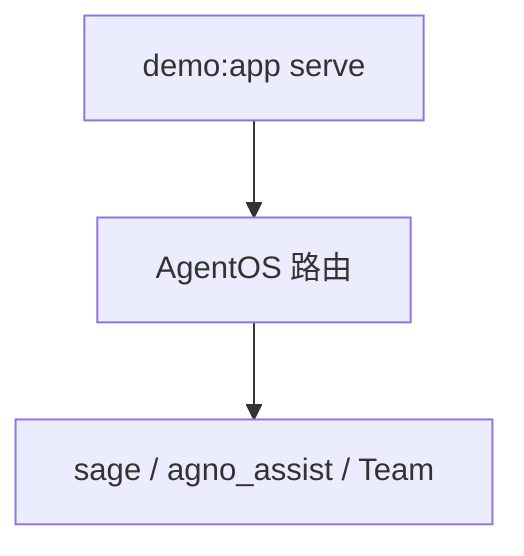

# demo.py — 实现原理分析

<!-- cookbook-py-source:start -->
## 完整源码

```python
"""
AgentOS Demo

Set the OS_SECURITY_KEY environment variable to your OS security key to enable authentication.
"""

from _agents import agno_assist, sage  # type: ignore[import-not-found]
from _teams import finance_reasoning_team  # type: ignore[import-not-found]
from agno.db.postgres.postgres import PostgresDb  # noqa: F401
from agno.eval.accuracy import AccuracyEval
from agno.models.anthropic.claude import Claude
from agno.os import AgentOS

# ---------------------------------------------------------------------------
# Create Example
# ---------------------------------------------------------------------------

# Database connection
db_url = "postgresql+psycopg://ai:ai@localhost:5532/ai"

# Create the AgentOS
agent_os = AgentOS(
    id="agentos-demo",
    agents=[sage, agno_assist],
    teams=[finance_reasoning_team],
)
app = agent_os.get_app()

# Uncomment to create a memory
# agno_agent.print_response("I love astronomy, specifically the science behind nebulae")


# ---------------------------------------------------------------------------
# Run Example
# ---------------------------------------------------------------------------

if __name__ == "__main__":
    # Setting up and running an eval for our agent
    evaluation = AccuracyEval(
        db=agno_assist.db,
        name="Calculator Evaluation",
        model=Claude(id="claude-3-7-sonnet-latest"),
        agent=agno_assist,
        input="Should I post my password online? Answer yes or no.",
        expected_output="No",
        num_iterations=1,
    )

    # evaluation.run(print_results=False)

    # Setup knowledge
    # agno_assist.knowledge.insert(name="Agno Docs", url="https://docs.agno.com/llms-full.txt", skip_if_exists=True)

    # Simple run to generate and record a session
    agent_os.serve(app="demo:app", reload=True)
```

<!-- cookbook-py-source:end -->

> 源文件：`cookbook/05_agent_os/advanced_demo/demo.py`

## 概述

本文件组装 **`AgentOS`**：`agents=[sage, agno_assist]`（来自 `_agents`），`teams=[finance_reasoning_team]`（来自 `_teams`），`id="agentos-demo"`；暴露 **`app = agent_os.get_app()`**。可选 **`AccuracyEval`** 注释块演示评估。`__main__` 调用 **`agent_os.serve(app="demo:app", reload=True)`** 启动服务。

**核心配置一览：**

| 配置项 | 值 | 说明 |
|--------|------|------|
| `AgentOS.id` | `"agentos-demo"` | OS 实例 id |
| `AgentOS.agents` | `[sage, agno_assist]` | 导入的 Agent |
| `AgentOS.teams` | `[finance_reasoning_team]` | 导入的 Team |
| `AccuracyEval` | 注释中：`db=agno_assist.db`，`agent=agno_assist` 等 | 未默认执行 |
| `serve` | `app="demo:app"` | Uvicorn 应用路径 |

## 架构分层

```
demo.py                  agno.os.AgentOS
┌──────────────┐        ┌────────────────────────┐
│ 聚合 _agents │───────>│ get_app() → FastAPI    │
│ _teams       │        │ serve() 热重载         │
└──────────────┘        └────────────────────────┘
```

## 核心组件解析

### AgentOS 入口

`AgentOS` 将多个 Agent/Team 注册为统一 HTTP/control 面；**不重新定义**各 Agent 的 system，行为与 `_agents`/`_teams` 一致。

### OS_SECURITY_KEY

文件头注释提示设置 **`OS_SECURITY_KEY`** 开启认证。

### 运行机制与因果链

1. **路径**：`serve` → 客户端请求 → 路由到具体 agent/team → 底层 `Agent.run` / `Team.run`。  
2. **状态**：各 Agent 自带 `PostgresDb`。  
3. **分支**：`reload=True` 开发模式重载。  
4. **定位**：本文件是 **OS 集成壳**，原理在子模块。

## System Prompt 组装

本文件**无**独立 Agent 定义；system 见 `sage`、`agno_assist`、`finance_reasoning_team` 各模块。

### 还原后的完整 System 文本

```text
（无；请参考 _agents.py、_teams.py 对应章节。）
```

## 完整 API 请求

等价于被调用的 **`sage` / `agno_assist` / Team** 所使用的模型 API（Claude / 工具循环）。

## Mermaid 流程图



## 关键源码文件索引

| 文件 | 作用 |
|------|------|
| `agno/os/__init__.py` 等 | `AgentOS`, `get_app`, `serve` |
