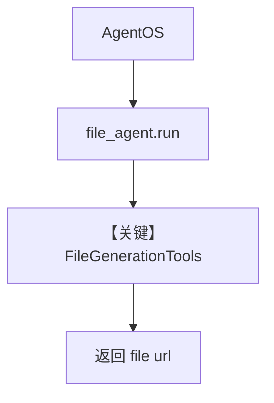

# file_output.py — 实现原理分析

> 源文件：`cookbook/05_agent_os/advanced_demo/file_output.py`

## 概述

本示例展示 **AgentOS + `FileGenerationTools`**：`file_agent` 使用 **`OpenAIChat(id="gpt-4o")`**，**`send_media_to_model=False`**，指令要求 **只返回文件 URL、不要做额外处理**；通过 `AgentOS` 对外提供服务。

**核心配置一览：**

| 配置项 | 值 | 说明 |
|--------|------|------|
| `name` | `"File Output Agent"` | Agent 名 |
| `model` | `OpenAIChat(id="gpt-4o")` | Chat Completions |
| `db` | `SqliteDb(db_file="tmp/agentos.db")` | 会话 |
| `send_media_to_model` | `False` | 不向模型发送媒体 |
| `tools` | `[FileGenerationTools(output_directory="tmp")]` | 文件生成 |
| `instructions` | `"Just return the file url as it is don't do anythings."` | 字面指令 |
| `AgentOS.id` | `"agentos-demo"` | 与 advanced 其他 demo 同 id |
| `markdown` | 未设置（默认 False） | 无 markdown 附加句 |

## 架构分层

```
file_output.py           agno.agent + agno.os
┌──────────────┐        ┌────────────────────────┐
│ file_agent   │───────>│ AgentOS.serve          │
│ FileGen工具  │        │ OpenAIChat.invoke      │
└──────────────┘        └────────────────────────┘
```

## 核心组件解析

### FileGenerationTools

工具将模型输出落地到 `tmp/`，URL 回传；与 `instructions` 组合强调「原样返回 URL」。

### 运行机制与因果链

1. **路径**：用户请求 → Agent 可能调用文件生成工具 → 返回 URL。  
2. **状态**：SQLite `tmp/agentos.db`。  
3. **分支**：无工具则纯文本回复。  
4. **差异**：强调 **媒体不送模型** 与 **极简指令**。

## System Prompt 组装

| 组成部分 | 值 | 生效 |
|---------|-----|------|
| `instructions` | 见下「还原」 | 是 |
| `markdown` | False | 否（不追加 Use markdown） |
| `description` | 未设置 | 否 |

### 还原后的完整 System 文本

```text
Just return the file url as it is don't do anythings.

```

（若存在模型级 `instructions` 合并，以 `OpenAIChat` 默认 `instructions` 为准，通常为无。）

### 段落释义

- 强制输出形态为「文件 URL 原样」，抑制多余解释或改写。

### 与 User 边界

用户消息为 API 中的用户输入；工具结果以 tool 消息回到对话。

## 完整 API 请求

`OpenAIChat.invoke` → `chat.completions.create`（`agno/models/openai/chat.py` `L412` 起），可带 `tools` 定义。

```python
client.chat.completions.create(
    model="gpt-4o",
    messages=[
        {"role": "system", "content": "Just return the file url as it is don't do anythings.\n\n"},
        {"role": "user", "content": "<用户请求>"},
    ],
    tools=[...],  # FileGenerationTools 序列化结果
)
```

## Mermaid 流程图



## 关键源码文件索引

| 文件 | 作用 |
|------|------|
| `agno/tools/file_generation.py` | `FileGenerationTools` |
| `agno/models/openai/chat.py` | `invoke` |
