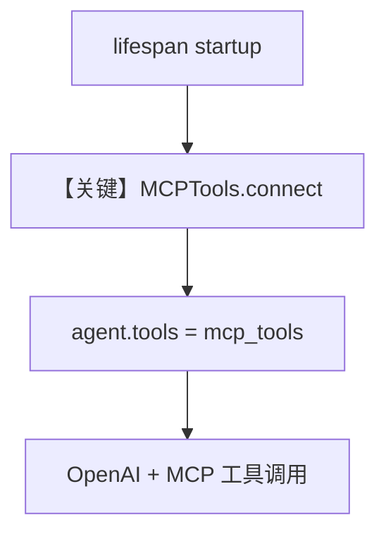

# mcp_demo.py — 实现原理分析

<!-- cookbook-py-source:start -->
## 完整源码

```python
"""This example shows how to run an Agent using our MCP integration in the Agno OS.

For this example to run you need:
- Create a GitHub personal access token following these steps:
    - https://github.com/modelcontextprotocol/servers/tree/main/src/github#setup
- Set the GITHUB_TOKEN environment variable: `export GITHUB_TOKEN=<Your GitHub access token>`
- Run: `uv pip install agno mcp openai` to install the dependencies
"""

from contextlib import asynccontextmanager
from os import getenv
from textwrap import dedent

from agno.agent import Agent
from agno.db.sqlite import SqliteDb
from agno.models.openai import OpenAIChat
from agno.os import AgentOS
from agno.tools.mcp import MCPTools
from fastapi import FastAPI
from mcp import StdioServerParameters

# ---------------------------------------------------------------------------
# Create Example
# ---------------------------------------------------------------------------

agent_storage_file: str = "tmp/agents.db"


# MCP server parameters setup
github_token = getenv("GITHUB_TOKEN") or getenv("GITHUB_ACCESS_TOKEN")
if not github_token:
    raise ValueError("GITHUB_TOKEN environment variable is required")

server_params = StdioServerParameters(
    command="npx",
    args=["-y", "@modelcontextprotocol/server-github"],
)


# This is required to start the MCP connection correctly in the FastAPI lifecycle
@asynccontextmanager
async def lifespan(app: FastAPI):
    """Manage MCP connection lifecycle inside a FastAPI app"""
    global mcp_tools

    # Startuplogic: connect to our MCP server
    mcp_tools = MCPTools(server_params=server_params)
    await mcp_tools.connect()

    # Add the MCP tools to our Agent
    agent.tools = [mcp_tools]

    yield

    # Shutdown: Close MCP connection
    await mcp_tools.close()


agent = Agent(
    name="MCP GitHub Agent",
    instructions=dedent("""\
        You are a GitHub assistant. Help users explore repositories and their activity.

        - Use headings to organize your responses
        - Be concise and focus on relevant information\
    """),
    model=OpenAIChat(id="gpt-4o"),
    db=SqliteDb(db_file=agent_storage_file),
    update_memory_on_run=True,
    enable_session_summaries=True,
    add_history_to_context=True,
    num_history_runs=3,
    add_datetime_to_context=True,
    markdown=True,
)

# Setup our AgentOS app
agent_os = AgentOS(
    description="Example OS setup",
    agents=[agent],
)
app = agent_os.get_app()


# ---------------------------------------------------------------------------
# Run Example
# ---------------------------------------------------------------------------

if __name__ == "__main__":
    agent_os.serve(app="mcp_demo:app", reload=True)
```

<!-- cookbook-py-source:end -->

> 源文件：`cookbook/05_agent_os/advanced_demo/mcp_demo.py`

## 概述

本示例在 **AgentOS** 中集成 **MCP GitHub 服务**：启动时需 **`GITHUB_TOKEN`**；定义 **`lifespan`** 在 FastAPI 生命周期内 **`MCPTools.connect()`**，并将 **`mcp_tools` 赋给 `agent.tools`**；`Agent` 启用 **会话摘要、历史、时间、markdown**。

**核心配置一览：**

| 配置项 | 值 | 说明 |
|--------|------|------|
| `Agent.name` | `"MCP GitHub Agent"` | 名称 |
| `instructions` | `dedent(...)` 多行（GitHub 助手） | system 核心 |
| `model` | `OpenAIChat(id="gpt-4o")` | Chat Completions |
| `db` | `SqliteDb(db_file=agent_storage_file)`，`tmp/agents.db` | 存储 |
| `update_memory_on_run` | `True` | 记忆更新 |
| `enable_session_summaries` | `True` | 会话摘要 |
| `add_history_to_context` | `True`，`num_history_runs=3` | 历史 |
| `add_datetime_to_context` | `True` | 时间 |
| `markdown` | `True` | markdown 说明进入 additional |
| `MCPTools` | `StdioServerParameters(command="npx", args=["-y", "@modelcontextprotocol/server-github"])` | GitHub MCP |
| `AgentOS.description` | `"Example OS setup"` | OS 描述 |

**注意**：`lifespan` 在模块中定义；**需确认** `agent_os.get_app()` 返回的 `app` 是否自动挂载该 `lifespan`（若未挂载，MCP 可能未连接——以当前 `AgentOS` 实现为准）。

## 架构分层

```
mcp_demo.py              MCP + FastAPI 生命周期
┌──────────────┐        ┌────────────────────────┐
│ lifespan     │───────>│ connect → agent.tools  │
│ MCPTools     │        │ AgentOS.get_app()      │
└──────────────┘        └────────────────────────┘
```

## 核心组件解析

### MCPTools 与 stdio

通过 `npx` 拉起官方 GitHub MCP；`await mcp_tools.connect()` 后工具列表注入 Agent。

### 运行机制与因果链

1. **路径**：应用启动 → lifespan 连接 MCP → 请求 → OpenAI + MCP 工具调用。  
2. **状态**：SQLite + 会话摘要字段。  
3. **分支**：无 token 时模块级 `raise ValueError`。  
4. **差异**：相对 `agno_assist.py`（URL MCP），本例为 **stdio + npx**。

## System Prompt 组装

### 还原后的完整 System 文本（instructions + 默认 additional）

**Instructions 字面量：**

```text
You are a GitHub assistant. Help users explore repositories and their activity.

- Use headings to organize your responses
- Be concise and focus on relevant information
```

** additional_information（`markdown=True` 等，时间动态）：**

```text
- Use markdown to format your answers.
- The current time is <运行时>.
```

（`add_name_to_context` 未开，无姓名行。）

### 拼装顺序

`get_system_message` `# 3.1` instructions → `# 3.3.3` → `# 3.3.4` 附加段 → 工具说明（MCP 工具 schema 由 `_tool_instructions` 等注入，以运行时为准）。

### 段落释义

- 约束回答结构（标题）、简洁性；GitHub 能力来自 MCP 工具而非纯文本。

## 完整 API 请求

`OpenAIChat` → `chat.completions.create`，`tools` 为 MCP 暴露的工具 schema。

## Mermaid 流程图



## 关键源码文件索引

| 文件 | 作用 |
|------|------|
| `agno/tools/mcp.py` | `MCPTools` |
| `agno/models/openai/chat.py` | `invoke` |
