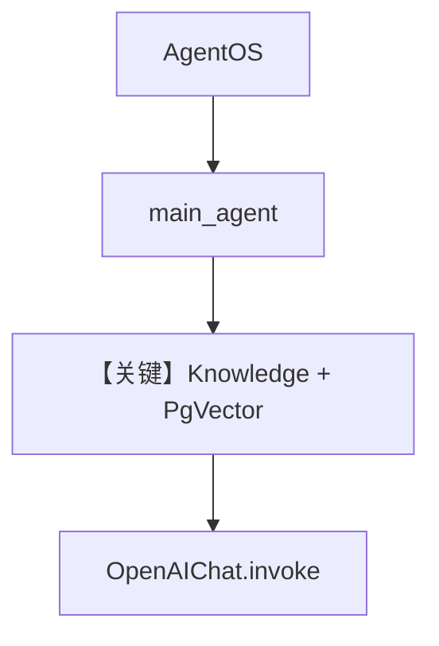

# multiple_knowledge_bases.py — 实现原理分析

<!-- cookbook-py-source:start -->
## 完整源码

```python
"""
Multiple Knowledge Bases
========================

Demonstrates multiple knowledge bases.
"""

from agno.agent import Agent
from agno.db.json import JsonDb
from agno.knowledge.knowledge import Knowledge
from agno.models.openai import OpenAIChat
from agno.os import AgentOS
from agno.vectordb.pgvector import PgVector

# ---------------------------------------------------------------------------
# Create Example
# ---------------------------------------------------------------------------

db_url = "postgresql+psycopg://ai:ai@localhost:5532/ai"


vector_db = PgVector(table_name="vectors", db_url=db_url)
secondary_vector_db = PgVector(table_name="more_vectors", db_url=db_url)
contents_db = JsonDb(db_path="./agno_json_data", knowledge_table="main_knowledge")
secondary_contents_db = JsonDb(
    db_path="./agno_json_data_2", knowledge_table="secondary_knowledge"
)

# Create knowledge bases
knowledge_base = Knowledge(
    name="Main Knowledge Base",
    description="A simple knowledge base",
    contents_db=contents_db,
    vector_db=vector_db,
)

main_agent = Agent(
    name="Main Agent",
    model=OpenAIChat(id="gpt-4o"),
    knowledge=knowledge_base,
    add_datetime_to_context=True,
    markdown=True,
    db=contents_db,
)

agent_os = AgentOS(
    description="Example app for basic agent with knowledge capabilities",
    id="knowledge-demo",
    agents=[main_agent],
)
app = agent_os.get_app()

# ---------------------------------------------------------------------------
# Run Example
# ---------------------------------------------------------------------------

if __name__ == "__main__":
    """ Run your AgentOS:
    Now you can interact with your knowledge base using the API. Examples:
    - http://localhost:8001/knowledge/{id}/documents
    - http://localhost:8001/knowledge/{id}/documents/123
    - http://localhost:8001/knowledge/{id}/documents?agent_id=123
    - http://localhost:8001/knowledge/{id}/documents?limit=10&page=0&sort_by=created_at&sort_order=desc
    """
    agent_os.serve(app="multiple_knowledge_bases:app", reload=True)
```

<!-- cookbook-py-source:end -->

> 源文件：`cookbook/05_agent_os/advanced_demo/multiple_knowledge_bases.py`

## 概述

本示例注册 **`main_agent`**，绑定单一 **`Knowledge`**（`Main Knowledge Base`），使用 **`PgVector`** 与 **`JsonDb` contents_db`**；同时脚本中定义了 **`secondary_vector_db`** 与 **`secondary_contents_db`**，但**未**挂到任何 Agent（仅作扩展参考）。**未**显式设置 `search_knowledge=True`（若框架默认 False，则需核对是否需开启才能检索）。

**核心配置一览：**

| 配置项 | 值 | 说明 |
|--------|------|------|
| `main_agent.name` | `"Main Agent"` | 名称 |
| `main_agent.model` | `OpenAIChat(id="gpt-4o")` | Chat Completions |
| `main_agent.knowledge` | `knowledge_base` | 主知识库 |
| `main_agent.db` | `contents_db`（JsonDb） | Agent 会话用同一 JsonDb |
| `main_agent.add_datetime_to_context` | `True` | 时间 |
| `main_agent.markdown` | `True` | markdown |
| `knowledge_base` | `Knowledge(name=..., contents_db=..., vector_db=vector_db)` | 主 KB |
| `AgentOS.id` | `"knowledge-demo"` | OS id |

## 架构分层

```
multiple_knowledge_bases.py    AgentOS + Knowledge API
┌────────────────────┐        ┌─────────────────────────┐
│ main_agent         │───────>│ HTTP 知识文档 CRUD 等     │
│ PgVector + JsonDb  │        │ OpenAIChat + 检索管线     │
└────────────────────┘        └─────────────────────────┘
```

## 核心组件解析

### 双库定义与单 Agent

`secondary_*` 展示如何再建一套向量/内容库，但当前 **只使用 `knowledge_base`**。

### 运行机制与因果链

1. **路径**：`serve` → 问答 → 若启用检索则向量查询 → 模型回答。  
2. **状态**：Postgres pgvector + 本地 Json 目录。  
3. **分支**：无文档时模型依赖 parametric 知识。  
4. **差异**：文件注释列出 **knowledge REST 路径**（`/knowledge/{id}/documents` 等）。

## System Prompt 组装

`main_agent` **未**设置 `description`/`instructions`（默认 None）。则 `get_system_message` 主要包含：

- `# 3.2.1` markdown 句（`markdown=True`）
- `# 3.2.2` 当前时间（`add_datetime_to_context=True`）
- 模型自带 `get_instructions_for_model`（若有）
- **Knowledge 相关段落**：若 `search_knowledge` 为 True 会注入检索说明（需查 `Agent` 默认与 `_messages` 分支）

### 还原后的完整 System 文本（可静态确定部分）

```text
Use markdown to format your answers.

```

```text
The current time is <运行时>.
```

**无法静态还原**：知识库检索说明、工具段落（若运行时注入）。验证：打印 `get_system_message` 返回值。

### 段落释义

- markdown 与时间约束仍生效；若缺 `instructions`，模型行为更依赖用户消息与知识注入。

## 完整 API 请求

`OpenAIChat` → `chat.completions.create`；若带知识工具或内部检索，messages 中含检索结果片段。

## Mermaid 流程图



## 关键源码文件索引

| 文件 | 作用 |
|------|------|
| `agno/knowledge/knowledge.py` | `Knowledge` |
| `agno/vectordb/pgvector/` | `PgVector` |
| `agno/agent/_messages.py` | knowledge 相关 system 段 |
