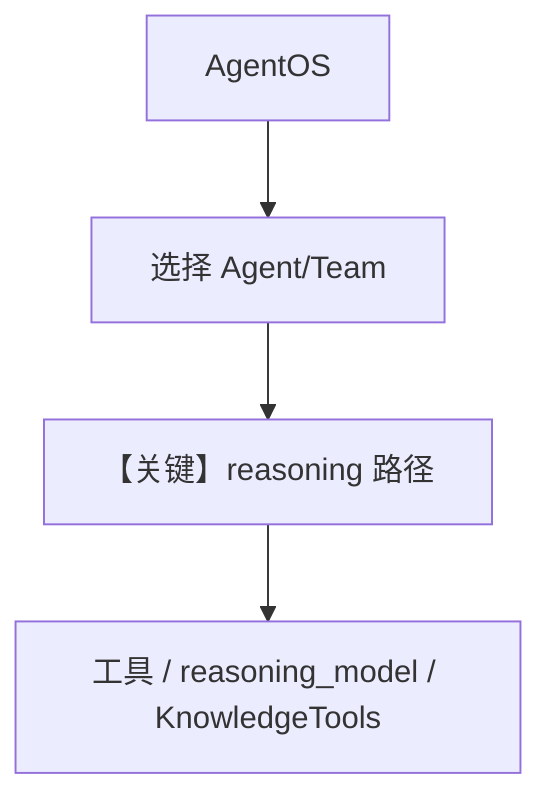

# reasoning_demo.py — 实现原理分析

<!-- cookbook-py-source:start -->
## 完整源码

```python
"""Run `uv pip install openai exa_py ddgs yfinance pypdf sqlalchemy 'fastapi[standard]' youtube-transcript-api python-docx agno` to install dependencies."""

from agno.agent import Agent
from agno.db.postgres import PostgresDb
from agno.knowledge.knowledge import Knowledge
from agno.models.openai import OpenAIChat
from agno.os import AgentOS
from agno.team import Team
from agno.tools.knowledge import KnowledgeTools
from agno.tools.reasoning import ReasoningTools
from agno.tools.websearch import WebSearchTools
from agno.vectordb.lancedb import LanceDb, SearchType

# ---------------------------------------------------------------------------
# Create Example
# ---------------------------------------------------------------------------

db_url = "postgresql+psycopg://ai:ai@localhost:5532/ai"
db = PostgresDb(db_url)


finance_agent = Agent(
    name="Finance Agent",
    role="Get financial data",
    id="finance-agent",
    model=OpenAIChat(id="gpt-4o"),
    tools=[
        WebSearchTools(
            enable_news=True,
        )
    ],
    instructions=["Always use tables to display data"],
    db=db,
    add_history_to_context=True,
    num_history_runs=5,
    add_datetime_to_context=True,
    markdown=True,
)

cot_agent = Agent(
    name="Chain-of-Thought Agent",
    role="Answer basic questions",
    id="cot-agent",
    model=OpenAIChat(id="gpt-5.2"),
    db=db,
    add_history_to_context=True,
    num_history_runs=3,
    add_datetime_to_context=True,
    markdown=True,
    reasoning=True,
)

reasoning_model_agent = Agent(
    name="Reasoning Model Agent",
    role="Reasoning about Math",
    id="reasoning-model-agent",
    model=OpenAIChat(id="gpt-4o"),
    reasoning_model=OpenAIChat(id="o3-mini"),
    instructions=["You are a reasoning agent that can reason about math."],
    markdown=True,
    db=db,
)

reasoning_tool_agent = Agent(
    name="Reasoning Tool Agent",
    role="Answer basic questions",
    id="reasoning-tool-agent",
    model=OpenAIChat(id="gpt-5.2"),
    db=db,
    add_history_to_context=True,
    num_history_runs=3,
    add_datetime_to_context=True,
    markdown=True,
    tools=[ReasoningTools()],
)


web_agent = Agent(
    name="Web Search Agent",
    role="Handle web search requests",
    model=OpenAIChat(id="gpt-5.2"),
    id="web_agent",
    tools=[WebSearchTools()],
    instructions="Always include sources",
    add_datetime_to_context=True,
    db=db,
)

agno_docs = Knowledge(
    # Use LanceDB as the vector database and store embeddings in the `agno_docs` table
    vector_db=LanceDb(
        uri="tmp/lancedb",
        table_name="agno_docs",
        search_type=SearchType.hybrid,
    ),
)

knowledge_tools = KnowledgeTools(
    knowledge=agno_docs,
    enable_think=True,
    enable_search=True,
    enable_analyze=True,
    add_few_shot=True,
)
knowledge_agent = Agent(
    id="knowledge_agent",
    name="Knowledge Agent",
    model=OpenAIChat(id="gpt-4o"),
    tools=[knowledge_tools],
    markdown=True,
    db=db,
)

reasoning_finance_team = Team(
    name="Reasoning Finance Team",
    model=OpenAIChat(id="gpt-4o"),
    members=[
        web_agent,
        finance_agent,
    ],
    # reasoning=True,
    tools=[ReasoningTools(add_instructions=True)],
    # uncomment it to use knowledge tools
    # tools=[knowledge_tools],
    id="reasoning_finance_team",
    instructions=[
        "Only output the final answer, no other text.",
        "Use tables to display data",
    ],
    markdown=True,
    show_members_responses=True,
    add_datetime_to_context=True,
    db=db,
)


# Setup our AgentOS app
agent_os = AgentOS(
    description="Example OS setup",
    agents=[
        finance_agent,
        cot_agent,
        reasoning_model_agent,
        reasoning_tool_agent,
        knowledge_agent,
    ],
    teams=[reasoning_finance_team],
)
app = agent_os.get_app()


# ---------------------------------------------------------------------------
# Run Example
# ---------------------------------------------------------------------------

if __name__ == "__main__":
    agno_docs.insert(name="Agno Docs", url="https://www.paulgraham.com/read.html")
    agent_os.serve(app="reasoning_demo:app", reload=True)
```

<!-- cookbook-py-source:end -->

> 源文件：`cookbook/05_agent_os/advanced_demo/reasoning_demo.py`

## 概述

本文件向 **`AgentOS`** 注册多个 **Agent**（金融、CoT、`reasoning_model` 双模型、`ReasoningTools`、**KnowledgeTools + LanceDB**）以及 **`reasoning_finance_team`（Team）**，用于演示 **推理、联网、Yahoo 财经、知识工具** 等组合。`__main__` 中 **`agno_docs.insert(...)`** 拉取网页文本写入 LanceDB 后 **`serve`**。

**核心配置一览（摘录）：**

| 配置项 | 值 | 说明 |
|--------|------|------|
| `finance_agent` | `WebSearchTools(enable_news=True)`，等 | 金融+新闻搜索 |
| `cot_agent` | `model=OpenAIChat(id="gpt-5.2")`，`reasoning=True` | 链式推理标记 |
| `reasoning_model_agent` | `reasoning_model=OpenAIChat(id="o3-mini")` | 推理用副模型 |
| `reasoning_tool_agent` | `ReasoningTools()` | 推理工具 |
| `knowledge_agent` | `KnowledgeTools(knowledge=agno_docs, ...)` | 检索/think/analyze |
| `reasoning_finance_team` | members `web_agent`+`finance_agent`，`ReasoningTools(add_instructions=True)` | Team |
| `db` | `PostgresDb(db_url)` | 共享 DB |
| `agno_docs` | `LanceDb(uri="tmp/lancedb", hybrid)` | 向量库 |

## 架构分层

```
reasoning_demo.py        多 Agent + Team → AgentOS
┌────────────────┐      ┌──────────────────────────┐
│ insert 文档    │─────>│ LanceDB 检索 + 各模型调用  │
└────────────────┘      └──────────────────────────┘
```

## 核心组件解析

### reasoning 三种形态

- **`reasoning=True`**（`cot_agent`）：框架内链式推理。  
- **`reasoning_model`**（`reasoning_model_agent`）：主答与推理拆分模型。  
- **`ReasoningTools`**（`reasoning_tool_agent` / Team）：工具化推理步骤。

### KnowledgeTools

`enable_think/search/analyze`，`add_few_shot=True`，与 `LanceDb` 上 `agno_docs` 配合。

### 运行机制与因果链

1. **路径**：`serve` → 选 agent/team → run → 工具/检索/推理。  
2. **状态**：Postgres + `tmp/lancedb`。  
3. **分支**：Team 注释可切换 `tools` 为 `knowledge_tools`。  
4. **定位**：**AgentOS 能力展台**，一文件多模式。

## System Prompt 组装

各 Agent/Team **独立**；示例字面量包括：

- `finance_agent.instructions`: `["Always use tables to display data"]`  
- `reasoning_model_agent.instructions`: `["You are a reasoning agent that can reason about math."]`  
- `web_agent.instructions`: `"Always include sources"`  
- `reasoning_finance_team.instructions`: `["Only output the final answer, no other text.", "Use tables to display data"]`

### 还原示例（`reasoning_model_agent` 核心）

```text
You are a reasoning agent that can reason about math.

```

并叠加 `markdown=True`、`add_datetime_to_context=True` 的 additional 段（时间动态）。

完整 Team system 需 **`agno/team`** 运行时拼接。

## 完整 API 请求

主要为 **`OpenAIChat.invoke`**（`gpt-4o` / `gpt-5.2` / `o3-mini` 等）；以各模型类 `invoke` 为准。

## Mermaid 流程图



## 关键源码文件索引

| 文件 | 作用 |
|------|------|
| `agno/agent/agent.py` | `reasoning`, `reasoning_model` |
| `agno/tools/reasoning.py` | `ReasoningTools` |
| `agno/tools/knowledge.py` | `KnowledgeTools` |
