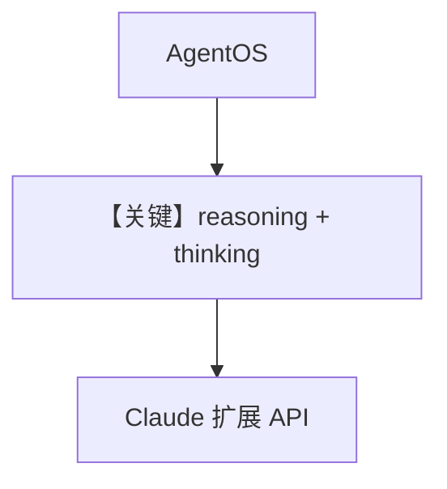

# reasoning_model.py — 实现原理分析

<!-- cookbook-py-source:start -->
## 完整源码

```python
"""
Example showing a reasoning Agent in the AgentOS.

You can interact with the Agent as normally. It will reason before providing a final answer.
You will see its chain of thought live as it is generated.
"""

from agno.agent import Agent
from agno.models.anthropic import Claude
from agno.os import AgentOS
from agno.run.agent import RunEvent  # noqa

# ---------------------------------------------------------------------------
# Create Example
# ---------------------------------------------------------------------------

# Create an agent with reasoning enabled
agent = Agent(
    reasoning_model=Claude(
        id="claude-sonnet-4-5",
        thinking={"type": "enabled", "budget_tokens": 1024},
    ),
    reasoning=True,
    instructions="Think step by step about the problem.",
)

# Setup our AgentOS app
agent_os = AgentOS(
    description="Reasoning model streaming",
    agents=[agent],
)
app = agent_os.get_app()


# ---------------------------------------------------------------------------
# Run Example
# ---------------------------------------------------------------------------

if __name__ == "__main__":
    """Run your AgentOS.

    You can see the configuration and available apps at:
    http://localhost:7777/config

    """
    agent_os.serve(app="reasoning_model:app", reload=True)
```

<!-- cookbook-py-source:end -->

> 源文件：`cookbook/05_agent_os/advanced_demo/reasoning_model.py`

## 概述

本示例创建 **单 Agent**：**`reasoning_model=Claude(id="claude-sonnet-4-5", thinking={"type": "enabled", "budget_tokens": 1024})`**，**`reasoning=True`**，**`instructions="Think step by step about the problem."`**；**未显式设置 `model=`**（`Agent.model` 默认 `None`）。**成功运行依赖**当前版本 Agno 是否在仅有 `reasoning_model` 时自动选用其作为主模型，或是否要求在构造时补全 `model`——**需以运行时或源码校验为准**。

**核心配置一览：**

| 配置项 | 值 | 说明 |
|--------|------|------|
| `reasoning_model` | `Claude(..., thinking={...})` | 扩展思考（Claude thinking） |
| `reasoning` | `True` | 启用推理路径 |
| `instructions` | `"Think step by step about the problem."` | 显式字面量 |
| `db` | 未设置 | 无持久化 DB |
| `AgentOS.description` | `"Reasoning model streaming"` | OS 描述 |

## 架构分层

```
reasoning_model.py       agno.agent + Claude extended thinking
┌────────────────┐      ┌──────────────────────────┐
| AgentOS.serve  │─────>│ Claude invoke_stream/思考块 │
└────────────────┘      └──────────────────────────┘
```

## 核心组件解析

### Claude `thinking` 参数

`thinking={"type": "enabled", "budget_tokens": 1024}` 交给 Anthropic **带思考预算** 的模型能力；流式时可观察思维链（文件头注释）。

### 运行机制与因果链

1. **路径**：请求 → 推理模型生成思考+答案 → 客户端展示。  
2. **状态**：无 db，会话可能仅内存。  
3. **分支**：`reasoning=True` 与 `reasoning_model` 共同作用时的优先级依框架实现。  
4. **差异**：相对 `reasoning_demo.py` 多代理，本例 **最小推理演示**。

## System Prompt 组装

| 组成部分 | 值 | 生效 |
|---------|-----|------|
| `instructions` | 见下 | 是 |
| `markdown` | 默认 False | 否 |

### 还原后的完整 System 文本

```text
Think step by step about the problem.

```

（若 `Claude` 合并 model 级 instructions，叠加之。）

### 段落释义

- 明确要求分步思考，与 `thinking` 能力对齐。

## 完整 API 请求

**Anthropic Messages API**，带 `thinking`/`budget_tokens` 等扩展参数（见 `Claude` 实现 `invoke`/`invoke_stream`）。

```python
# 示意：非 chat.completions；参数以 claude.py 为准
# messages.create(..., thinking=..., system="...", messages=[...])
```

## Mermaid 流程图



## 关键源码文件索引

| 文件 | 作用 |
|------|------|
| `agno/models/anthropic/claude.py` | `thinking`、invoke |
| `agno/agent/agent.py` | `reasoning_model` 字段 |
