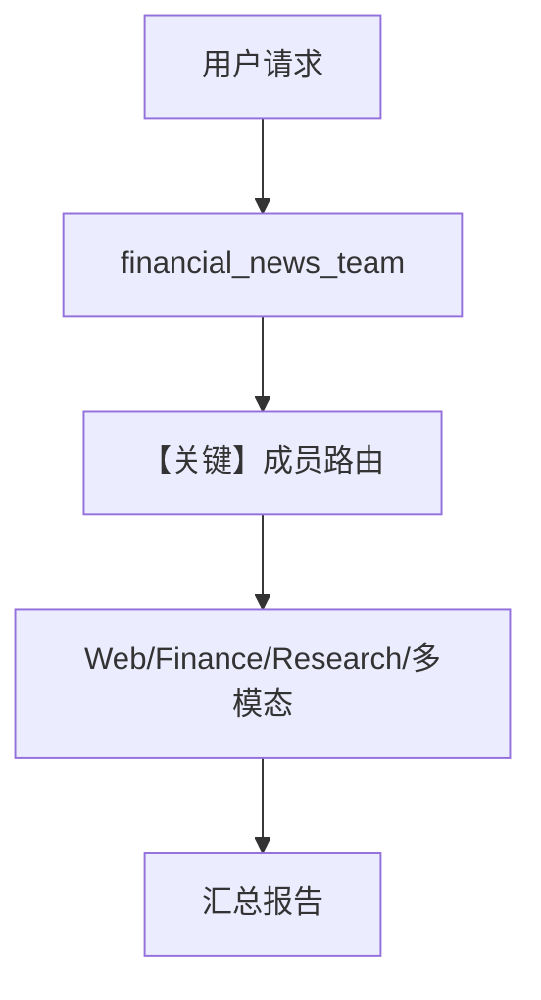

# teams_demo.py — 实现原理分析

<!-- cookbook-py-source:start -->
## 完整源码

```python
"""
Teams Demo
==========

Demonstrates teams demo.
"""

from agno.agent import Agent
from agno.db.postgres import PostgresDb
from agno.models.anthropic import Claude
from agno.models.google.gemini import Gemini
from agno.models.openai import OpenAIChat
from agno.os import AgentOS
from agno.team.team import Team
from agno.tools.exa import ExaTools
from agno.tools.websearch import WebSearchTools
from agno.tools.yfinance import YFinanceTools

# ---------------------------------------------------------------------------
# Create Example
# ---------------------------------------------------------------------------

db_url = "postgresql+psycopg://ai:ai@localhost:5532/ai"
db = PostgresDb(db_url)

file_agent = Agent(
    name="File Upload Agent",
    id="file-upload-agent",
    role="Answer questions about the uploaded files",
    model=Claude(id="claude-3-7-sonnet-latest"),
    db=db,
    update_memory_on_run=True,
    instructions=[
        "You are an AI agent that can analyze files.",
        "You are given a file and you need to answer questions about the file.",
    ],
    markdown=True,
)

video_agent = Agent(
    name="Video Understanding Agent",
    model=Gemini(id="gemini-3-flash-preview"),
    id="video-understanding-agent",
    role="Answer questions about video files",
    db=db,
    update_memory_on_run=True,
    add_history_to_context=True,
    add_datetime_to_context=True,
    markdown=True,
)

audio_agent = Agent(
    name="Audio Understanding Agent",
    id="audio-understanding-agent",
    role="Answer questions about audio files",
    model=OpenAIChat(id="gpt-4o-audio-preview"),
    db=db,
    update_memory_on_run=True,
    add_history_to_context=True,
    add_datetime_to_context=True,
    markdown=True,
)

web_agent = Agent(
    name="Web Agent",
    role="Search the web for information",
    model=OpenAIChat(id="gpt-4o"),
    tools=[WebSearchTools()],
    id="web_agent",
    instructions=[
        "You are an experienced web researcher and news analyst.",
    ],
    update_memory_on_run=True,
    markdown=True,
    db=db,
)

finance_agent = Agent(
    name="Finance Agent",
    role="Get financial data",
    id="finance_agent",
    model=OpenAIChat(id="gpt-4o"),
    tools=[YFinanceTools()],
    instructions=[
        "You are a skilled financial analyst with expertise in market data.",
        "Follow these steps when analyzing financial data:",
        "Start with the latest stock price, trading volume, and daily range",
        "Present detailed analyst recommendations and consensus target prices",
        "Include key metrics: P/E ratio, market cap, 52-week range",
        "Analyze trading patterns and volume trends",
    ],
    update_memory_on_run=True,
    markdown=True,
    db=db,
)

simple_agent = Agent(
    name="Simple Agent",
    role="Simple agent",
    id="simple_agent",
    model=OpenAIChat(id="gpt-4o"),
    instructions=["You are a simple agent"],
    update_memory_on_run=True,
    db=db,
)

research_agent = Agent(
    name="Research Agent",
    role="Research agent",
    id="research_agent",
    model=OpenAIChat(id="gpt-4o"),
    instructions=["You are a research agent"],
    tools=[WebSearchTools(), ExaTools()],
    update_memory_on_run=True,
    db=db,
)

research_team = Team(
    name="Research Team",
    description="A team of agents that research the web",
    members=[research_agent, simple_agent],
    model=OpenAIChat(id="gpt-4o"),
    id="research_team",
    instructions=[
        "You are the lead researcher of a research team.",
    ],
    update_memory_on_run=True,
    add_datetime_to_context=True,
    markdown=True,
    db=db,
)

multimodal_team = Team(
    name="Multimodal Team",
    description="A team of agents that can handle multiple modalities",
    members=[file_agent, audio_agent, video_agent],
    model=OpenAIChat(id="gpt-4o"),
    respond_directly=True,
    id="multimodal_team",
    instructions=[
        "You are the lead editor of a prestigious financial news desk.",
    ],
    update_memory_on_run=True,
    db=db,
)
financial_news_team = Team(
    name="Financial News Team",
    description="A team of agents that search the web for financial news and analyze it.",
    members=[
        web_agent,
        finance_agent,
        research_agent,
        file_agent,
        audio_agent,
        video_agent,
    ],
    model=OpenAIChat(id="gpt-4o"),
    respond_directly=True,
    id="financial_news_team",
    instructions=[
        "You are the lead editor of a prestigious financial news desk.",
        "If you are given a file send it to the file agent.",
        "If you are given an audio file send it to the audio agent.",
        "If you are given a video file send it to the video agent.",
        "Use USD as currency.",
        "If the user is just being conversational, you should respond directly WITHOUT forwarding a task to a member.",
    ],
    add_datetime_to_context=True,
    markdown=True,
    show_members_responses=True,
    db=db,
    update_memory_on_run=True,
    expected_output="A good financial news report.",
)


# Setup our AgentOS app
agent_os = AgentOS(
    description="Example OS setup",
    agents=[
        simple_agent,
        web_agent,
        finance_agent,
        research_agent,
    ],
    teams=[research_team, multimodal_team, financial_news_team],
)
app = agent_os.get_app()


# ---------------------------------------------------------------------------
# Run Example
# ---------------------------------------------------------------------------

if __name__ == "__main__":
    agent_os.serve(app="teams_demo:app", reload=True)
```

<!-- cookbook-py-source:end -->

> 源文件：`cookbook/05_agent_os/advanced_demo/teams_demo.py`

## 概述

本文件定义 **多个 Agent**（文件上传、视频、音频、网页、金融、简单、研究）与 **三个 Team**（`research_team`、`multimodal_team`、`financial_news_team`），统一 **`PostgresDb`**，通过 **`AgentOS`** 暴露 **`research_team`、`multimodal_team`、`financial_news_team`** 及若干独立 Agent。展示 **多模态分工**（Claude/Gemini/OpenAI audio）、**金融分析**与 **`respond_directly=True`** 的 Team 行为。

**核心配置一览（Team 层）：**

| 配置项 | 值 | 说明 |
|--------|------|------|
| `research_team` | members `research_agent`, `simple_agent`，`model=OpenAIChat(gpt-4o)` | 研究小队 |
| `multimodal_team` | `file_agent`,`audio_agent`,`video_agent`，`respond_directly=True` | 多模态 |
| `financial_news_team` | 5 名成员含 web/finance/research/文件/音/视频，`respond_directly=True`，`show_members_responses=True` | 财经新闻工作台 |
| `financial_news_team.expected_output` | `"A good financial news report."` | 期望输出约束 |

**Agent 摘录**：`file_agent` 使用 **Claude**；`video_agent` **Gemini**；`audio_agent` **gpt-4o-audio-preview**；其余多为 **gpt-4o** 加工具。

## 架构分层

```
teams_demo.py            多 Team 注册 AgentOS
┌────────────────┐      ┌────────────────────────────┐
│ get_app()      │─────>│ 路由到不同 team / agent     │
└────────────────┘      └────────────────────────────┘
```

## 核心组件解析

### respond_directly

`financial_news_team` 与 `multimodal_team` 设为 **`True`**：部分对话可由 Team 主模型直接回复而不必委派成员（与 `instructions` 中「 conversational 则直接回复」一致）。

### expected_output

Team 级 **`expected_output`** 进入 system 的 `# 3.3.7` 段（若 Team 继承与 Agent 相同拼装逻辑，以 `Team` 实现为准）。

### 运行机制与因果链

1. **路径**：用户上传或文本 → Team 路由 → 成员工具调用 → 汇总。  
2. **状态**：共享 `PostgresDb(db_url)`。  
3. **分支**：媒体类型决定委派对象（见 team `instructions`）。  
4. **定位**：**大规模 Team 编排**示例。

## System Prompt 组装

### `financial_news_team` 显式 instructions（字面量拼接）

```text
You are the lead editor of a prestigious financial news desk.
If you are given a file send it to the file agent.
If you are given an audio file send it to the audio agent.
If you are given a video file send it to the video agent.
Use USD as currency.
If the user is just being conversational, you should respond directly WITHOUT forwarding a task to a member.
```

### expected_output

```text
A good financial news report.
```

成员 Agent 各有独立 `instructions`/`role`（见源文件 L26-116）。

### 完整 Team system

需合并 **Team 默认描述、instructions、markdown、datetime、expected_output**；以运行时 `Team` 类为准。

## 完整 API 请求

混合 **Claude / Gemini / OpenAI** 多种 `invoke` 形态；成员被调用时使用对应厂商 API。

## Mermaid 流程图



## 关键源码文件索引

| 文件 | 作用 |
|------|------|
| `agno/team/team.py` | `Team`，`respond_directly` |
| `agno/agent/_messages.py` | 成员 Agent system |
