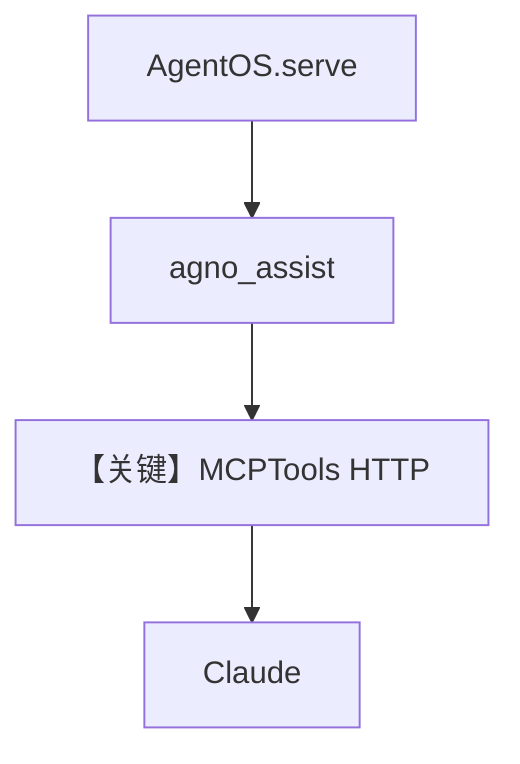

# agno_assist.py — 实现原理分析

<!-- cookbook-py-source:start -->
## 完整源码

```python
"""
Agno Assist
==========

Demonstrates a minimal agno agent.
"""

from agno.agent import Agent
from agno.db.sqlite import SqliteDb
from agno.models.anthropic import Claude
from agno.os import AgentOS
from agno.tools.mcp import MCPTools

# ---------------------------------------------------------------------------
# Create Agent
# ---------------------------------------------------------------------------

agno_assist = Agent(
    name="Agno Assist",
    model=Claude(id="claude-sonnet-4-5"),
    db=SqliteDb(db_file="agno.db"),
    tools=[MCPTools(url="https://docs.agno.com/mcp")],
    add_datetime_to_context=True,
    add_history_to_context=True,
    num_history_runs=10,
    markdown=True,
)

agent_os = AgentOS(agents=[agno_assist])
app = agent_os.get_app()

# ---------------------------------------------------------------------------
# Run Agent
# ---------------------------------------------------------------------------

if __name__ == "__main__":
    agent_os.serve(app="agno_assist:app", reload=True)
```

<!-- cookbook-py-source:end -->

> 源文件：`cookbook/05_agent_os/agno_assist.py`

## 概述

最小 **AgentOS** 示例：**单 Agent `agno_assist`**，**`MCPTools(url="https://docs.agno.com/mcp")`** 通过 **HTTP MCP** 暴露文档能力；**`Claude(id="claude-sonnet-4-5")`**；**`SqliteDb(db_file="agno.db")`**；**历史 + 时间 + markdown**。

**核心配置一览：**

| 配置项 | 值 | 说明 |
|--------|------|------|
| `name` | `"Agno Assist"` | 名称 |
| `model` | `Claude(id="claude-sonnet-4-5")` | Anthropic Messages |
| `db` | `SqliteDb(db_file="agno.db")` | 会话 |
| `tools` | `[MCPTools(url="https://docs.agno.com/mcp")]` | 远程 MCP |
| `add_datetime_to_context` | `True` | 时间 |
| `add_history_to_context` | `True`，`num_history_runs=10` | 历史 |
| `markdown` | `True` | markdown |
| `description` / `instructions` | 未设置 | 无额外文案 |

## 架构分层

```
agno_assist.py           MCP (HTTP) + AgentOS
┌────────────────┐      ┌──────────────────────────┐
│ MCPTools(url)  │─────>│ Claude + MCP 工具调用      │
└────────────────┘      └──────────────────────────┘
```

## 核心组件解析

### HTTP MCP

与 `mcp_demo.py` 的 **stdio npx** 不同，本例 **URL** 连接托管 MCP 服务，依赖网络可达。

### 运行机制与因果链

1. **路径**：用户问 Agno 文档相关问题 → 模型选用 MCP 工具拉取内容 → 回答。  
2. **状态**：本地 `agno.db`。  
3. **分支**：MCP 不可用时工具失败。  
4. **差异**：相对 `advanced_demo/mcp_demo.py`，**无 lifespan**，连接方式更简单。

## System Prompt 组装

无 `description`/`instructions`；默认拼装主要为：

### 还原后的完整 System 文本（静态 + 动态）

```text
Use markdown to format your answers.

```

```text
The current time is <运行时>.
```

MCP 工具 schema 以运行时注入为准。

### 段落释义

- markdown 与时间；工具能力来自 MCP，不由自然语言长篇描述。

## 完整 API 请求

`Claude.invoke` → Anthropic Messages API。

## Mermaid 流程图



## 关键源码文件索引

| 文件 | 作用 |
|------|------|
| `agno/tools/mcp.py` | `MCPTools` |
| `agno/models/anthropic/claude.py` | `invoke` |
