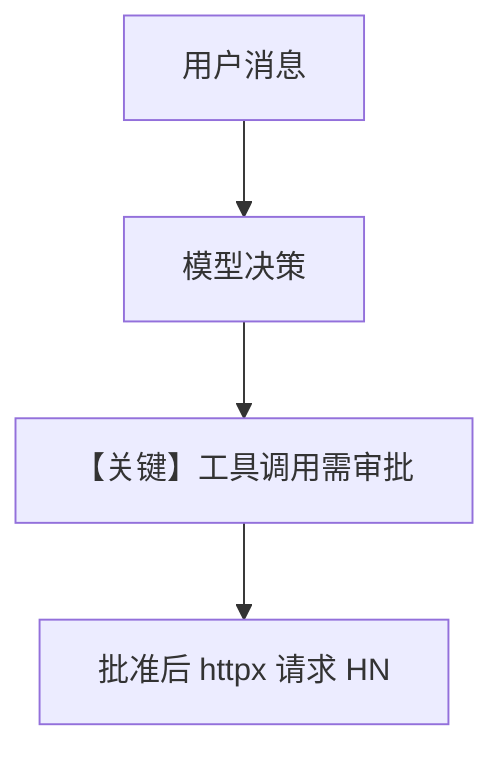

# approval_basic.py — 实现原理分析

> 源文件：`cookbook/05_agent_os/approvals/approval_basic.py`

## 概述

本示例演示 **基于审批的 HITL**：`@approval(type="required")` 与 `@tool(requires_confirmation=True)` 组合，在调用 **Hacker News API** 拉取热帖前需审批；**`OpenAIResponses`**（非 Chat Completions）；**`SqliteDb`** 含 **`approvals_table`** 持久化审批记录。

**核心配置一览：**

| 配置项 | 值 | 说明 |
|--------|------|------|
| `Agent.name` | `"Approval Basic Agent"` | 名称 |
| `Agent.model` | `OpenAIResponses(id="gpt-5-mini")` | Responses API |
| `Agent.tools` | `[get_top_hackernews_stories]` | 装饰后的工具 |
| `Agent.markdown` | `True` | markdown 附加说明 |
| `Agent.db` | `SqliteDb(..., approvals_table="approvals")` | 审批表 |
| `AgentOS.db` | 同上 | OS 级共享 DB |

## 架构分层

```
@approval + @tool     agno.agent + OpenAIResponses
┌──────────────┐      ┌─────────────────────────────┐
│ httpx 拉 HN   │<────│ 工具调用前审批流 + 会话持久化   │
└──────────────┘      └─────────────────────────────┘
```

## 核心组件解析

### 审批装饰器

`@approval(type="required")` 强制走审批工作流；`requires_confirmation=True` 在工具层标记需确认。

### 运行机制与因果链

1. **路径**：用户提问 → 模型决定调用工具 → **暂停待审批** → 通过后执行 `httpx` 请求。  
2. **状态**：`tmp/approvals_test.db` 写入 session/approval。  
3. **分支**：拒绝则工具不执行。  
4. **差异**：相对普通 `tool`，多 **AgentOS 审批 UI/API**。

## System Prompt 组装

无显式 `instructions`；默认拼装含 **markdown** 句与 **工具 schema**（由框架注入）。

### 还原后的完整 System 文本

```text
Use markdown to format your answers.

```

外加 **动态时间**（若 `add_datetime` 未开则无）与 **工具定义**（运行时）。本文件未设 `add_datetime_to_context`。

### 段落释义

- 模型需先理解何时调用 `get_top_hackernews_stories`，并在审批通过前不能完成工具侧效果。

## 完整 API 请求

**`OpenAIResponses`** → `responses.create` 形态（见 `agno/models/openai/responses.py` `invoke`），非 `chat.completions.create`。

## Mermaid 流程图



## 关键源码文件索引

| 文件 | 作用 |
|------|------|
| `agno/approval/` | `@approval` |
| `agno/models/openai/responses.py` | `OpenAIResponses.invoke` |
