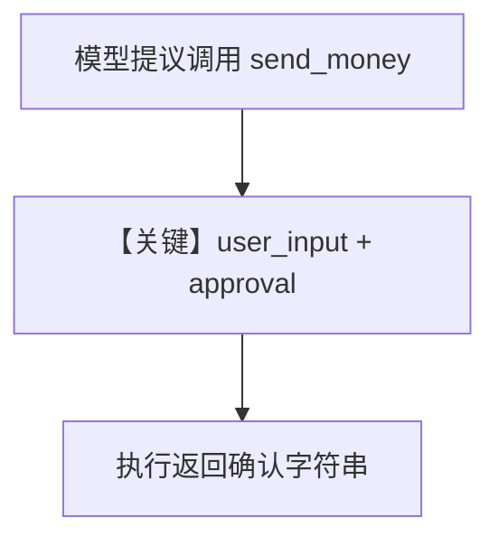

# approval_user_input.py — 实现原理分析

<!-- cookbook-py-source:start -->
## 完整源码

```python
"""
Approval User Input
=============================

Approval + user input HITL: @approval + @tool(requires_user_input=True).
"""

import os

from agno.agent import Agent
from agno.approval import approval
from agno.db.sqlite import SqliteDb
from agno.models.openai import OpenAIResponses
from agno.os import AgentOS
from agno.tools import tool

DB_FILE = "tmp/approvals_test.db"


@approval(type="required")
@tool(requires_user_input=True, user_input_fields=["recipient", "note"])
def send_money(amount: float, recipient: str, note: str) -> str:
    """Send money to a recipient.

    Args:
        amount (float): The amount of money to send.
        recipient (str): The recipient to send money to (provided by user).
        note (str): A note to include with the transfer.

    Returns:
        str: Confirmation of the transfer.
    """
    return f"Sent ${amount} to {recipient}: {note}"


# ---------------------------------------------------------------------------
# Create Agent
# ---------------------------------------------------------------------------
db = SqliteDb(
    db_file=DB_FILE, session_table="agent_sessions", approvals_table="approvals"
)
agent = Agent(
    name="Approval User Input Agent",
    model=OpenAIResponses(id="gpt-5-mini"),
    tools=[send_money],
    markdown=True,
    db=db,
)

# ---------------------------------------------------------------------------
# Run Agent
# ---------------------------------------------------------------------------
if __name__ == "__main__":
    # Clean up from previous runs
    if os.path.exists(DB_FILE):
        os.remove(DB_FILE)
    os.makedirs("tmp", exist_ok=True)

    # Re-create after cleanup
    db = SqliteDb(
        db_file=DB_FILE, session_table="agent_sessions", approvals_table="approvals"
    )
    agent = Agent(
        model=OpenAIResponses(id="gpt-5-mini"),
        tools=[send_money],
        markdown=True,
        db=db,
    )
agent_os = AgentOS(
    description="Example app for approvals with user input",
    agents=[
        agent,
    ],
    db=db,
)
app = agent_os.get_app()

if __name__ == "__main__":
    agent_os.serve(app="approval_user_input:app", reload=True)
```

<!-- cookbook-py-source:end -->

> 源文件：`cookbook/05_agent_os/approvals/approval_user_input.py`

## 概述

本示例演示 **审批 + 用户输入 HITL**：`@approval(type="required")` 与 `@tool(requires_user_input=True, user_input_fields=["recipient", "note"])`，在「转账」工具执行前收集 **recipient/note** 并可能经审批。使用 **`OpenAIResponses`** 与带 **`approvals_table`** 的 **`SqliteDb`**。

**核心配置一览：**

| 配置项 | 值 | 说明 |
|--------|------|------|
| `tool` | `send_money(amount, recipient, note)` | LLM 填 amount；recipient/note 来自 HITL |
| `Agent`（首段） | `name="Approval User Input Agent"`，`model=OpenAIResponses(id="gpt-5-mini")` | 首次定义 |
| `__main__` 内重建 | 删除 DB 后重建 `db`/`agent`（**未保留 name**） | 注意与首段 Agent 差异 |

**代码结构提示**：文件末尾 `agent_os = AgentOS(...)` 与第二个 `if __name__` 的缩进需以仓库实际为准；运行时应确保 **`agent`** 为最终绑定实例。

## 核心组件解析

### user_input_fields

与 `amount` 等模型直接生成的参数分离，由用户在表单中提供，再注入工具调用。

## System Prompt 组装

无显式 `instructions`；工具 schema 描述 `send_money` 的语义。

### 还原后的完整 System 文本

以默认拼装为准：**markdown 附加**（`markdown=True`）+ **工具说明**；无静态长 instructions。

## 完整 API 请求

`OpenAIResponses` → Responses API。

## Mermaid 流程图



## 关键源码文件索引

| 文件 | 作用 |
|------|------|
| `agno/tools` | `@tool` 参数 |
| `agno/models/openai/responses.py` | `invoke` |
