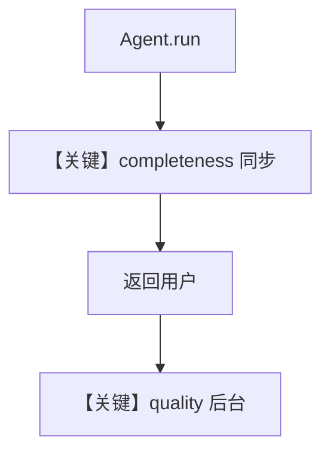

# background_evals_example.py — 实现原理分析

> 源文件：`cookbook/05_agent_os/background_tasks/background_evals_example.py`

## 概述

本示例用 **`AgentAsJudgeEval`** 作为 **`post_hooks`**：一个 **`run_in_background=False`**（默认，阻塞至评测完再返回），另一个 **`run_in_background=True`**（响应后后台评测）。**`AsyncSqliteDb`**；主 Agent **`OpenAIChat(id="gpt-5.2")`**，指令为地理助手。

**核心配置一览：**

| 配置项 | 值 | 说明 |
|--------|------|------|
| `post_hooks` | `[completeness_eval, quality_eval]` | 顺序执行；后者后台 |
| `completeness_eval.run_in_background` | False（默认） | 同步阻塞 |
| `quality_eval.run_in_background` | True | 非阻塞 |
| `Agent.instructions` | `"You are a helpful geography assistant..."` | 见源文件 |
| `telemetry` | `False`（Agent） | 关闭 Agent 遥测 |

## 运行机制与因果链

1. 请求 → Agent 生成回复 → **先跑 completeness**（阻塞）→ 返回用户 → **quality 后台**。  
2. `AsyncSqliteDb` 存评测结果。

## System Prompt 组装

### 还原后的完整 System 文本（主 Agent）

```text
You are a helpful geography assistant. Provide accurate and concise answers.

```

并含 markdown 与时间（`add_datetime` 未显式开启则为默认；本文件 `markdown=True` 故有 markdown 句）。

## 完整 API 请求

`OpenAIChat` → `chat.completions.create`。

## Mermaid 流程图



## 关键源码文件索引

| 文件 | 作用 |
|------|------|
| `agno/eval/agent_as_judge.py` | `AgentAsJudgeEval` |
