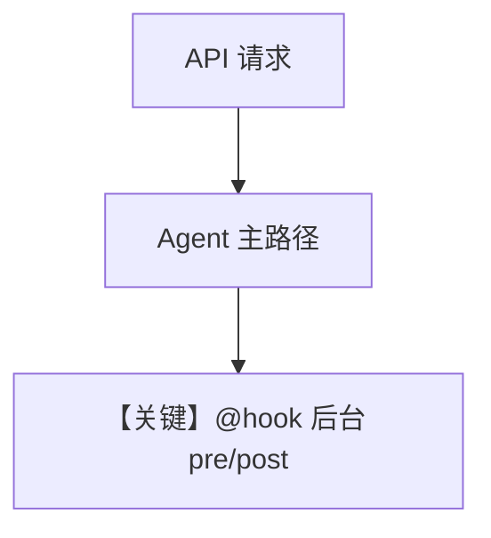

# background_hooks_decorator.py — 实现原理分析

<!-- cookbook-py-source:start -->
## 完整源码

```python
"""
Example: Using Background Post-Hooks in AgentOS

This example demonstrates how to run post-hooks as FastAPI background tasks,
making them completely non-blocking.
"""

import asyncio

from agno.agent import Agent
from agno.db.sqlite import AsyncSqliteDb
from agno.hooks.decorator import hook
from agno.models.openai import OpenAIChat
from agno.os import AgentOS
from agno.run.agent import RunInput

# ---------------------------------------------------------------------------
# Create Example
# ---------------------------------------------------------------------------


@hook(run_in_background=True)
def log_request(run_input: RunInput, agent):
    """
    This pre-hook will run in the background before the agent processes the request.
    Note: Pre-hooks in background mode cannot modify run_input.
    """
    print(f"[Background Pre-Hook] Request received for agent: {agent.name}")
    print(f"[Background Pre-Hook] Input: {run_input.input_content}")


async def log_analytics(run_output, agent, session):
    """
    Post hook for logging analytics
    """
    print(f"[Post-Hook] Logging analytics for run: {run_output.run_id}")
    print(f"[Post-Hook] Agent: {agent.name}")
    print(f"[Post-Hook] Session: {session.session_id}")
    print("[Post-Hook] Analytics logged successfully!")


@hook(run_in_background=True)
async def send_notification(run_output, agent):
    """
    Post hook for sending notifications
    """
    print(f"[Post-Hook] Sending notification for agent: {agent.name}")
    await asyncio.sleep(3)
    print("[Post-Hook] Notification sent!")


# Create an agent with background post-hooks enabled
agent = Agent(
    id="background-task-agent",
    name="BackgroundTaskAgent",
    model=OpenAIChat(id="gpt-5.2"),
    instructions="You are a helpful assistant",
    db=AsyncSqliteDb(db_file="tmp/agent.db"),
    # Define hooks
    pre_hooks=[log_request],
    post_hooks=[log_analytics, send_notification],
    markdown=True,
)

# Create AgentOS
agent_os = AgentOS(
    agents=[agent],
)

# Get the FastAPI app
app = agent_os.get_app()


# When you make a request to POST /agents/{agent_id}/runs:
# 1. The agent will process the request
# 2. The response will be sent immediately to the user, with log_analytics executing with the normal execution flow
# 3. The pre-hooks (log_request) and post-hooks (send_notification) will run in the background without blocking the API response
# 4. The user doesn't have to wait for these tasks to complete

# Example request:
# curl -X POST http://localhost:8000/agents/background-task-agent/runs \
#   -F "message=Hello, how are you?" \
#   -F "stream=false"

# ---------------------------------------------------------------------------
# Run Example
# ---------------------------------------------------------------------------

if __name__ == "__main__":
    agent_os.serve(app="background_hooks_decorator:app", port=7777, reload=True)
```

<!-- cookbook-py-source:end -->

> 源文件：`cookbook/05_agent_os/background_tasks/background_hooks_decorator.py`

## 概述

使用 **`@hook(run_in_background=True)`** 标记 **pre/post** 钩子：`log_request`（pre）、`send_notification`（post）在后台跑；**`log_analytics` 未用装饰器**，注释说明其与正常执行流一起跑。**`AgentOS` 未传 `run_hooks_in_background`**（与 `background_hooks_example.py` 对比）。**`AsyncSqliteDb`**。

**核心配置一览：**

| 配置项 | 值 | 说明 |
|--------|------|------|
| `pre_hooks` | `[log_request]` | 后台 pre |
| `post_hooks` | `[log_analytics, send_notification]` | 后者带 @hook |
| `Agent.model` | `OpenAIChat(id="gpt-5.2")` | 主模型 |
| `instructions` | `"You are a helpful assistant"` | 字面量 |

## 运行机制与因果链

注释说明：响应立即返回；**pre 与带 @hook 的 post** 在后台；**log_analytics** 随主流程。

## System Prompt 组装

### 还原后的完整 System 文本

```text
You are a helpful assistant

```

及 `markdown=True` 的附加段。

## 完整 API 请求

`OpenAIChat.invoke` → Chat Completions。

## Mermaid 流程图



## 关键源码文件索引

| 文件 | 作用 |
|------|------|
| `agno/hooks/decorator.py` | `@hook` |
