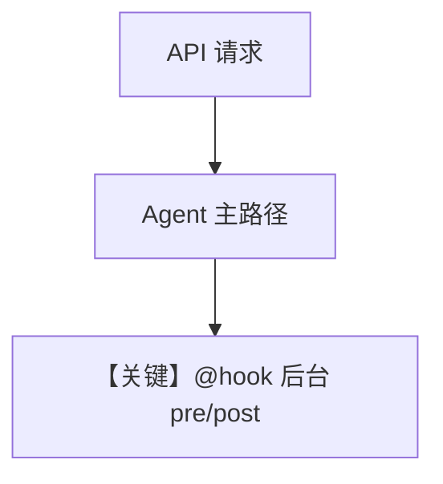

# background_hooks_decorator.py — 实现原理分析

> 源文件：`cookbook/05_agent_os/background_tasks/background_hooks_decorator.py`

## 概述

使用 **`@hook(run_in_background=True)`** 标记 **pre/post** 钩子：`log_request`（pre）、`send_notification`（post）在后台跑；**`log_analytics` 未用装饰器**，注释说明其与正常执行流一起跑。**`AgentOS` 未传 `run_hooks_in_background`**（与 `background_hooks_example.py` 对比）。**`AsyncSqliteDb`**。

**核心配置一览：**

| 配置项 | 值 | 说明 |
|--------|------|------|
| `pre_hooks` | `[log_request]` | 后台 pre |
| `post_hooks` | `[log_analytics, send_notification]` | 后者带 @hook |
| `Agent.model` | `OpenAIChat(id="gpt-5.2")` | 主模型 |
| `instructions` | `"You are a helpful assistant"` | 字面量 |

## 运行机制与因果链

注释说明：响应立即返回；**pre 与带 @hook 的 post** 在后台；**log_analytics** 随主流程。

## System Prompt 组装

### 还原后的完整 System 文本

```text
You are a helpful assistant

```

及 `markdown=True` 的附加段。

## 完整 API 请求

`OpenAIChat.invoke` → Chat Completions。

## Mermaid 流程图



## 关键源码文件索引

| 文件 | 作用 |
|------|------|
| `agno/hooks/decorator.py` | `@hook` |
