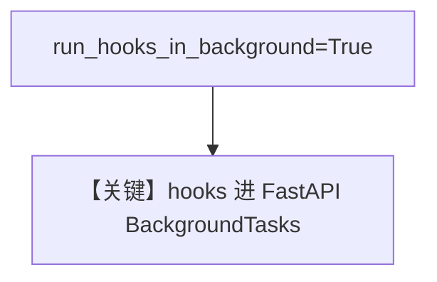

# background_hooks_example.py — 实现原理分析

> 源文件：`cookbook/05_agent_os/background_tasks/background_hooks_example.py`

## 概述

与 **`background_hooks_decorator.py`** 类似，但 **不用 `@hook` 装饰器**，改为 **`AgentOS(run_hooks_in_background=True)`** 将 **全部 pre/post 钩子** 放到 FastAPI 后台任务中执行（**非装饰器模式**）。

**核心配置一览：**

| 配置项 | 值 | 说明 |
|--------|------|------|
| `AgentOS.run_hooks_in_background` | `True` | 全局后台钩子 |
| `pre_hooks` / `post_hooks` | `log_request` / `log_analytics`, `send_notification` | 普通函数 |

## 运行机制与因果链

响应先返回；`log_request`、`log_analytics`、`send_notification` 在后台继续（见文件注释）。

## System Prompt 组装

```text
You are a helpful assistant

```

（+ markdown 附加）

## 完整 API 请求

`OpenAIChat` → Chat Completions。

## Mermaid 流程图



## 关键源码文件索引

| 文件 | 作用 |
|------|------|
| `agno/os` | `AgentOS` 钩子调度 |
