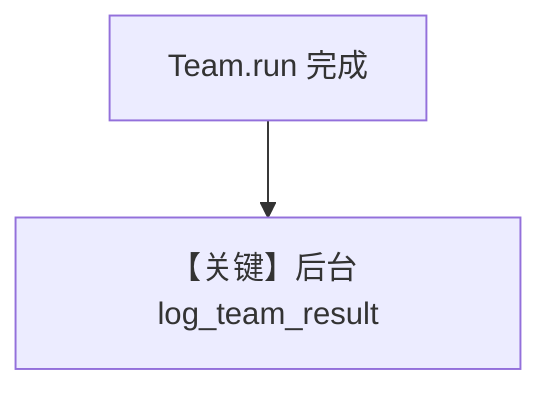

# background_hooks_team.py — 实现原理分析

<!-- cookbook-py-source:start -->
## 完整源码

```python
"""
Example: Background Hooks with Teams in AgentOS

This example demonstrates how to use background hooks with a Team.
Background hooks execute after the API response is sent, making them non-blocking.
"""

import asyncio

from agno.agent import Agent
from agno.db.sqlite import AsyncSqliteDb
from agno.hooks.decorator import hook
from agno.models.openai import OpenAIChat
from agno.os import AgentOS
from agno.run.team import TeamRunOutput
from agno.team import Team

# ---------------------------------------------------------------------------
# Create Example
# ---------------------------------------------------------------------------


@hook(run_in_background=True)
async def log_team_result(run_output: TeamRunOutput, team: Team) -> None:
    """
    Background post-hook that logs team execution results.
    Runs after the response is sent to the user.
    """
    print(f"[Background Hook] Team '{team.name}' completed run: {run_output.run_id}")
    print(f"[Background Hook] Content length: {len(str(run_output.content))} chars")

    # Simulate async work (e.g., storing metrics)
    await asyncio.sleep(2)
    print("[Background Hook] Team metrics logged successfully!")


# Create team members
researcher = Agent(
    name="Researcher",
    model=OpenAIChat(id="gpt-5.2"),
    instructions="You research topics and provide factual information.",
)

writer = Agent(
    name="Writer",
    model=OpenAIChat(id="gpt-5.2"),
    instructions="You write clear, engaging content based on research.",
)

# Create the team with background hooks
content_team = Team(
    id="content-team",
    name="ContentTeam",
    model=OpenAIChat(id="gpt-5.2"),
    members=[researcher, writer],
    instructions="Coordinate between researcher and writer to create content.",
    db=AsyncSqliteDb(db_file="tmp/team.db"),
    post_hooks=[log_team_result],
    markdown=True,
)

# Create AgentOS with background hooks enabled
agent_os = AgentOS(
    teams=[content_team],
    run_hooks_in_background=True,
)

app = agent_os.get_app()

# Example request:
# curl -X POST http://localhost:7777/teams/content-team/runs \
#   -F "message=Write a short paragraph about Python" \
#   -F "stream=false"

# ---------------------------------------------------------------------------
# Run Example
# ---------------------------------------------------------------------------

if __name__ == "__main__":
    agent_os.serve(app="background_hooks_team:app", port=7777, reload=True)
```

<!-- cookbook-py-source:end -->

> 源文件：`cookbook/05_agent_os/background_tasks/background_hooks_team.py`

## 概述

**Team 级 post_hook**：`@hook(run_in_background=True) async def log_team_result(run_output: TeamRunOutput, team: Team)`，在 API 返回后记录团队运行指标。**`AgentOS(run_hooks_in_background=True)`**。**`content_team`** 含 **Researcher** 与 **Writer** 两 Agent，**`gpt-5.2`**。

**核心配置一览：**

| 配置项 | 值 | 说明 |
|--------|------|------|
| `Team.post_hooks` | `[log_team_result]` | Team 钩子 |
| `Team.instructions` | 协调研究员与写手 | 见源文件 |
| `members` | researcher, writer | 两 Agent |

## System Prompt 组装

成员与各 Agent/Team 的 `get_system_message` 分别适用；钩子**不产生** LLM system。

## 完整 API 请求

成员与 Team 模型均为 OpenAI Chat 系。

## Mermaid 流程图



## 关键源码文件索引

| 文件 | 作用 |
|------|------|
| `agno/run/team` | `TeamRunOutput` |
| `agno/team/team.py` | Team 钩子 |
