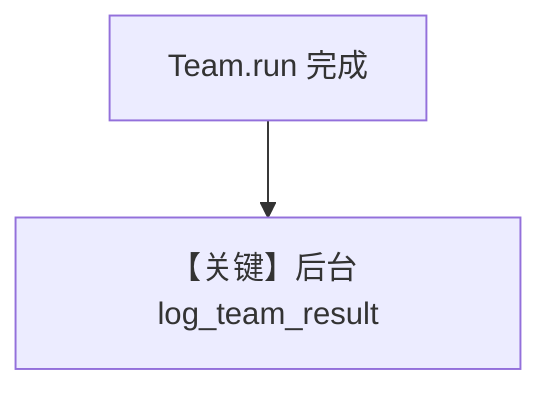

# background_hooks_team.py — 实现原理分析

> 源文件：`cookbook/05_agent_os/background_tasks/background_hooks_team.py`

## 概述

**Team 级 post_hook**：`@hook(run_in_background=True) async def log_team_result(run_output: TeamRunOutput, team: Team)`，在 API 返回后记录团队运行指标。**`AgentOS(run_hooks_in_background=True)`**。**`content_team`** 含 **Researcher** 与 **Writer** 两 Agent，**`gpt-5.2`**。

**核心配置一览：**

| 配置项 | 值 | 说明 |
|--------|------|------|
| `Team.post_hooks` | `[log_team_result]` | Team 钩子 |
| `Team.instructions` | 协调研究员与写手 | 见源文件 |
| `members` | researcher, writer | 两 Agent |

## System Prompt 组装

成员与各 Agent/Team 的 `get_system_message` 分别适用；钩子**不产生** LLM system。

## 完整 API 请求

成员与 Team 模型均为 OpenAI Chat 系。

## Mermaid 流程图

## 关键源码文件索引

| 文件 | 作用 |
|------|------|
| `agno/run/team` | `TeamRunOutput` |
| `agno/team/team.py` | Team 钩子 |
