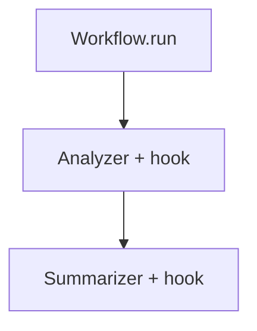

# background_hooks_workflow.py — 实现原理分析

<!-- cookbook-py-source:start -->
## 完整源码

```python
"""
Example: Background Hooks with Workflows in AgentOS

This example demonstrates how to use background hooks with a Workflow.
Background hooks execute after the API response is sent, making them non-blocking.
"""

import asyncio

from agno.agent import Agent
from agno.db.sqlite import AsyncSqliteDb
from agno.models.openai import OpenAIChat
from agno.os import AgentOS
from agno.run.agent import RunOutput
from agno.workflow import Workflow

# ---------------------------------------------------------------------------
# Create Example
# ---------------------------------------------------------------------------


async def log_step_completion(run_output: RunOutput, agent: Agent) -> None:
    """
    Background post-hook on the agent that runs after each step completes.
    """
    print(f"[Background Hook] Agent '{agent.name}' completed step")
    print(f"[Background Hook] Run ID: {run_output.run_id}")

    # Simulate async work
    await asyncio.sleep(1)
    print(f"[Background Hook] Logged metrics for {agent.name}")


# Create agents for the workflow steps
analyzer = Agent(
    name="Analyzer",
    model=OpenAIChat(id="gpt-5.2"),
    instructions="Analyze the input and identify key points.",
    post_hooks=[log_step_completion],
)

summarizer = Agent(
    name="Summarizer",
    model=OpenAIChat(id="gpt-5.2"),
    instructions="Summarize the analysis into a brief response.",
    post_hooks=[log_step_completion],
)

# Create the workflow
analysis_workflow = Workflow(
    id="analysis-workflow",
    name="AnalysisWorkflow",
    description="Analyzes input and provides a summary",
    steps=[analyzer, summarizer],
    db=AsyncSqliteDb(db_file="tmp/workflow.db"),
)

# Create AgentOS with background hooks enabled
agent_os = AgentOS(
    workflows=[analysis_workflow],
    run_hooks_in_background=True,
)

app = agent_os.get_app()

# Example request:
# curl -X POST http://localhost:7777/workflows/analysis-workflow/runs \
#   -F "message=Explain the benefits of exercise" \
#   -F "stream=false"

# ---------------------------------------------------------------------------
# Run Example
# ---------------------------------------------------------------------------

if __name__ == "__main__":
    agent_os.serve(app="background_hooks_workflow:app", port=7777, reload=True)
```

<!-- cookbook-py-source:end -->

> 源文件：`cookbook/05_agent_os/background_tasks/background_hooks_workflow.py`

## 概述

**Workflow** 中两步各绑定 **Agent**，且在 **每个 Agent 上设置 `post_hooks=[log_step_completion]`**（异步，**非** `@hook` 装饰）。**`AgentOS(run_hooks_in_background=True)`**。**`analysis_workflow`**：`analyzer` → `summarizer`。

**核心配置一览：**

| 配置项 | 值 | 说明 |
|--------|------|------|
| `Workflow.steps` | `[analyzer, summarizer]` | Agent 顺序 |
| `Agent.post_hooks` | `[log_step_completion]` | 每步完成后记录 |

## 运行机制与因果链

工作流逐步执行；每步 Agent 完成时触发 post_hook（后台与否由 OS 标志与实现共同决定）。

## System Prompt 组装

各 Agent：`instructions` 分别为分析要点与摘要（见源文件）。

### 还原（analyzer）

```text
Analyze the input and identify key points.

```

### 还原（summarizer）

```text
Summarize the analysis into a brief response.

```

## 完整 API 请求

`OpenAIChat` → Chat Completions。

## Mermaid 流程图



## 关键源码文件索引

| 文件 | 作用 |
|------|------|
| `agno/workflow/workflow.py` | Workflow 执行 |
| `agno/agent/agent.py` | `post_hooks` |
