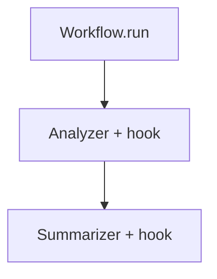

# background_hooks_workflow.py — 实现原理分析

> 源文件：`cookbook/05_agent_os/background_tasks/background_hooks_workflow.py`

## 概述

**Workflow** 中两步各绑定 **Agent**，且在 **每个 Agent 上设置 `post_hooks=[log_step_completion]`**（异步，**非** `@hook` 装饰）。**`AgentOS(run_hooks_in_background=True)`**。**`analysis_workflow`**：`analyzer` → `summarizer`。

**核心配置一览：**

| 配置项 | 值 | 说明 |
|--------|------|------|
| `Workflow.steps` | `[analyzer, summarizer]` | Agent 顺序 |
| `Agent.post_hooks` | `[log_step_completion]` | 每步完成后记录 |

## 运行机制与因果链

工作流逐步执行；每步 Agent 完成时触发 post_hook（后台与否由 OS 标志与实现共同决定）。

## System Prompt 组装

各 Agent：`instructions` 分别为分析要点与摘要（见源文件）。

### 还原（analyzer）

```text
Analyze the input and identify key points.

```

### 还原（summarizer）

```text
Summarize the analysis into a brief response.

```

## 完整 API 请求

`OpenAIChat` → Chat Completions。

## Mermaid 流程图



## 关键源码文件索引

| 文件 | 作用 |
|------|------|
| `agno/workflow/workflow.py` | Workflow 执行 |
| `agno/agent/agent.py` | `post_hooks` |
