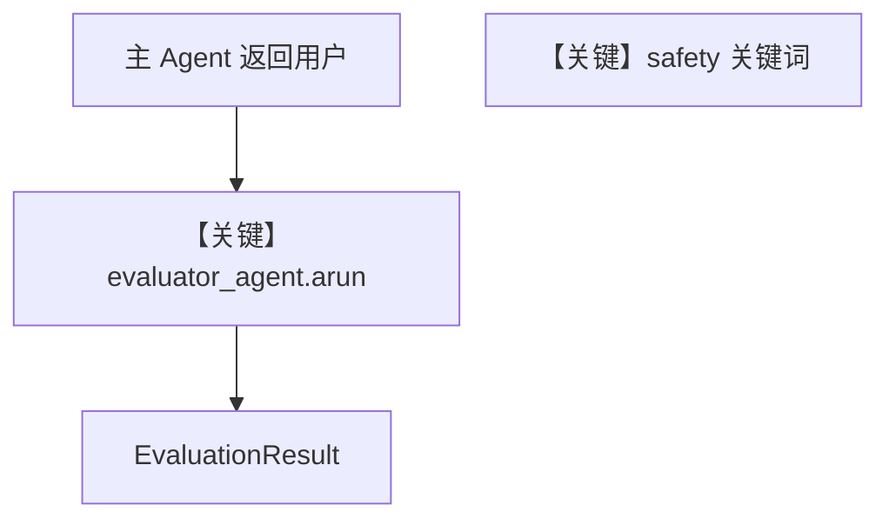

# background_output_evaluation.py — 实现原理分析

> 源文件：`cookbook/05_agent_os/background_tasks/background_output_evaluation.py`

## 概述

**主 Agent** 的 **`post_hooks`** 含两个 **`@hook(run_in_background=True)`** 异步函数：`evaluate_output_quality` 内 **`await evaluator_agent.arun(...)`**，**`output_schema=EvaluationResult`**；`check_response_safety` 做简单关键词扫描。**评测 Agent 在模块级单例创建**（符合「勿在循环内创建」）。**`AsyncSqliteDb`**。

**核心配置一览：**

| 配置项 | 值 | 说明 |
|--------|------|------|
| `main_agent.instructions` | 客服三条 bullet | 见源文件 |
| `evaluator_agent.output_schema` | `EvaluationResult` | 结构化评测 |
| `post_hooks` | `evaluate_output_quality`, `check_response_safety` | 并行后台（注释） |

## System Prompt 组装

### 主 Agent 还原

```text
You are a helpful customer support agent.
Provide clear, accurate, and friendly responses.
If you don't know something, say so honestly.

```

### 评测 Agent 还原

多行 `instructions` 列表（见源 `L49-63`），须原样复制至文档若需完整还原。

## 完整 API 请求

主对话与评测均为 **`OpenAIChat`** → `chat.completions.create`；评测 `messages` 为用户构造的 `evaluation_prompt`。

## Mermaid 流程图



## 关键源码文件索引

| 文件 | 作用 |
|------|------|
| `agno/hooks/decorator.py` | `@hook` |
| `agno/agent/_messages.py` | `output_schema` 与 system |
