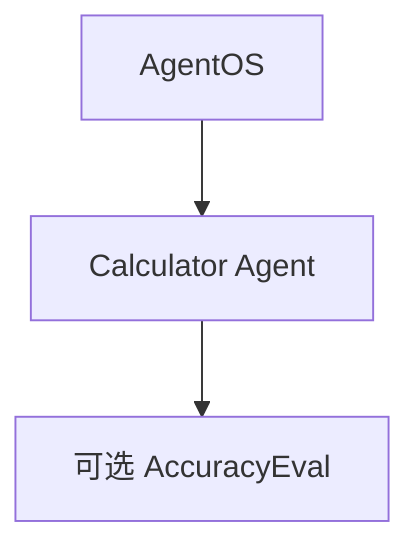

# evals_demo.py — 实现原理分析

> 源文件：`cookbook/05_agent_os/background_tasks/evals_demo.py`

## 概述

与 **`client` 目录 `evals_demo` 命名易混**；本文件在 **`05_agent_os/background_tasks/`**，内容为 **`PostgresDb` + `CalculatorTools` Agent**、**`AccuracyEval` 定义（注释未运行）**、**`AgentOS`** **`id="eval-demo"`**。用于演示 **Eval API** 与 AgentOS 集成。

**核心配置一览：**

| 配置项 | 值 | 说明 |
|--------|------|------|
| `basic_agent` | `CalculatorTools()`，`instructions` 要求用计算器 | 算术 |
| `basic_team` | 单成员 `basic_agent` | Team |
| `AccuracyEval` | `input`/`expected_output` 密码问题 | 注释掉 `run` |

## System Prompt 组装

```text
You are an assistant that can answer arithmetic questions. Always use the Calculator tools you have.

```

（+ markdown）

## 完整 API 请求

`OpenAIChat` + tools → Chat Completions with tool calls。

## Mermaid 流程图



## 关键源码文件索引

| 文件 | 作用 |
|------|------|
| `agno/eval/accuracy.py` | `AccuracyEval` |
