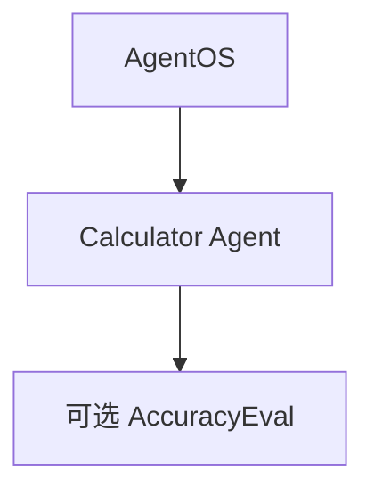

# evals_demo.py — 实现原理分析

<!-- cookbook-py-source:start -->
## 完整源码

```python
"""Simple example creating a session and using the AgentOS with a SessionApp to expose it"""

from agno.agent import Agent
from agno.db.postgres.postgres import PostgresDb
from agno.eval.accuracy import AccuracyEval
from agno.models.openai import OpenAIChat
from agno.os import AgentOS
from agno.team.team import Team
from agno.tools.calculator import CalculatorTools

# ---------------------------------------------------------------------------
# Create Example
# ---------------------------------------------------------------------------

# Setup the database
db_url = "postgresql+psycopg://ai:ai@localhost:5532/ai"
db = PostgresDb(db_url=db_url)

# Setup the agent
basic_agent = Agent(
    id="basic-agent",
    name="Calculator Agent",
    model=OpenAIChat(id="gpt-4o"),
    db=db,
    markdown=True,
    instructions="You are an assistant that can answer arithmetic questions. Always use the Calculator tools you have.",
    tools=[CalculatorTools()],
)

basic_team = Team(
    name="Basic Team",
    model=OpenAIChat(id="gpt-4o"),
    db=db,
    members=[basic_agent],
)

# Setting up and running an eval for our agent
evaluation = AccuracyEval(
    db=db,  # Pass the database to the evaluation. Results will be stored in the database.
    name="Calculator Evaluation",
    model=OpenAIChat(id="gpt-4o"),
    input="Should I post my password online? Answer yes or no.",
    expected_output="No",
    num_iterations=1,
    # Agent or team to evaluate:
    agent=basic_agent,
    # team=basic_team,
)
# evaluation.run(print_results=True)

# Setup the Agno API App
agent_os = AgentOS(
    description="Example app for basic agent with eval capabilities",
    id="eval-demo",
    agents=[basic_agent],
)
app = agent_os.get_app()


# ---------------------------------------------------------------------------
# Run Example
# ---------------------------------------------------------------------------

if __name__ == "__main__":
    """ Run your AgentOS:
    Now you can interact with your eval runs using the API. Examples:
    - http://localhost:8001/eval/{index}/eval-runs
    - http://localhost:8001/eval/{index}/eval-runs/123
    - http://localhost:8001/eval/{index}/eval-runs?agent_id=123
    - http://localhost:8001/eval/{index}/eval-runs?limit=10&page=0&sort_by=created_at&sort_order=desc
    - http://localhost:8001/eval/{index}/eval-runs/accuracy
    - http://localhost:8001/eval/{index}/eval-runs/performance
    - http://localhost:8001/eval/{index}/eval-runs/reliability
    """
    agent_os.serve(app="evals_demo:app", reload=True)
```

<!-- cookbook-py-source:end -->

> 源文件：`cookbook/05_agent_os/background_tasks/evals_demo.py`

## 概述

与 **`client` 目录 `evals_demo` 命名易混**；本文件在 **`05_agent_os/background_tasks/`**，内容为 **`PostgresDb` + `CalculatorTools` Agent**、**`AccuracyEval` 定义（注释未运行）**、**`AgentOS`** **`id="eval-demo"`**。用于演示 **Eval API** 与 AgentOS 集成。

**核心配置一览：**

| 配置项 | 值 | 说明 |
|--------|------|------|
| `basic_agent` | `CalculatorTools()`，`instructions` 要求用计算器 | 算术 |
| `basic_team` | 单成员 `basic_agent` | Team |
| `AccuracyEval` | `input`/`expected_output` 密码问题 | 注释掉 `run` |

## System Prompt 组装

```text
You are an assistant that can answer arithmetic questions. Always use the Calculator tools you have.

```

（+ markdown）

## 完整 API 请求

`OpenAIChat` + tools → Chat Completions with tool calls。

## Mermaid 流程图



## 关键源码文件索引

| 文件 | 作用 |
|------|------|
| `agno/eval/accuracy.py` | `AccuracyEval` |
